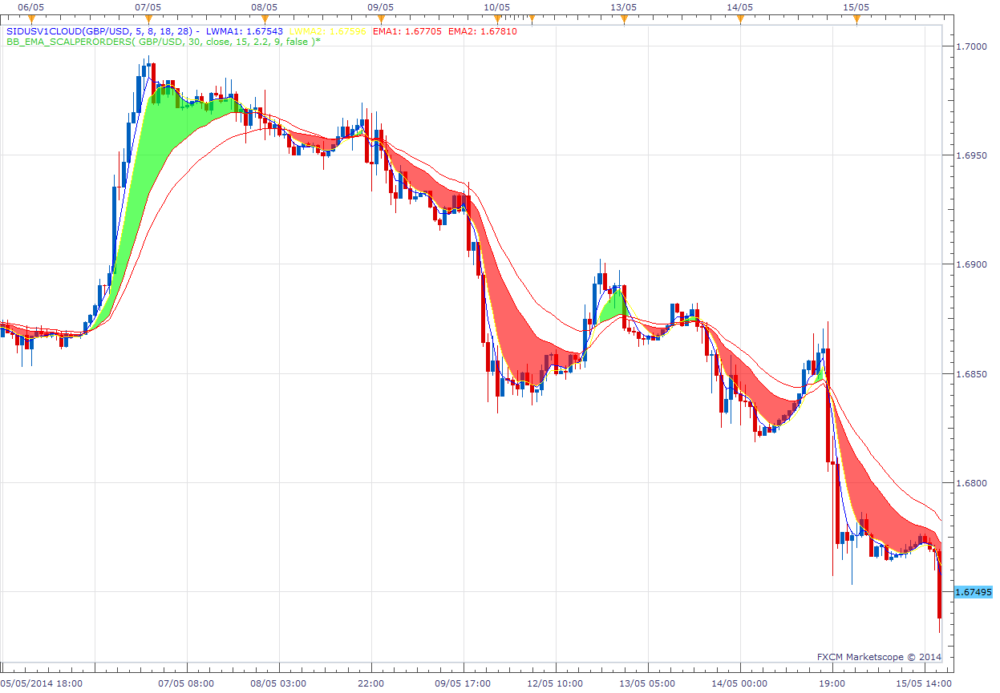

# Sidus V1 Indicator

> Source: https://fxcodebase.com/code/viewtopic.php?f=17&t=60695  
> Forum: 17 · Topic 60695 · 3 post(s)

---

## Sidus V1 Indicator

**moomoofx** · Thu May 15, 2014 4:33 am

As requested on [viewtopic.php?f=27&t=60259](https://fxcodebase.com/code/viewtopic.php?f=27&t=60259)

Basically draws a cloud between the specified two channels.

 

For the strategy, go here: [viewtopic.php?f=31&t=60696](https://fxcodebase.com/code/viewtopic.php?f=31&t=60696)

Cheers,
MooMooFX

The indicator was revised and updated

---

## Re: Sidus V1 Indicator

**Alexander.Gettinger** · Thu Jun 05, 2014 10:01 am

MQL4 version of Sidus V1 indicator: [viewtopic.php?f=38&t=60782](https://fxcodebase.com/code/viewtopic.php?f=38&t=60782).

---

## Re: Sidus V1 Indicator

**Apprentice** · Fri Jun 16, 2017 7:33 am

The indicator was revised and updated.
