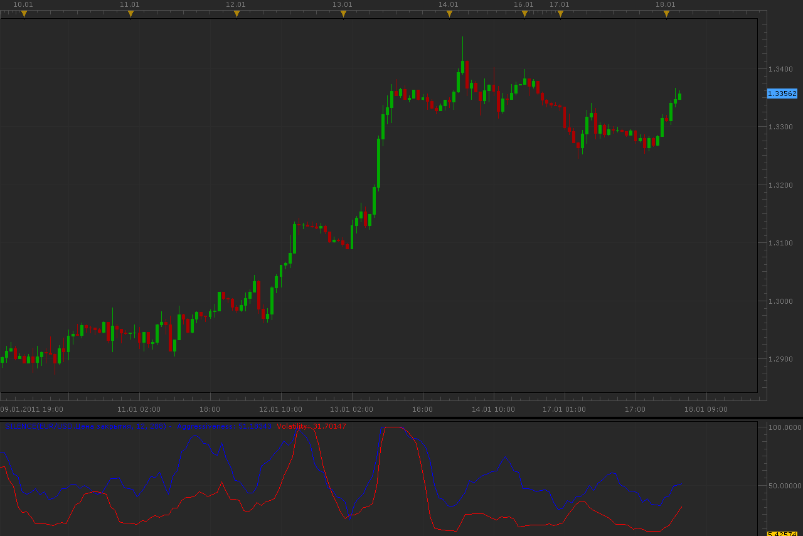

# Silence oscillator

> Source: https://fxcodebase.com/code/viewtopic.php?f=17&t=3194  
> Forum: 17 · Topic 3194 · 15 post(s)

---

## Silence oscillator

**Alexander.Gettinger** · Tue Jan 18, 2011 3:31 am

Indicator show aggressiveness (velocity of price change, blue line) and volatility (red line).
Volatility corresponds to StdDev indicator.

 

Download:

 [Silence.lua](files/7541/Silence.lua)

---

## Re: Silence oscillator

**nookie** · Tue Mar 03, 2015 8:50 am

Hello, is it possible to have a similar indicator like this one but to have a calculated price change of high and low of each previous period, something like volatility but table based with exact values. For example 1H last bar open was 160.15 and close was 160.55 so a visual of 40 as a green bar is displayed with the "40" inside or on top?

Thanks,

nookie

---

## Re: Silence oscillator

**Apprentice** · Wed Mar 04, 2015 3:37 pm

Something like Bar Height Indicator?
[viewtopic.php?f=17&t=15639&p=29633&hilit=bar+size#p29633](https://fxcodebase.com/code/viewtopic.php?f=17&t=15639&p=29633&hilit=bar+size#p29633)

---

## Re: Silence oscillator

**nookie** · Sat Mar 07, 2015 1:48 pm

Exactly, looks excellent, I need some statistics but this is enough for the moment. Thanks a lot!

I have a question and its related to the same indicator, is it possible based on data input from MA or other indicators to have a drawing on the chart in shape of rectangles ?

---

## Re: Silence oscillator

**Apprentice** · Sun Mar 08, 2015 4:50 am

Sure, such a thing is possible.
We have to hardcode this.

---

## Re: Silence oscillator

**nookie** · Mon Mar 09, 2015 8:39 am

Thanks, will it be hardcoded as an indicator or in the trading station options?

Some more functions could think of, like select "grey areas" or "bold areas" / "italic areas" and also detection of the indicators loaded and choosing values from those indicators for the areas to color in a certain fashion. Also removing /shrinking or changing fonts could be done.

---

## Re: Silence oscillator

**Apprentice** · Tue Mar 10, 2015 3:36 am

Sure.
Can you provide an algorithm that will determine the starting point for such a rectangle.

---

## Re: Silence oscillator

**nookie** · Tue Mar 10, 2015 5:48 am

The best would be based on data input from indicators loaded to have a drawing on the chart in shape of rectangles, for example I am adding an ADX/DMI and on cross up with a value of 35, the area is grey until another indicator like ROC is with value of 15. Grey and color of chart is not that of high importance in this case. I hope this helps.

---

## Re: Silence oscillator

**Apprentice** · Wed Mar 11, 2015 5:35 am

You mean something similar to MA Cross Zones.lua ?
[viewtopic.php?f=17&t=60261&p=92367&hilit=background#p92367](https://fxcodebase.com/code/viewtopic.php?f=17&t=60261&p=92367&hilit=background#p92367)

---

## Re: Silence oscillator

**nookie** · Sun Dec 27, 2015 11:34 am

Exactly

---

## Re: Silence oscillator

**Apprentice** · Mon Dec 28, 2015 4:43 am

I can have this made for you in one day.

Can you define conditions, indicators of yours interests.
If ... then ... color
and so on.

---

## Re: Silence oscillator

**Apprentice** · Sun Oct 21, 2018 5:43 am

The indicator was revised and updated.

---

## Re: Silence oscillator

**mayk01** · Fri Jul 18, 2025 4:34 am

Hi,
is it possible to do this in a bar version showing both sides, so it increases and decreases with an alarm?
M.

---

## Re: Silence oscillator

**Apprentice** · Fri Jul 18, 2025 6:57 am

We have added your request to the development list.
Development reference 458

---

## Re: Silence oscillator

**mayk01** · Wed Jul 23, 2025 4:53 am

I would like to help, what would be good for position change coloring, two-color Bar:
[https://fxcodebase.com/code/viewtopic.p ... nex#p67547](https://fxcodebase.com/code/viewtopic.php?f=17&t=41318&p=67547&hilit=cronex#p67547)

Alerts would not depend on level, but on status change and position change. For example: Aggression and volatility change position if aggression was up, but volatility jumped above it.
Alerts:
- Position change
- Aggression increases
- Aggression decreases
- Aggression is neutral
- Volatility increases
- Volatility decreases
- Volatility is neutral

M.

The forum kicks me out, it won't let me write.
