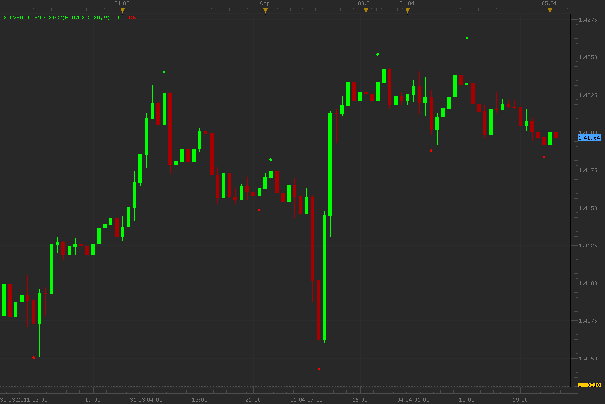

# Silver trend indicator

> Source: https://fxcodebase.com/code/viewtopic.php?f=17&t=3844  
> Forum: 17 · Topic 3844 · 6 post(s)

---

## Silver trend indicator

**Alexander.Gettinger** · Tue Apr 05, 2011 10:36 pm

The indicator is a port of SHI_SilverTrendSig.mq4 by Shurka ([http://shforex.narod.ru](http://shforex.narod.ru)).

Indicator paint UP dot if Close price[i]>Max-Range and DN dot if Close price[i]<Min+Range, where
Max, Min is a maximum and minimum of price at range from (i-Period) to i,
Range=(Max-Min)*Border/100.

 

Download:

 [Silver_Trend_Sig2.lua](files/9398/Silver_Trend_Sig2.lua)

Important! Indicator redraws historical data when new price appears!

The version of the indicator without re-drawing:

 [Silver_Trend_Sig.lua](files/9398/Silver_Trend_Sig.lua)

The indicator was revised and updated

---

## Re: Silver trend indicator

**RJH501** · Fri Jul 22, 2011 7:18 am

Hello Alexander,

I have been using your STI indicator that paints and find it to be very helpful in my trading. If you could, can you develop the following:

1. Develop a signal that provides a **sound alert**when the signal stops painting and the opposite STI signal appears on the next candle. This typically marks a trend change in my observations.
2. Develop a trading strategy that would work with the signal in 1.?

Thanks for all your work!

RJH

---

## Re: Silver trend indicator

**Apprentice** · Fri Jul 22, 2011 5:10 pm

Your request has been added to our database.

---

## Re: Silver trend indicator

**RJH501** · Sat Jul 23, 2011 10:34 am

Thanks Apprentice!

RJH

---

## Re: Silver trend indicator

**Alexander.Gettinger** · Mon Jul 25, 2011 10:26 pm

Please, see this strategy: [viewtopic.php?f=31&t=5436](https://fxcodebase.com/code/viewtopic.php?f=31&t=5436)

---

## Re: Silver trend indicator

**Apprentice** · Thu Mar 16, 2017 5:38 am

Indicator was revised and updated.
