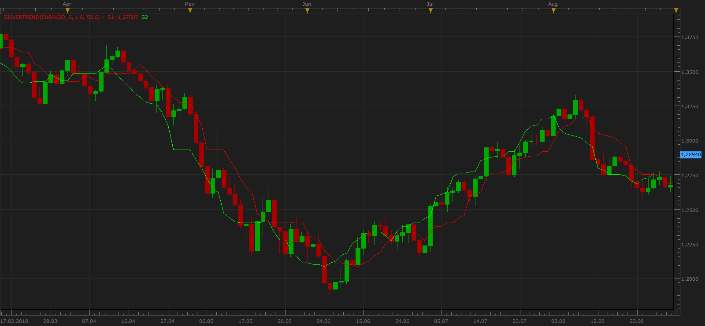

# Silver Trend

> Source: https://fxcodebase.com/code/viewtopic.php?f=17&t=2060  
> Forum: 17 · Topic 2060 · 7 post(s)

---

## Silver Trend

**Apprentice** · Sat Sep 04, 2010 11:29 am

Silver Trend a.k.a. ForexOFFTrend

 [SilverTrend.lua](files/4216/SilverTrend.lua)

 

 [SilverTrendOverlay.lua](files/4216/SilverTrendOverlay.lua)

The indicator was revised and updated

---

## question

**boursicoton** · Sat Sep 04, 2010 4:34 pm

silver trend is an repaint indicator ?

if no...gooood .....gooooooooood !

---

## Re: Silver Trend

**mennzz** · Sat Sep 04, 2010 10:48 pm

SilverTrend is a re-painting indicator , But, combined with other indicators to form a strategy might be profitable.

---

## Re: Silver Trend

**Alexander.Gettinger** · Thu Jan 08, 2015 4:50 pm

MQL4 version of Silver Trend indicator: [viewtopic.php?f=38&t=61687](https://fxcodebase.com/code/viewtopic.php?f=38&t=61687).

---

## Re: Silver Trend

**easytrading** · Wed Jun 29, 2016 7:00 pm

hello Apprentice,

could we have overlay for this indicator please? thanks

---

## Re: Silver Trend

**Apprentice** · Thu Jun 30, 2016 3:11 am

SilverTrendOverlay.lua added.

---

## Re: Silver Trend

**Apprentice** · Sun Apr 02, 2017 6:39 am

Indicator was revised and updated.
