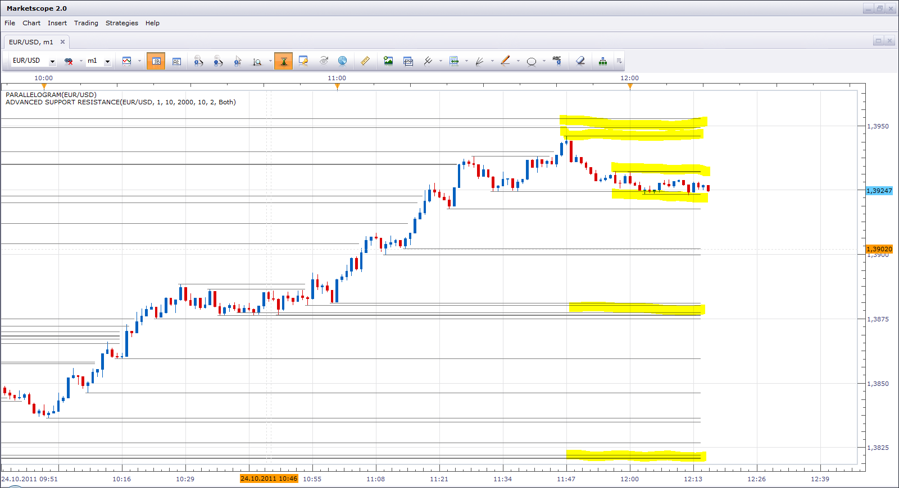
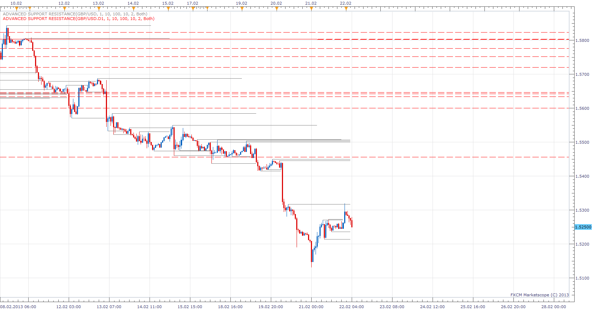
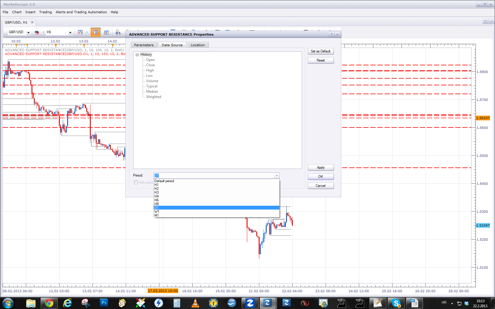

# Simple/Advanced Support/Resistance Levels

> Source: https://fxcodebase.com/code/viewtopic.php?f=17&t=7511  
> Forum: 17 · Topic 7511 · 33 post(s)

---

## Simple/Advanced Support/Resistance Levels

**Apprentice** · Sat Oct 22, 2011 2:36 pm

Algorithm
Define the minimum number of confirmed extremes.
Define the width of the zone, within which to seek extremes (in pips)
Find Max and Min in the defined period.

Draw the line if the confirmation number is greater than the minimum number.

This is a conceptual indicator.
The advanced version is under development.

 [Simple SupportResistance.lua](files/16674/Simple%20SupportResistance.lua)

The indicator was revised and updated

---

## Re: Simple Support/Resistance

**Apprentice** · Sun Oct 23, 2011 10:55 am

Parameters walk through
"Min You Qualified"
Minimum number of in Zone rejections for registration of a level

"Min Length"
Minimum Length of line

"Max Length"
Maximum Length of line

 "Zone width (in Pips)"
Zone width from Fractal

"Fractal"
Number of consecutive higher highs for Down Fractal
Number of consecutive lower lows for Up Fractal

 "Search for " "Both"/ "Support" / "Resistance"
Show "Support" or "Resistance" or "Both".

 [Advanced Support Resistance.bin](files/16705/Advanced%20Support%20Resistance.bin)

With bin file extension you can work the same way as you used to with lua.

---

## Re: Simple/Advanced Support/Resistance Levels

**Apprentice** · Sun Oct 23, 2011 12:47 pm

Final version added.
Further Improvements are possible.
I'm thinking about some additional functionality.
Suggestions are welcome.

---

## Re: Simple/Advanced Support/Resistance Levels

**Apprentice** · Mon Oct 24, 2011 11:30 am

Here I have indicated possible zones of resistance and support.
The zone is stronger if it is confirmed by multiple lines.

---

## Re: Simple/Advanced Support/Resistance Levels

**Miroslav** · Sun Oct 30, 2011 11:50 am

Thank you for very useful indicator! I use S/R zones for my trading. Every weekend I draw these zones in to the graph for next week. This indicator is very helpful for me.

I think that would be interesting add sound alarm. For example if price move across the S/R line .

Thank you, Mirek

---

## Re: Simple/Advanced Support/Resistance Levels

**Apprentice** · Sun Oct 30, 2011 5:25 pm

I have added more options to the advanced version.
First, tolerance.
It allows tolerating a certain number of candles outside of area.
Second, given the choice between Body / Wick as line break triggers.

---

## Re: Simple/Advanced Support/Resistance Levels

**TraderKen** · Mon Oct 31, 2011 2:52 am

Hi Apprentice,
Thank you for this useful indicator.
I have a small suggestion. When several support/resistance lines stay close together (in a small range like 10 pips, for example), all these lines will automatically combine to form a blurred zone on the chart. It also helps avoid a lot of lines in such a small area.

And if the current candle stays higher than that zone, the zone will have a green color. On the contrary, if the current candle stays below that area, the color of the zone will be red. If this function is too complicated to code, please feel free to dismiss.

Best regards,
Ken

---

## Re: Simple/Advanced Support/Resistance Levels

**Miroslav** · Sun Nov 20, 2011 4:43 pm

Indicator Advanced Support Resistance.bin doesn't work in new version of platform

---

## Re: Simple/Advanced Support/Resistance Levels

**Apprentice** · Sun Nov 20, 2011 5:53 pm

I am aware of that fact.
Tomorrow I will try to find time to update all .Bin indicators

---

## Re: Simple/Advanced Support/Resistance Levels

**Apprentice** · Mon Nov 21, 2011 4:31 am

Bin file recompiled for new version of TS.

---

## Re: Simple/Advanced Support/Resistance Levels

**Greggs66** · Wed Nov 23, 2011 8:20 am

Hi Apprentice,

Thats great, exactly what I asked for! Thanks!
I have a further request though if possible... Would you be able to make it include re jection of zones so create Supply and Demand zones rather than specific Support and Resistance lines.

So for example it would create a variable zone (for example a 10 pip zone) in which there were 'x' number of re jections within that 10 pip zone. Rather than a specific point rejection. Do you understand what I mean?

A lot of the time bounces off S/R S/D areas are not exact, it would account for this

I tried to attach an FXCM snapshot to better explain, but it appears my computer skills are lacking

---

## Re: Simple/Advanced Support/Resistance Levels

**Apprentice** · Wed Nov 23, 2011 10:23 am

You can send it to my Privat Email.

---

## Re: Simple/Advanced Support/Resistance Levels

**Greggs66** · Wed Nov 23, 2011 11:35 am

Sent

---

## Re: Simple/Advanced Support/Resistance Levels

**Apprentice** · Thu Nov 24, 2011 2:57 am

And here it is.

 [Rejection.rar](files/18585/Rejection.rar)

---

## Re: Simple/Advanced Support/Resistance Levels

**Tumster** · Wed Jan 25, 2012 12:53 pm

How do we use these with the trading station ?

Dont they have to be .lua ?

---

## Re: Simple/Advanced Support/Resistance Levels

**Apprentice** · Wed Jan 25, 2012 6:11 pm

You can use both extensions in the same way.
The only difference.
. Bin is encrypted .Lua.

---

## Re: Simple/Advanced Support/Resistance Levels

**Tumster** · Thu Jan 26, 2012 9:48 am

ok great thanks

---

## Re: Simple/Advanced Support/Resistance Levels

**crmbak** · Wed Mar 07, 2012 6:51 am

I would like to ask if it possible to have a strategy or a signal or alert
for simple support/resistance when it crosses or touches.
thank you
crmbak

---

## Re: Simple/Advanced Support/Resistance Levels

**Apprentice** · Thu Mar 08, 2012 6:31 am

Your request is added to the development list.

---

## Re: Simple/Advanced Support/Resistance Levels

**nuhocodebase** · Mon Feb 18, 2013 4:26 pm

Hello,
Is it possible to see the legend when the chart is on a black background
Thank you for your response
nuho

---

## Re: Simple/Advanced Support/Resistance Levels

**Apprentice** · Wed Feb 20, 2013 5:34 am

Legend color is now customizable.

---

## Re: Simple/Advanced Support/Resistance Levels

**nuhocodebase** · Wed Feb 20, 2013 3:01 pm

Thank you for the legend customizable and speed of response.
is it also possible to have the values ​​of top and bottom lines on this legend.

nuho

---

## Re: Simple/Advanced Support/Resistance Levels

**taroblaro** · Thu Feb 21, 2013 11:20 pm

This is a very basic question, but I suppose I must ask it. If I have 2 charts with 2 different time frames, and if I put an indicator (specifically this one) on the higher time frame, is there a way to make the lines from the indicator on the higher time frame show up on the lower time frame?

---

## Re: Simple/Advanced Support/Resistance Levels

**Apprentice** · Fri Feb 22, 2013 5:34 am

On this chart I have bort H1 and D1 on same Charts.

 

For higher time frame, u have to select the desired time frame.
U have to select desired time frame source, for indicator.

---

## Re: Simple/Advanced Support/Resistance Levels

**Captain** · Tue Feb 26, 2013 1:02 pm

Dear Apprentice,

Could you please, if possible, add in this indicator the possibility to draw as well the upper and lower trend-lines (support/resistance) for up-trending and down-trending equidistant channels?

Thanks in advance.
Captain

---

## Re: Simple/Advanced Support/Resistance Levels

**Apprentice** · Wed Feb 27, 2013 10:57 am

This equidistant channel.
How it will be calculated.

---

## Re: Simple/Advanced Support/Resistance Levels

**Captain** · Thu Feb 28, 2013 9:03 am

Apprentice, if you are going to use FXCM’s default equidistant channel, possibly by:

If ascending channel:
Find the lowest low and next higher low from the lower limit (supporting trendline) and highest high from the upper limit (resistance) with option expend line end.

If descending channel:
Find the highest high and next lower high from the upper limit (resisting trendline) and lowest low from the lower limit (support) with option expend line end.

It would be perfect if you could always keep 2 channels on chart the same time that is, the channel broke and the “possible” new channel.
Thanks in advance,
Captain

---

## Re: Simple/Advanced Support/Resistance Levels

**Apprentice** · Fri Mar 01, 2013 5:38 am

Can you post a link for FXCM’s default equidistant channel.

I'm not sure I know it under that name.
I can try to recreate it according your description.

---

## Re: Simple/Advanced Support/Resistance Levels

**Captain** · Mon Mar 04, 2013 7:19 am

Apprentice, I meant Marketscope's equidistant channels, mistakenly said FXCM's.

Nevertheless, I have 2 screenshots, 1 for channel selection from menu and 1 with channel applied on chart...

If is faster to do it otherwise, please do so...

Thanks for advance,
Captain

---

## Re: Simple/Advanced Support/Resistance Levels

**Apprentice** · Tue Mar 05, 2013 6:55 am

Something like this.
[viewtopic.php?f=17&t=548&p=958&hilit=Channel#p958](https://fxcodebase.com/code/viewtopic.php?f=17&t=548&p=958&hilit=Channel#p958)
We have a problem here.
Which algorithm to choose for this indicator.
Equidistant channels are drawn by user/hand.
Witt try to come up with something.

---

## Re: Simple/Advanced Support/Resistance Levels

**Captain** · Wed Mar 06, 2013 12:46 pm

Apprentice, maybe this can do the work if you can add the upper limit for uptrend and lower limit for downtrend in parallel.
[http://www.fxcodebase.com/code/viewtopic.php?f=17&t=2467](http://www.fxcodebase.com/code/viewtopic.php?f=17&t=2467)
The upper limit and lower is drawn by finding one higher high (upper) and one for lower low (down).

If it still cant be done, that's ok please don't mind
Thanks in advance,
Captain

---

## Re: Simple/Advanced Support/Resistance Levels

**elpresidente** · Thu Mar 28, 2013 7:17 pm

This is exactly what I have been looking for minus one thing, that I was curious if you could incorporate into it.

A full heat map that is on the chart itself, where it colors the chart completely red except and fades from darker greens to lighter greens as it gets close to the S/R lines.

Example of what im talking about included, unfortunately i had to color this in paint shop

[http://s1130.photobucket.com/user/Elpre ... p.png.html](http://s1130.photobucket.com/user/Elpresidente2012/media/temp.png.html)

---

## Re: Simple/Advanced Support/Resistance Levels

**Apprentice** · Wed May 10, 2017 5:41 am

Indicator was revised and updated.
