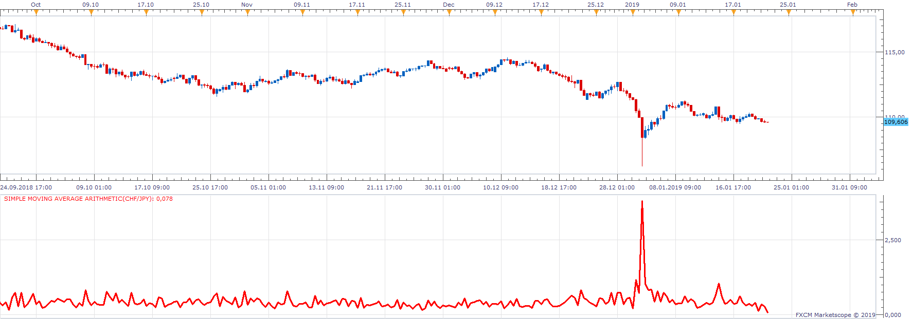

# Simple moving average arithmetic

> Source: https://fxcodebase.com/code/viewtopic.php?f=17&t=67290  
> Forum: 17 · Topic 67290 · 2 post(s)

---

## Simple moving average arithmetic

**Apprentice** · Tue Jan 22, 2019 10:58 am

Price - MA
Calculated as MA(1) of Close - MA(X) of Close

 

High-Low
Calculated as MA(1) of High - MA(1) of Low
For first intermediate value
 "0", "1+2", "1-2" "1" , "2", "0-1" , "0-2");
0-Zero
1.1. MA
1.2. MA

For second intermediate value
 "0", "1+2", "1-2" "1" , "2", "0-1" , "0-2");
0-Zero
2.1. MA
2.2. MA

For final value
 "1+2", "1-2" "1" , "2", "0-1" , "0-2");
0-Zero
1. intermediate value
2. intermediate value

 [Simple moving average arithmetic.lua](files/123487/Simple%20moving%20average%20arithmetic.lua)

For advanced valculation please use Indicator Arithmetic.bin.

 

The following syntax is allowed.
Number + MVA(Period1, Price1) + MVA(Period2, Price2) -MVA(Period3, Price3)

 [Indicator Arithmetic.bin](files/123487/Indicator%20Arithmetic.bin)

---

## Re: Simple moving average arithmetic

**Apprentice** · Sat Feb 16, 2019 3:54 am

Indicator Arithmetic.bin. added.
