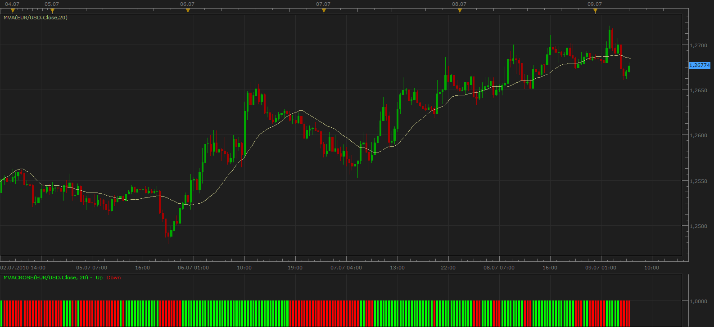
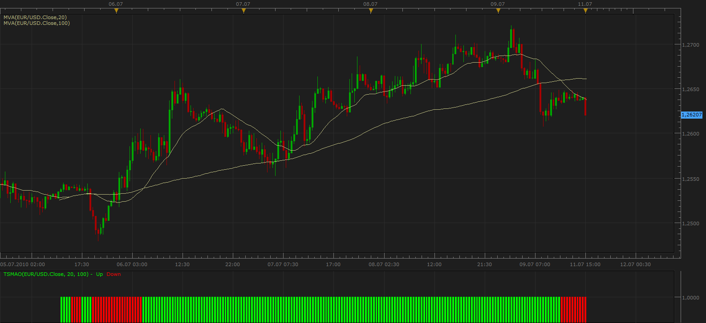
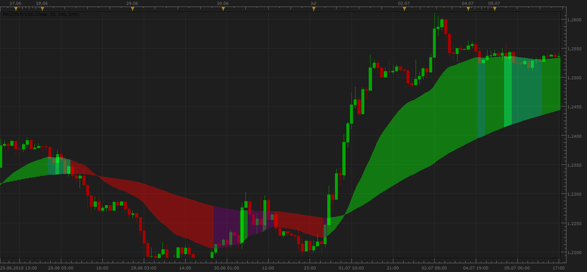

# Simple Moving Average Oscillator

> Source: https://fxcodebase.com/code/viewtopic.php?f=17&t=1479  
> Forum: 17 · Topic 1479 · 14 post(s)

---

## Simple Moving Average Oscillator

**Apprentice** · Fri Jul 09, 2010 5:46 am

This oscillator is an example of how you can write a simple indicator.
Tells you when the price is above or below the moving average.

 [SMO.lua](files/2894/SMO.lua)

Original post, How to, Cook Book can be found here.
[http://fxcodebase.com/code/viewtopic.php?f=18&t=1478](https://fxcodebase.com/code/viewtopic.php?f=18&t=1478)

---

## Re: Simple Moving Average Oscillator

**VictorFX** · Fri Jul 09, 2010 8:42 am

Thank you , It's great oscillator, im using 20 SMA its helps alot this oscilator.

---

## Re: Simple Moving Average Oscillator

**zekelogan** · Sun Jul 11, 2010 4:31 am

Can anyone tell me how I would be able to edit this so the indicator shows whether one MVA is above or below another MVA? E.G. 20MVA is above or below the 100MVA.

I'm going to read the how-to and attempt this later today, so a head start would be great!

Thanks!

---

## Re: Simple Moving Average Oscillator

**Apprentice** · Sun Jul 11, 2010 2:19 pm

An example of an oscillator based on two moving averages.

The differences between these two indicators are minimal, when I find time I'll describe the differences.

 [TMAO.lua](files/2924/TMAO.lua)

---

## Re: Simple Moving Average Oscillator

**zekelogan** · Sun Jul 11, 2010 2:58 pm

Thanks Apprentice!

---

## Re: Simple Moving Average Oscillator

**jsi@jp** · Mon Jul 19, 2010 9:16 am

Thank you very much for this Oscillator.

Can a Indicator Version be done ?
Please look at image file.

---

## Re: Simple Moving Average Oscillator

**Apprentice** · Mon Jul 19, 2010 10:28 am

The task is not difficult. Give me a few days (2,3).
I am on vacation until the end of the week.
So we do not have much time to work these days.

---

## Re: Simple Moving Average Oscillator

**Apprentice** · Fri Jul 23, 2010 4:51 pm

This is the first version, I hope I hit the meaning of your request.

It is possible to add two additional clouds.
But that complicates things a bit.
In essence this is the continuation of the previous clouds of the same dynamics.

However, if you will insist, I can add them.

 [MAC.lua](files/3089/MAC.lua)

---

## Re: Simple Moving Average Oscillator

**jsi@jp** · Mon Jul 26, 2010 7:40 am

Really thank you very much Apprentice
This indicator is very good

---

## Re: Simple Moving Average Oscillator

**mrlnb2016** · Fri Aug 12, 2016 3:39 pm

Dear Apprentice，

Is it possible to display the distance between the current price and current MVA in the candles below?

Thanks a lot for the help.

---

## Re: Simple Moving Average Oscillator

**Apprentice** · Sun Aug 14, 2016 3:49 am

According to this formula?
Distance = Price - MA

---

## Re: Simple Moving Average Oscillator

**mrlnb2016** · Tue Aug 16, 2016 2:10 am

Yes it is. Distance = Price - MVA

---

## Re: Simple Moving Average Oscillator

**Apprentice** · Tue Aug 16, 2016 4:31 am

Try this version.
[viewtopic.php?f=17&t=61337&hilit=moving+average](https://fxcodebase.com/code/viewtopic.php?f=17&t=61337&hilit=moving+average)

---

## Re: Simple Moving Average Oscillator

**Apprentice** · Tue Sep 18, 2018 7:01 am

The indicator was revised and updated.
