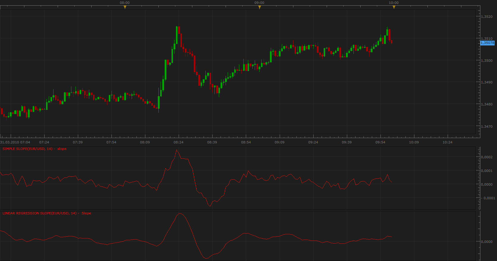

# Simple Slope, Linear Regression Slope

> Source: https://fxcodebase.com/code/viewtopic.php?f=17&t=547  
> Forum: 17 · Topic 547 · 16 post(s)

---

## Simple Slope, Linear Regression Slope

**Apprentice** · Wed Mar 31, 2010 9:18 am

*Slope*

Bar Version

 [Simple Slope.lua](files/957/Simple%20Slope.lua)

 [Linear Regression Slope.lua](files/957/Linear%20Regression%20Slope.lua)

Tick Versions

 [LRS.lua](files/957/LRS.lua)

 [SS.lua](files/957/SS.lua)

The indicator was revised and updated

---

## Re: Simple Slope, Linear Regression Slope

**michaelwen** · Thu Apr 01, 2010 12:05 am

yes, it is works this time. thanks a lots!

---

## Re: Simple Slope, Linear Regression Slope

**Sub7th** · Tue Jul 19, 2011 1:39 am

hi Apprentice

The Linear regression slope needs a MA of the indicator itself to act as a signal line. This signal line could be chosen by the trader of his choice. either 5, 10 or whatever periods. Can you add this option to your indicator ?

Also I am looking for something similar to be added over RSI.

Thank you in advance.

---

## Re: Simple Slope, Linear Regression Slope

**Apprentice** · Tue Jul 19, 2011 4:42 am

I will take this request under consideration.
However, we can not add this addon for every indicator.
Users can easily apply a moving average of their choice.

---

## Re: Simple Slope, Linear Regression Slope

**rhodia16** · Tue Jul 19, 2011 6:39 am

> **Sub7th wrote:**
> hi Apprentice
>
> The Linear regression slope needs a MA of the indicator itself to act as a signal line. This signal line could be chosen by the trader of his choice. either 5, 10 or whatever periods. Can you add this option to your indicator ?
>
> Also I am looking for something similar to be added over RSI.
>
> Thank you in advance.

Hi Sub7th,

If you use the indicator called "Averages" that is downloadable from this site, what is your intending is probably possible.

In "Averages", choose "zeroLagEMA" as the Method, set the period to 3, and in the Data Source tab, choose the line of your interest of the indicator (e.g. Linear Regression Slope or RSI) already loaded. ColorMode and Style options are up to your preference. This can, in most cases, add colours to lines of indicators and oscillators. You become able to change colours depending on the direction of the line (e.g. lines can be green when ascending and red when descending etc.).

If you use "EMA" or whatever instead of "zerolagEMA", you can have a signal line of your preference quite flexibly.

If my understanding of your intention is wrong, I am sorry. I only hope this helps!

Rhodia

---

## Re: Simple Slope, Linear Regression Slope

**Sub7th** · Tue Sep 20, 2011 3:37 pm

Thanks Rhodia,

Sorry I didn't see your reply except now. I thought this forum sends a notification when a reply is posted, And yes this is what I wanted.

I needed to ask what is the difference between Linear regression slope and simple slope. I mean as inner calculation structure or main idea.

Also FXCM platform is missing a lot of tools. Such as Fibonacci projection and Andrew's pitchfork extra parallel rays to its upper and lower boundaries. Is there a way for traders to download such tools for the platform?

Thank again to everyone.
K. Zaben

---

## Re: Simple Slope, Linear Regression Slope

**Apprentice** · Wed Sep 21, 2011 1:20 am

Linear regression slope and simple slope using a different approach.

Simple slope takes into account the difference between the current period and the period of n periods ago.
Linear regression attempts to adjust the slope, regression line, so that best fits all the data points in the same perodu.

---

## Re: Simple Slope, Linear Regression Slope

**Sub7th** · Wed Sep 21, 2011 4:07 am

Hi Apprentice,

So I understand that simple slope compares linear value of today to linear value of n-periods ago. Because it sounds like momentum indicator except that momentum = close price (today) - close price (n-periods ago) . Is this true?

I am interested in your work, so forgive me for my questions.

Thanks for your quick response.
K. Zaben

---

## Re: Simple Slope, Linear Regression Slope

**Apprentice** · Wed Sep 21, 2011 8:11 am

Something like it, but not quite.
slope=(close[period]-source.close[period-frame])/(period-(period-frame));

---

## Re: Simple Slope, Linear Regression Slope

**Sub7th** · Wed Sep 21, 2011 9:07 am

Thanks Apprentice.

---

## Re: Simple Slope, Linear Regression Slope

**fxadam** · Wed Aug 22, 2012 6:34 am

Hi,

I am looking for alert/strategy based on Linear Regression Slope:
buy when LRS cross above zero
sell when LRS cross below zero

Also I am looking for alert/strategy based on cross two LRS
buy when short LRS cross above long LRS
sell when short LRS cross below long LRS.

Anybody can create it for me, please,
Thank you.
Adam

---

## Re: Simple Slope, Linear Regression Slope

**Apprentice** · Thu Aug 23, 2012 6:28 am

Requested can be found here.
[viewtopic.php?f=31&t=22664&p=39097#p39097](https://fxcodebase.com/code/viewtopic.php?f=31&t=22664&p=39097#p39097)

---

## Re: Simple Slope, Linear Regression Slope

**Apprentice** · Fri May 06, 2016 5:03 am

Bump Up.

---

## Re: Simple Slope, Linear Regression Slope

**Markism** · Mon Jun 13, 2016 8:18 am

Hello!

First thanks for all the work you put in.

I have searched throughout this forum but couldn't find what I am looking for.

I am using the linear regression slope indicator, however I need it to support multiple periods on the same indicator. I would need to plot up to 4 periods all within the same indicator. having 4 separate indicators takes up too much space off the chart.

Your help is much appreciated.

---

## Re: Simple Slope, Linear Regression Slope

**Apprentice** · Tue Jun 14, 2016 2:39 am

You can add four instances on this indicator.

---

## Re: Simple Slope, Linear Regression Slope

**Apprentice** · Wed Apr 26, 2017 11:27 am

Indicator was revised and updated.
