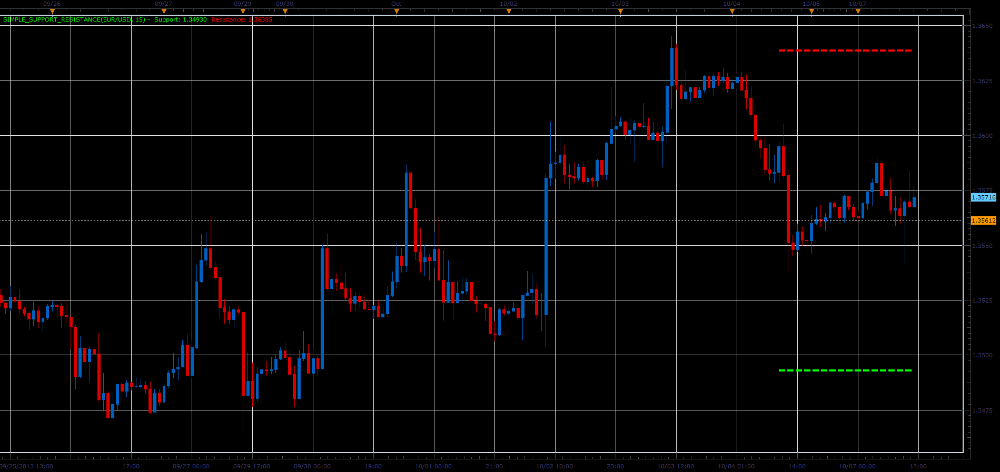

# Simple Support/Resistance indicator

> Source: https://fxcodebase.com/code/viewtopic.php?f=17&t=59640  
> Forum: 17 · Topic 59640 · 2 post(s)

---

## Simple Support/Resistance indicator

**Alexander.Gettinger** · Wed Oct 09, 2013 6:02 pm

Formulas:
Support[i] = 2*Min-Max,
Resistance[i] = 2*Max-Min, where
Max, Min - maximum and minimum prices at range from (i-Length) to (i-1).

 

Download:

 [Simple_Support_Resistance.lua](files/89932/Simple_Support_Resistance.lua)

The indicator was revised and updated

---

## Re: Simple Support/Resistance indicator

**Apprentice** · Mon Jun 12, 2017 6:09 am

The indicator was revised and updated.
