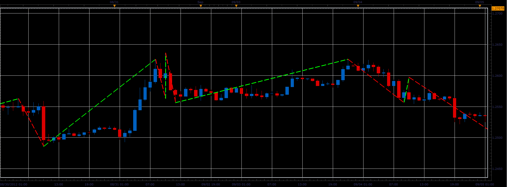
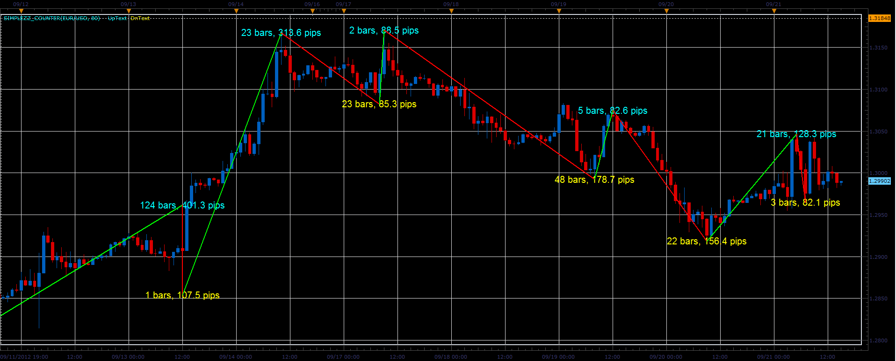
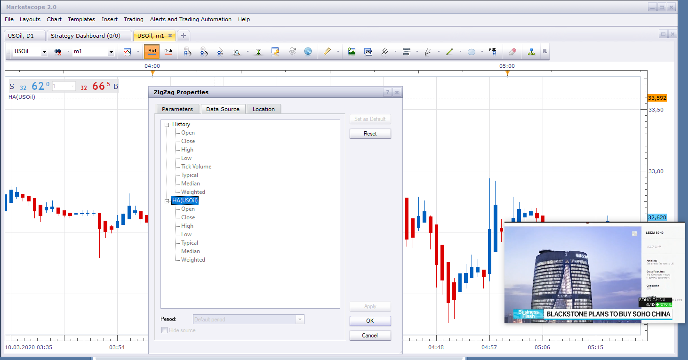

# Simple ZigZag

> Source: https://fxcodebase.com/code/viewtopic.php?f=17&t=23386  
> Forum: 17 · Topic 23386 · 27 post(s)

---

## Simple ZigZag

**Alexander.Gettinger** · Thu Sep 13, 2012 4:10 pm

Simple ZigZag with one parameter (the minimum distance from the peak in pips or percentage).

 

Download:

 [SimpleZZ.lua](files/40246/SimpleZZ.lua)

 [SimpleZZ_Counter tick.lua](files/40246/SimpleZZ_Counter%20tick.lua)

---

## Re: Simple ZigZag

**nazaar** · Mon Sep 17, 2012 4:04 pm

Hello,

could you add the option to count the # of bars that make up each up and down lines?

thanks.

---

## Re: Simple ZigZag

**Apprentice** · Tue Sep 18, 2012 1:50 am

Your request is added to the development list.

---

## Re: Simple ZigZag

**nsaale** · Tue Sep 18, 2012 11:46 am

Apprentice, can you please make a zigzag that doesn't repaint?

Is it already available?

---

## Re: Simple ZigZag

**Alexander.Gettinger** · Tue Sep 18, 2012 4:49 pm

> **nsaale wrote:**
> Apprentice, can you please make a zigzag that doesn't repaint?
>
> Is it already available?

Yes, It is available.

---

## Re: Simple ZigZag

**nsaale** · Wed Sep 19, 2012 2:58 am

PLease offer me a link to where I can find the zigzag which does not repaint.

---

## Re: Simple ZigZag

**Alexander.Gettinger** · Wed Sep 19, 2012 1:10 pm

> **nsaale wrote:**
> PLease offer me a link to where I can find the zigzag which does not repaint.

This is the regular ZigZag indicator without the last branch.

---

## Re: Simple ZigZag

**Alexander.Gettinger** · Fri Sep 21, 2012 2:21 pm

Simple ZigZag with bar and pips counter.

 

Download:

 [SimpleZZ_Counter.lua](files/40712/SimpleZZ_Counter.lua)

---

## Re: Simple ZigZag

**Apprentice** · Wed Apr 12, 2017 6:09 am

Indicator was revised and updated.

---

## Re: Simple ZigZag

**Gilles** · Fri Feb 28, 2020 5:02 am

Hi,

Please a simpleZZ_counter for ticks

thank you :)
See you soon.

---

## Re: Simple ZigZag

**Apprentice** · Fri Feb 28, 2020 5:51 am

Tick Volume from the previous top/bottom?

Your request is added to the development list.
Development reference 787.

---

## Re: Simple ZigZag

**Gilles** · Fri Feb 28, 2020 5:53 am

Hi Apprentice,

No, juste a core.tick version of simpleZZ_counter please.

thank you :)

---

## Re: Simple ZigZag

**Gilles** · Sat Feb 29, 2020 7:35 am

Apprentice, I'm thinking more of a core.Tick version with the ability to choose the PRICE source (open, high, low, close). Thank you very much Apprentice.

---

## Re: Simple ZigZag

**Apprentice** · Mon Mar 02, 2020 2:12 pm

SimpleZZ_Counter tick.lua added.

---

## Re: Simple ZigZag

**Gilles** · Tue Mar 10, 2020 3:42 am

Hi Apprentice,

Please a simple ZigZag version with the Heikin-Ashi source.

Thank you :)!
See you soon :)!

---

## Re: Simple ZigZag

**Apprentice** · Tue Mar 10, 2020 5:32 am

Your request is added to the development list.
Development reference 846.

---

## Re: Simple ZigZag

**Apprentice** · Tue Mar 10, 2020 6:09 am

You can put any indicator on HA. No coding required.

 

Do you have any reason to have this version?

---

## Re: Simple ZigZag

**Gilles** · Tue Mar 10, 2020 6:13 am

I know that is possible Apprentice, but i want use it in strategy but i can't.

I obtain an error "index is out of range".

Can you help me…

ZZ = core.indicators:create("ZigZag", HA.close, 12, 5, 3);
Error : "Specified index is out of range".

Thank you

---

## Re: Simple ZigZag

**Gilles** · Tue Mar 10, 2020 6:23 am

I think I've found it.
if I write ZZ. DATA[HA], it's got to go :) ?
i try it now

---

## Re: Simple ZigZag

**Gilles** · Tue Mar 10, 2020 10:15 am

Hi Apprentice,

Can we apply the simple_ZigZag to another source?

For example: MVA 20, HA or other.

I ask this question, because I cannot do it in a strategy.

I always encounter an error message.

See you soon.

---

## Re: Simple ZigZag

**Apprentice** · Tue Mar 10, 2020 12:13 pm

Your request is added to the development list.
Development reference 849.

---

## Re: Simple ZigZag

**Apprentice** · Wed Mar 11, 2020 4:46 am

[Heikin-Ashi ZigZag.lua](files/131866/Heikin-Ashi%20ZigZag.lua)

 [Strategy Example.lua](files/131866/Strategy%20Example.lua)

These additions will work on the bar source.
We can do tick / MVA / single line source, values will vary.

---

## Re: Simple ZigZag

**Gilles** · Mon Mar 16, 2020 10:26 am

Hi Apprentice,

Please, could you propose a simple ZZ adaptation with the MVA 20 periods source?
I'm getting mistakes on my side.
Thank you very much :).

---

## Re: Simple ZigZag

**Apprentice** · Mon Mar 16, 2020 1:51 pm

20 period MVA based Simple ZigZag?

---

## Re: Simple ZigZag

**Gilles** · Mon Mar 16, 2020 3:15 pm

Hi Apprentice,

Yes, the simple_ZigZag calculated on a simple moving average of 20 periods, please :)

Thank you.

---

## Re: Simple ZigZag

**Apprentice** · Tue Mar 17, 2020 11:34 am

Your request is added to the development list.
Development reference 887.

---

## Re: Simple ZigZag

**Apprentice** · Wed Mar 18, 2020 4:55 am

Try this version.
[viewtopic.php?f=17&t=69545](https://fxcodebase.com/code/viewtopic.php?f=17&t=69545)
