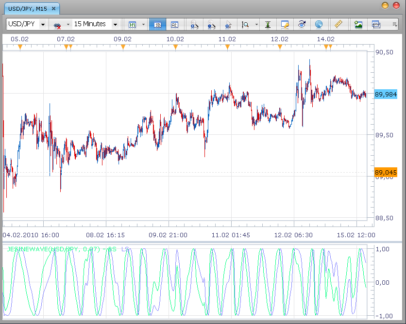

# Sine Wave Indicator by John Ehlers

> Source: https://fxcodebase.com/code/viewtopic.php?f=17&t=349  
> Forum: 17 · Topic 349 · 4 post(s)

---

## Sine Wave Indicator by John Ehlers

**Nikolay.Gekht** · Mon Feb 15, 2010 11:37 am

> **John Ehlers in Cybernetic analysis for stock and futures wrote:**
> Compared to conventional oscillators such as the Stochastic or RSI, the Sinewave Indicator has two major advantages:
> * The Sinewave Indicator anticipates the Cycle Mode turning point rather than waiting for confirmation
> * The phases does not advance when the market is in a trend mode. Therefore the Sinewave Indicator does not tend to give false whipsaw signals when the market is in a Trend Mode.

 

Note: The indicator results notable depends on the historical data, so, when more history is downloaded, the indicator output will changed.

This version of the indicator is a port of the original Easy Language version written by Dave Newberg and published at [Dave's site](http://www.davenewberg.com/Trading/TS_Code/Ehlers_Indicators/SineWave_Ind.html)

Download:

 [JESineWave.lua](files/586/JESineWave.lua)

The indicator was revised and updated

---

## Re: Sine Wave Indicator by John Ehlers

**Apprentice** · Mon Dec 26, 2016 7:15 am

Indicator was revised and updated.

---

## Re: Sine Wave Indicator by John Ehlers

**cash4u** · Tue Jan 03, 2017 1:30 pm

HI ,

MAY I REQUEST A STRATEGY BASED ON THIS INDICATOR;

INDICATOR PARAMETER;

**ALPHA;0.07**

**BUY LEVEL: -0.5
SELL LEVEL:0.5**

BUY: BS CROSS OVER LS AND BS < BUY LEVEL
SELL : BS CROSS UNDER LS AND BS > SELL LEVEL

---

## Re: Sine Wave Indicator by John Ehlers

**Apprentice** · Sat Jan 07, 2017 9:20 am

Try this version.
[viewtopic.php?f=31&t=64272](https://fxcodebase.com/code/viewtopic.php?f=31&t=64272)
