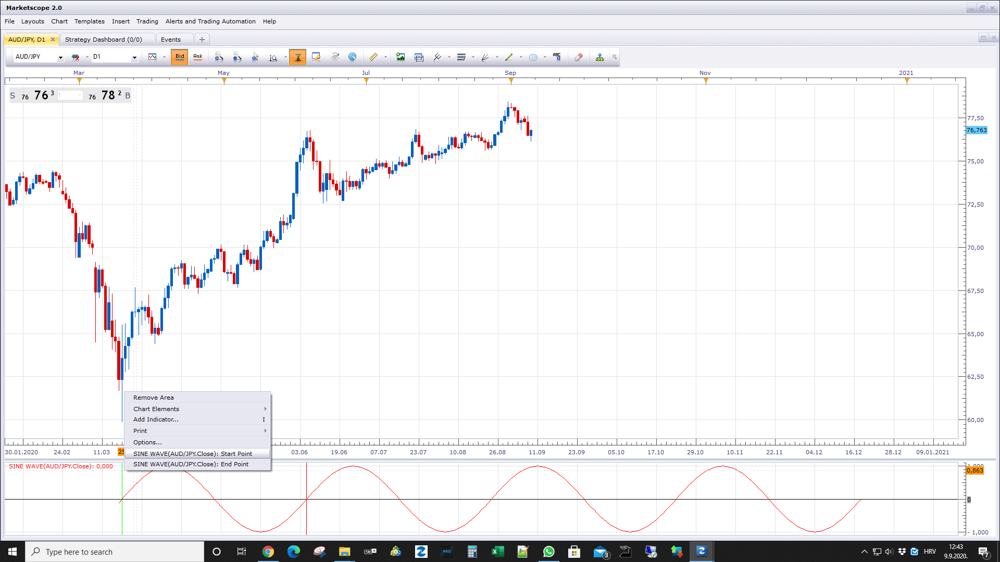

# Sine wave

> Source: https://fxcodebase.com/code/viewtopic.php?f=17&t=70412  
> Forum: 17 · Topic 70412 · 2 post(s)

---

## Sine wave

**Apprentice** · Wed Sep 09, 2020 5:44 am

 

Based on request.
[viewtopic.php?f=27&t=70410](https://fxcodebase.com/code/viewtopic.php?f=27&t=70410)

 [Sine wave.lua](files/137472/Sine%20wave.lua)

 [Sine wave Indictor.lua](files/137472/Sine%20wave%20Indictor.lua)

---

## MCP Cosine wave

**Apprentice** · Tue Jun 29, 2021 10:01 am

While Cosine wave.lua is stand alone indicator.

 [Cosine wave.lua](files/142636/Cosine%20wave.lua)

MCP Cosine wave.lua will allow you to first define up to three cosine lines,
and then display them.

 [MCP Cosine wave.lua](files/142636/MCP%20Cosine%20wave.lua)
