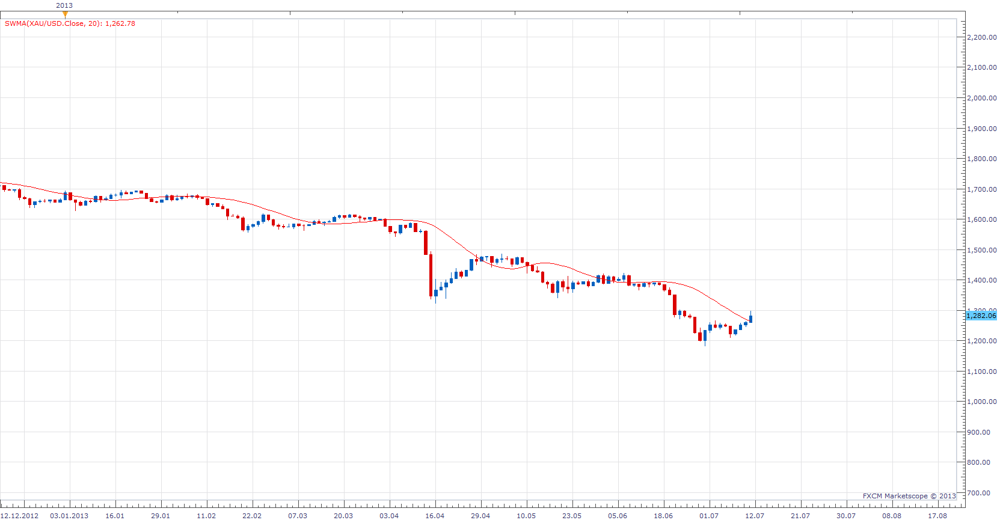

# Sine-Weighted Moving Average

> Source: https://fxcodebase.com/code/viewtopic.php?f=17&t=49601  
> Forum: 17 · Topic 49601 · 3 post(s)

---

## Sine-Weighted Moving Average

**Apprentice** · Thu Jul 11, 2013 6:30 am

SineWMA[i]=Sum/Weight, where
Sum=Price[i-N+1]*sin(PI*(N)/(N+1))+Price[i-N+2]*sin(PI*(N-1)/(N+1))+…+Price[i]*sin(PI*1/(N+1))
Weight= sin(PI*(N)/(N+1))+ sin(PI*(N-1)/(N+1))+…+ sin(PI*1/(N+1)).

 [SWMA.lua](files/76654/SWMA.lua)

---

## Re: Sine-Weighted Moving Average

**Alexander.Gettinger** · Thu Aug 29, 2013 11:10 am

MQL4 version of Sine-Weighted Moving Average: [http://www.fxcodebase.com/code/viewtopi ... 38&t=59353](http://www.fxcodebase.com/code/viewtopic.php?f=38&t=59353).

---

## Re: Sine-Weighted Moving Average

**Apprentice** · Fri Jun 22, 2018 8:28 am

The indicator was revised and updated.
