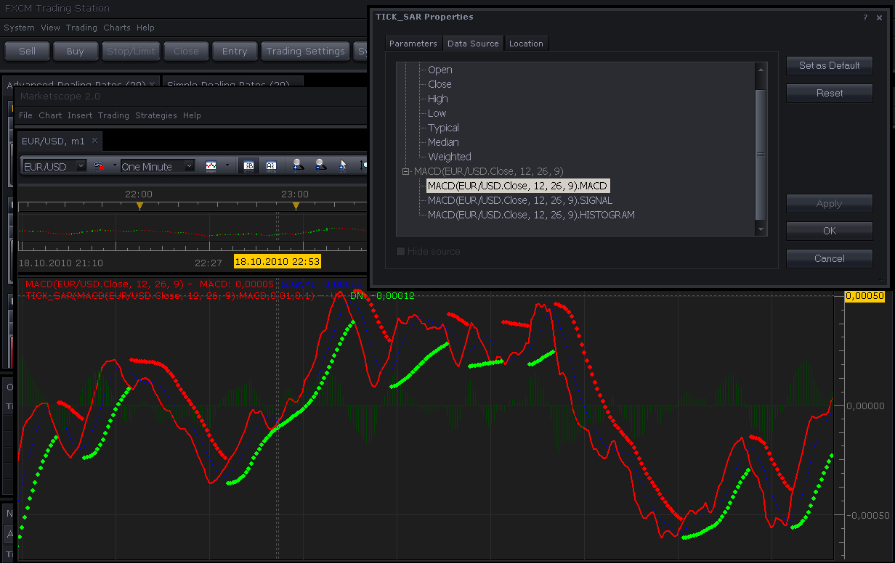

# Single price based version of SAR

> Source: https://fxcodebase.com/code/viewtopic.php?f=17&t=2450  
> Forum: 17 · Topic 2450 · 9 post(s)

---

## Single price based version of SAR

**Nikolay.Gekht** · Mon Oct 18, 2010 9:37 pm

This is the usual SAR indicator which can be applied on single price sources, for example on close price only or on the results of another indicator. This indicator can be very useful for the strategies such as described by the following link: [http://forex-strategies-revealed.com/system-2sarstogo](http://forex-strategies-revealed.com/system-2sarstogo)
This strategy proposes to apply SAR on MACD results. This is not possible with the regular SAR because it requires the whole bar to be calculated. In such cases use presented tick_sar indicator instead, just choose the price or indicator you want apply SAR to on the source tab of the indicator properties. Please see an example of SAR indicator applied on MACD results.

 

(click on image to enlarge)

Download the indicator:

 [tick_sar.lua](files/5320/tick_sar.lua)

 [tick_sar with alert.lua](files/5320/tick_sar%20with%20alert.lua)

---

## Re: Single price based version of SAR

**sai2k4** · Sun Jan 23, 2011 7:31 pm

I love this indicator, but is it possible to add a feature of a sound alert when it change side?

thanks

---

## Re: Single price based version of SAR

**Apprentice** · Mon Jun 13, 2011 11:56 am

Requested can be found here.
[viewtopic.php?f=31&t=4727](https://fxcodebase.com/code/viewtopic.php?f=31&t=4727)

---

## Re: Single price based version of SAR

**[email protected]** · Sun May 29, 2016 9:14 am

Hi, Can you please include an alert for this indicator. the previous link [url]viewtopic.php?f=31&t=4727[/url] is a strategy apparently. a standard alert indicator is much more convenient. Thanks!

---

## Re: Single price based version of SAR

**Apprentice** · Mon May 30, 2016 2:17 pm

tick_sar with alert.lua added

---

## Re: Single price based version of SAR

**[email protected]** · Mon May 30, 2016 11:07 pm

HI,
Thanks for creating the indicator but i got this error message when i tried to add it. please take a look at it and let me know how to fix it. Thanks!

---

## Re: Single price based version of SAR

**Apprentice** · Wed Jun 01, 2016 3:43 am

Try it now.

---

## Re: Single price based version of SAR

**[email protected]** · Wed Jun 01, 2016 4:29 am

Thanks for the update

---

## Re: Single price based version of SAR

**Apprentice** · Mon Sep 03, 2018 8:11 am

The indicator was revised and updated.
