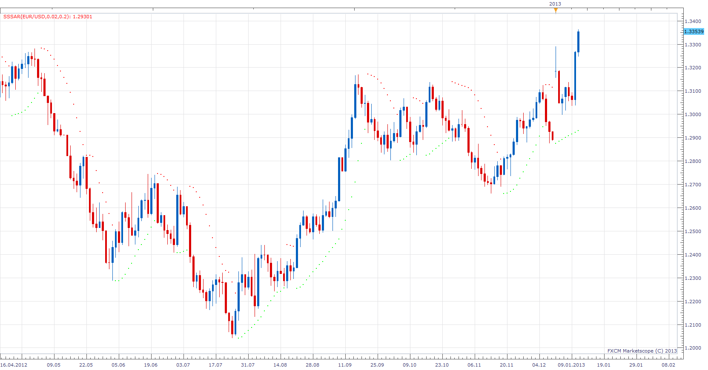

# Single Stream SAR

> Source: https://fxcodebase.com/code/viewtopic.php?f=17&t=29613  
> Forum: 17 · Topic 29613 · 16 post(s)

---

## Single Stream SAR

**Apprentice** · Fri Jan 11, 2013 1:15 pm

This version of the SAR Indicators, unlike the standard SAR, which has two, has only one output stream.

 [SSSAR.lua](files/51254/SSSAR.lua)

---

## Re: Single Stream SAR

**oisin12** · Wed May 15, 2013 2:17 pm

Hi,

Any chance you have an automated strategy for MarketScope on FXCM Trade Station II using this single stream SAR

I have a Canadian based account

No hedging required

Only one position open at a time

4 hour chart

Long: When SSSAR closes green.
Ability to set stop and limit in pips
Close if stop or limit is hit or if SSSAR closes red

Short: When SSSAR closes red
Ability to set stop and limit in pips
Close if stop or limit is hit or if SSSAR closes green

---

## Re: Single Stream SAR

**Apprentice** · Fri May 17, 2013 4:58 am

Your request is added to the development list.

---

## Re: Single Stream SAR

**Apprentice** · Wed May 22, 2013 9:48 am

Please Try this version.
[viewtopic.php?f=31&t=11912&hilit=sar](https://fxcodebase.com/code/viewtopic.php?f=31&t=11912&hilit=sar)

---

## Re: Single Stream SAR

**oisin12** · Thu May 23, 2013 7:38 pm

Thanks, I'll try it out

---

## Re: Single Stream SAR

**tradingboy** · Fri Jul 19, 2013 3:30 am

I'm a newbie, What 's the difference between one stream and two stream ? Thanks

---

## Re: Single Stream SAR

**Apprentice** · Fri Jul 19, 2013 1:31 pm

The values ​​are same.
However, can not use two stream version
as a source of data for some calculations.
Like moving average of SAR and so on.

---

## Re: Single Stream SAR

**Alexander.Gettinger** · Wed Aug 14, 2013 3:13 pm

MQL4 version of Single Stream SAR: [http://www.fxcodebase.com/code/viewtopi ... 38&t=59131](http://www.fxcodebase.com/code/viewtopic.php?f=38&t=59131).

---

## Re: Single Stream SAR

**Panther** · Tue Jan 21, 2014 2:02 pm

Could you make it so the standard SAR will work on a tick chart? Thanks

---

## Re: Single Stream SAR

**Apprentice** · Wed Jan 22, 2014 10:14 am

U can use this version.
[viewtopic.php?f=17&t=2450&p=5320&hilit=tick+sar#p5320](https://fxcodebase.com/code/viewtopic.php?f=17&t=2450&p=5320&hilit=tick+sar#p5320)

---

## Re: Single Stream SAR

**Apprentice** · Tue Oct 07, 2014 11:14 am

Update.

---

## Re: Single Stream SAR

**Apprentice** · Sun Apr 12, 2015 5:12 am

Bump Up.

---

## Re: Single Stream SAR

**spanizh_fly** · Wed Jun 03, 2015 6:50 am

impressed with the Single stream SAR,
but is it possible to have like an alert
when the signal changes. It will be very helpful.

---

## Re: Single Stream SAR

**Apprentice** · Sun Jun 07, 2015 3:58 am

There is no difference between Single Stream SAR and SAR Standard.
U can use this strategy.
[viewtopic.php?f=31&t=11912&hilit=sar](https://fxcodebase.com/code/viewtopic.php?f=31&t=11912&hilit=sar)

Make sure to set to Allow trading to No

---

## Re: Single Stream SAR

**spanizh_fly** · Wed Jun 10, 2015 12:09 pm

Thanks for the suggestion, appreciate it

---

## Re: Single Stream SAR

**Apprentice** · Mon Oct 29, 2018 7:17 am

The indicator was revised and updated.
