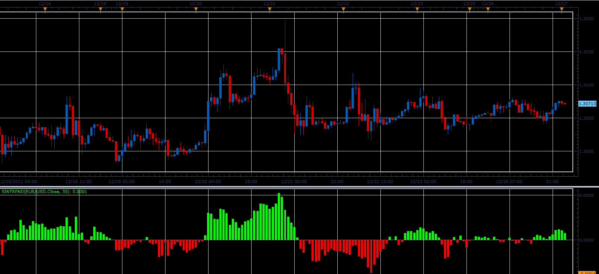

# SinTrend oscillator

> Source: https://fxcodebase.com/code/viewtopic.php?f=17&t=10495  
> Forum: 17 · Topic 10495 · 3 post(s)

---

## SinTrend oscillator

**Alexander.Gettinger** · Tue Dec 27, 2011 1:23 am

This indicator is a ported MQL5 indicator from [http://www.mql5.com/ru/code/778](http://www.mql5.com/ru/code/778) (in Russian).

Formula:
SinTrend[i]=Sin((Price[i]-Price[i-Period])/Period).

 

Download:

 [SinTrend.lua](files/21750/SinTrend.lua)

The indicator was revised and updated

---

## Re: SinTrend oscillator

**Alexander.Gettinger** · Fri Dec 30, 2011 2:09 am

Strategy based on SinTrend indicator: [viewtopic.php?f=31&t=10686](https://fxcodebase.com/code/viewtopic.php?f=31&t=10686)

---

## Re: SinTrend oscillator

**Apprentice** · Mon Mar 20, 2017 8:12 am

Indicator was revised and updated.
