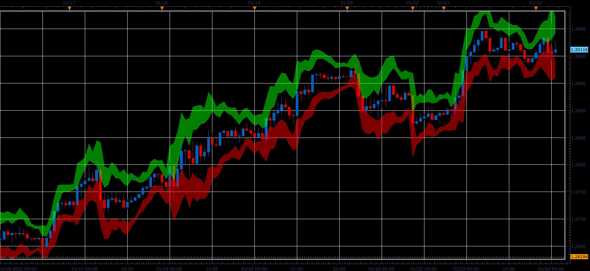

# SL_ATR indicator

> Source: https://fxcodebase.com/code/viewtopic.php?f=17&t=12228  
> Forum: 17 · Topic 12228 · 2 post(s)

---

## SL_ATR indicator

**Alexander.Gettinger** · Tue Jan 24, 2012 5:40 am

This indicator is a ported MQL5 indicator from [http://www.mql5.com/en/code/706](http://www.mql5.com/en/code/706)

Formulas:
Upper band (High+K*ATR, Low+K*ATR),
Lower band (High-K*ATR, Low-K*ATR).

 

Download:

 [SL_ATR.lua](files/24217/SL_ATR.lua)

The indicator was revised and updated

---

## Re: SL_ATR indicator

**Apprentice** · Thu Mar 23, 2017 2:59 pm

Indicator was revised and updated.
