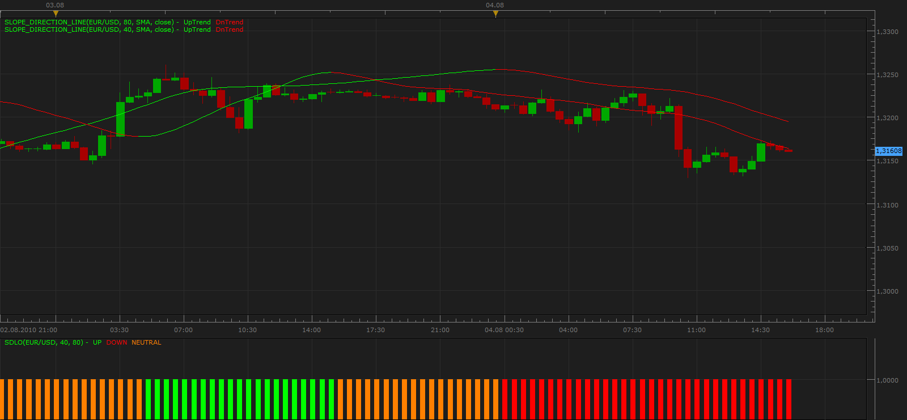

# Slope direction line oscillator

> Source: https://fxcodebase.com/code/viewtopic.php?f=17&t=1670  
> Forum: 17 · Topic 1670 · 17 post(s)

---

## Slope direction line oscillator

**Apprentice** · Thu Aug 05, 2010 4:36 am

**UP**
Both lines grow

**DOWN**
Both lines fall.

**NEUTRAL**
Lines do not confirm each other.

 [Slope direction line oscillator.lua](files/3325/Slope%20direction%20line%20oscillator.lua)

 [SDLO.lua](files/3325/SDLO.lua)

To work you need to have new version of Slope direction line indicator.
[http://fxcodebase.com/code/viewtopic.php?f=17&t=949&start=0&hilit=Slope+Direction](https://fxcodebase.com/code/viewtopic.php?f=17&t=949&start=0&hilit=Slope+Direction)

MT4/MQ4 version.
[viewtopic.php?f=38&t=64217](https://fxcodebase.com/code/viewtopic.php?f=38&t=64217)

The indicator was revised and updated

---

## Re: Slope direction line oscillator

**gcardo** · Fri Aug 06, 2010 2:33 pm

Hi Apprentice

I believe this indicator has a bug, because I don't get any down signal, even if the asset is melting down.

Thanks,

Gustavo

---

## Re: Slope direction line oscillator

**Apprentice** · Fri Aug 06, 2010 3:53 pm

Cause your problem is probably what you have an old version of Slope_Direction_Line indicator.
Try to install the new version of that indicators, I hope this will eliminate your problem.

[http://fxcodebase.com/code/viewtopic.php?f=17&t=949&start=0&hilit=Slope+Direction](https://fxcodebase.com/code/viewtopic.php?f=17&t=949&start=0&hilit=Slope+Direction)

---

## Re: Slope direction line oscillator

**gcardo** · Fri Aug 06, 2010 3:58 pm

Worked

Thanks!

---

## Re: Slope direction line oscillator

**Apprentice** · Fri Aug 06, 2010 4:11 pm

I'm glad I could help.
I am a bit guilty, I needed to emphasize that.

---

## Re: Slope direction line oscillator

**sedraude** · Mon Oct 25, 2010 2:39 am

Hi Apprentice,

Can you make average indicator (20 in 1) ([http://fxcodebase.com/code/viewtopic.php?f=17&t=2430)](https://fxcodebase.com/code/viewtopic.php?f=17&t=2430)) like slope direction line oscilator, too?

Thank in advance

---

## Re: Slope direction line oscillator

**Apprentice** · Wed Nov 10, 2010 5:49 am

Added to developmental cue.

---

## Re: Slope direction line oscillator

**Apprentice** · Wed Nov 10, 2010 6:09 am

20 in 1 (Avereges) Version From your request

 [SDO_20in1.lua](files/5982/SDO_20in1.lua)

---

## Re: Slope direction line oscillator

**sedraude** · Wed Nov 10, 2010 8:00 am

> **Apprentice wrote:**
> 20 in 1 (Avereges) Version From your request
>
>
> SDO_20in1.lua

Hi Apprentice,

Great work and thank you for your nice indi

---

## Re: Slope direction line oscillator

**DS0167** · Wed Nov 10, 2010 6:09 pm

Hello Apprentice,

I installed SDO_20in1 without any problem and it works very well but while trying install the SDLO I get the error message

"string "SDLO.lua" 118 Expected near"

any Idea what the reason of this? (in case you ask, YES I have installed the last Slope Direction Line and it works very well also.

Thanks in advance for your help.

Kind regards
DS0167

---

## Re: Slope direction line oscillator

**Apprentice** · Wed Nov 10, 2010 8:09 pm

I have a pretty good idea.
Arrogance.
Changing the code, without, debugging, a few dots, it lacked.

---

## Re: Slope direction line oscillator

**DS0167** · Wed Nov 10, 2010 8:14 pm

So you will debug it Because I just have no idea how to do it

 Kind regards
DS0167

---

## Re: Slope direction line oscillator

**Apprentice** · Thu Nov 11, 2010 3:43 am

I already have fix this bug.

---

## Re: Slope direction line oscillator

**DS0167** · Thu Nov 11, 2010 5:22 am

Big thank you, it works perfectly now

---

## Re: Slope direction line oscillator

**Apprentice** · Tue Jan 31, 2017 6:14 am

Indicator was revised and updated.

---

## Re: Oscillateur de ligne de direction de pente

**bruno2017** · Wed Dec 09, 2020 1:29 pm

Hello
I have a problem :
the oscillator is very small by clicking on "logarithmic scale" it is a little bigger it is difficult for the vision

---

## Re: Slope direction line oscillator

**Apprentice** · Thu Dec 10, 2020 5:32 am

Can you specify the exact indicator name?
