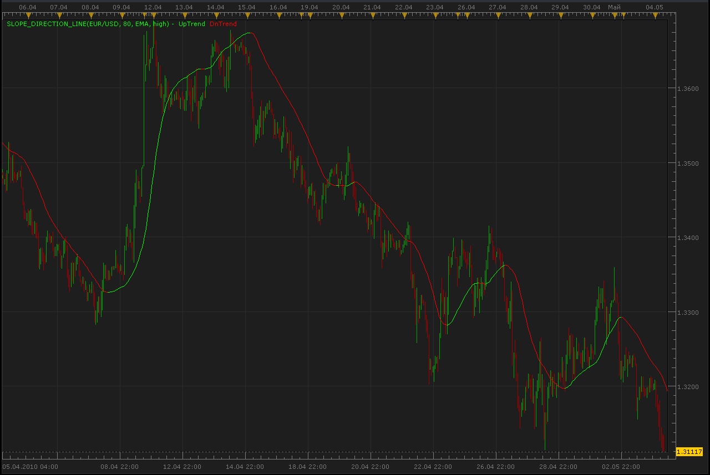
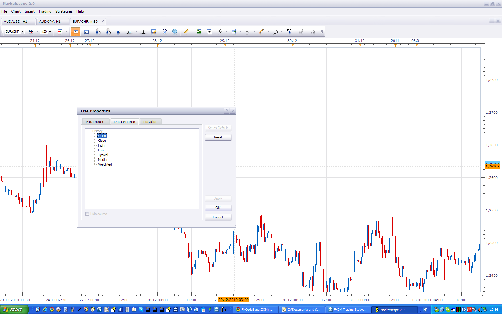

# Slope Direction Line

> Source: https://fxcodebase.com/code/viewtopic.php?f=17&t=949  
> Forum: 17 · Topic 949 · 33 post(s)

---

## Slope Direction Line

**Alexander.Gettinger** · Tue May 04, 2010 11:38 am

 [Slope_Direction_Line.lua](files/1738/Slope_Direction_Line.lua)

 

 [Averages Slope_Direction_Line.lua](files/1738/Averages%20Slope_Direction_Line.lua)

---

## Re: Slope Direction Line (Update)

**Apprentice** · Wed Jul 14, 2010 7:15 am

Update

Corrected some bugs.
I've added some new functionality.

---

## Re: Slope Direction Line (Update)

**Alexander.Gettinger** · Mon Oct 04, 2010 10:05 pm

[Slope_Direction_Line.lua](files/5007/Slope_Direction_Line.lua)

Update indicator.
Added other moving average methods and other prices for calculation.

 [Slope_Direction_Line with Alert.lua](files/5007/Slope_Direction_Line%20with%20Alert.lua)

---

## Re: Slope Direction Line (Update)

**sai2k4** · Mon Dec 06, 2010 5:26 am

Is it possible to code it to use the whole Bar instead of using Tick in the data source?

---

## Re: Slope Direction Line (Update)

**Apprentice** · Mon Dec 06, 2010 6:28 am

I do not understand what the problem is.

Possibility of using individual tick data for me is an advantage.
One of the reasons why, MA indicators used, use, tick data source.

Would you perhaps like, implement in which selection of data sources is within the indicators.

---

## Re: Slope Direction Line (Update)

**sai2k4** · Mon Dec 06, 2010 7:22 am

because sometimes SDL repaint pretty badly even on 1hr chart. so i was thinking, will it be better to use end of each Bar to calualate instead of using Tick.

---

## Re: Slope Direction Line (Update)

**Apprentice** · Mon Dec 06, 2010 8:00 am

Now I understand, it is possible

---

## Re: Slope Direction Line (Update)

**sai2k4** · Mon Dec 06, 2010 8:19 am

great. if this could be done, could you also code this indictor the same using end of Bar to calulate?
[http://fxcodebase.com/code/viewtopic.php?f=17&t=2450&p=5320&hilit=tick+sar#p5320](https://fxcodebase.com/code/viewtopic.php?f=17&t=2450&p=5320&hilit=tick+sar#p5320)

thanks

---

## Re: Slope Direction Line (Update)

**sai2k4** · Mon Dec 06, 2010 10:26 am

should i submit a new request in the indicator request page for this?
thanks

---

## Re: Slope Direction Line (Update)

**Apprentice** · Mon Dec 06, 2010 12:36 pm

No you request is in cue.

---

## Re: Slope Direction Line (Update)

**nyfx00** · Mon Jan 03, 2011 10:33 pm

Hi,

is there any update on this? i would also like to try this indicator caluate in Bars instead of ticks.

thanks.

---

## Re: Slope Direction Line (Update)

**Apprentice** · Tue Jan 04, 2011 4:59 am

Each Tick-based indicator can applied to the bar chart.

 

Just select the Bar Chart component you want to apply to the indicator.

Bar Based chart can not be apply to Tick Based chart.

---

## Re: Slope Direction Line (Update)

**jackfx09** · Wed Sep 14, 2011 12:55 pm

Could I please ask that we have the option to change the thickness of the SDL lines (like what is offered for Averages). I like the idea of giving shorter time frames a value of one and the largest time frame a five, so that the stronger trend shows up thicker and implies great "resistance".

Thanks.

sjc

---

## Re: Slope Direction Line (Update)

**Apprentice** · Thu Sep 15, 2011 4:39 am

Your request is added to the developmental cue.

---

## Re: Slope Direction Line (Update)

**Alexander.Gettinger** · Wed Sep 21, 2011 11:01 am

> **jackfx09 wrote:**
> Could I please ask that we have the option to change the thickness of the SDL lines (like what is offered for Averages). I like the idea of giving shorter time frames a value of one and the largest time frame a five, so that the stronger trend shows up thicker and implies great "resistance".

Please, see this version of indicator:

 [Slope_Direction_Line.lua](files/15244/Slope_Direction_Line.lua)

---

## Re: Slope Direction Line (Update)

**Coondawg71** · Wed Sep 21, 2011 2:44 pm

Thank You Sir!

sjc

---

## hi

**arindam89** · Mon Dec 19, 2011 4:22 am

hi Alexander.Gettinger
good job keep it up this is a good indicator
can this indicator be made into a strategy it would work great if it would work like this
1.buy when line turns green and
2.sell when line turns red
can you code this it would work great
thanks
by
arindam

---

## Re: Slope Direction Line (Update)

**Apprentice** · Mon Dec 19, 2011 4:54 am

Can you test Averages Strategy, I believe it has all the elements that you asked for.
[viewtopic.php?f=31&t=3859&p=15600&hilit=Slope#p15600](https://fxcodebase.com/code/viewtopic.php?f=31&t=3859&p=15600&hilit=Slope#p15600)

---

## Re: Slope Direction Line (Update)

**Poupouille** · Sun Jan 08, 2012 10:34 am

Is't possible to obtain a strategy for this indicator ?
tyvm

---

## Re: Slope Direction Line (Update)

**Apprentice** · Sun Jan 08, 2012 4:48 pm

This strategy should suit your needs.
[viewtopic.php?f=31&t=3859&p=9454&hilit=Slope#p9454](https://fxcodebase.com/code/viewtopic.php?f=31&t=3859&p=9454&hilit=Slope#p9454)

---

## Re: Slope Direction Line (Update)

**cersoz** · Sat Apr 26, 2014 12:02 am

anyone can add line thhickness/style options to this indicator

---

## Re: Slope Direction Line (Update)

**Apprentice** · Sat Apr 26, 2014 8:10 am

Style Option Added.

---

## Re: Slope Direction Line (Update)

**adloule** · Thu Mar 24, 2016 6:31 am

hi,
could you please add alert when color change ?
thanks

---

## Re: Slope Direction Line (Update)

**Apprentice** · Fri Mar 25, 2016 3:57 am

Slope_Direction_Line with Alert.lua Added.

---

## Re: Slope Direction Line (Update)

**trdheat** · Fri Mar 25, 2016 8:30 am

I have question about the indicator (indicator in first post).

Is it repaint or not (the uptrend and dntrend component, single stream=no) for example after close hour candle for period=2 or another period ? I have observe for in action candle changes between two components, this is natural because the candle it is in action. But after close there are entries in components with same price and other entries with one price in component (uptrend) and nothing in other (dntrend) and vice versa

Furthermore, in table view there are empty entries for uptrend or dntrend, is it possible to change this to zero? I mean empty entry -> 0. I need that for export to excel.In excel there are too empty entries.

---

## Re: Slope Direction Line

**Apprentice** · Mon Mar 28, 2016 8:21 am

Will only repaint current bar, previous will not be affected.

As for the second issue, indicator is encoded at a time when only one line color was available.
We can write single stream indicator.

---

## Re: Slope Direction Line

**trdheat** · Mon Mar 28, 2016 1:05 pm

Apprentice, thank you for your reply.

I try solve the situtation with empty entries with a mva period = 1 per component. Now its ok, there are zeros instead empty entries.

My interesting is in components uptrend and dntrend. How about repaint in components?

Furthermore, i observe repaint (see the images). For period 2 and 3 there is repaint in components and in color of indicator.Ι left to run and after few minutes calculate again. I choose 1min data for fast test. If i choose open price for source, there is not repaint. Only for close, high, low, median, typical and weighted there is problem.

I assume (if not repaint case) the problem is the platform. Maybe if after each close the bar recalculate the indicator, the problem solved. What do you think?

As i said, my interesting is in components. Is it possible fix the problem of repaint?

---

## Re: Slope Direction Line

**trdheat** · Mon Mar 28, 2016 2:25 pm

There is a mistake about images, sorry. But you can see only the components of period = 2. There is two same in period = 3, two dntrend.

---

## Re: Slope Direction Line

**Apprentice** · Tue Mar 29, 2016 2:59 am

Interests, did you try to set Single Stream yes.

---

## Re: Slope Direction Line

**trdheat** · Tue Mar 29, 2016 3:45 am

No repaint in single stream yes, only for single stream no.

I'm in interesting for components. Is there exist repaint in principale (i mean in code) for components?

Assumed no repaint code. As i said, maybe the auto recalculate the indicator for each hour (for example in case of 1 hour data source) solve the problem. Is it possible this modification?

In general, what do you thing?

---

## Re: Slope Direction Line

**Apprentice** · Wed Mar 30, 2016 6:05 am

If a single stream is used, no repaint will occur.
It is possible if the dual stream is used.

---

## Re: Slope Direction Line

**Apprentice** · Sun Sep 23, 2018 7:10 am

The indicator was revised and updated.

---

## Re: Slope Direction Line

**Apprentice** · Tue Jan 30, 2024 1:13 pm

Averages Slope_Direction_Line.lua added.
