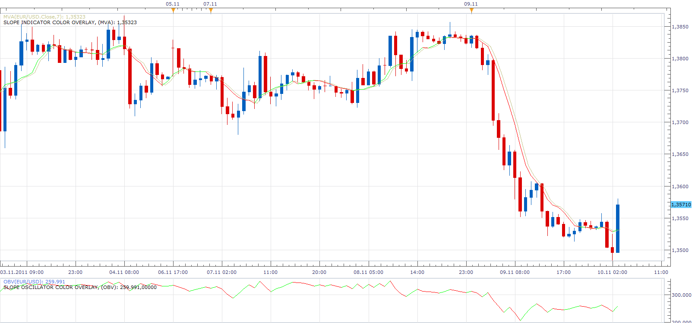

# Slope Indicator/Oscillator Color Overlay

> Source: https://fxcodebase.com/code/viewtopic.php?f=17&t=8277  
> Forum: 17 · Topic 8277 · 8 post(s)

---

## Slope Indicator/Oscillator Color Overlay

**Apprentice** · Mon Nov 21, 2011 7:27 am

These indicators allows you to add color overlay to any indicator or oscillator.
The color changes depending on whether the indicator rises or falls.

 [Slope Indicator Color Overlay.lua](files/18318/Slope%20Indicator%20Color%20Overlay.lua)

 [Slope Oscillator Color Overlay.lua](files/18318/Slope%20Oscillator%20Color%20Overlay.lua)

The indicator was revised and updated

---

## Re: Slope Indicator/Oscillator Color Overlay

**turkuaz** · Thu Feb 09, 2012 3:26 am

dear Apprentice

 I have an urgent request from you.
 5 minutes
 XAU / USD
 COLOR OVERLAY SLOPE INDICATOR (ICH)

 Need to create a strategy for this indicator.
 To support this indicator
 SIMPLE SUPPORTRESISTANCE (XAU / USD, 20, 1, 10, Both)
 also add indicator.

 I want to do both of these in the strategy builder

indicator is not supported.Contact Apperentice on Fxcodebase.com

 error message displays.
 Emergency waiting your help.
 please

---

## Re: Slope Indicator/Oscillator Color Overlay

**Apprentice** · Thu Feb 09, 2012 6:34 am

Your request is added to the list of developers.

---

## Re: Slope Indicator/Oscillator Color Overlay

**turkuaz** · Sat Mar 10, 2012 9:45 am

Dear programmers

I think I found a strategy that provides 90% of success. This strategy will be very nice if you can play automatically.

Strategy study used three indicators.

1 - slope indicator color overlay (Ichimoku)
 TenkanSen Period 9
 KjunSen Period and the 26
 Senkou Span Period 52

2 - slope indicator color overlay (Ichimoku)
 TenkanSen Period 4
 KjunSen Period and the 13
 Senkou Span Period 26

3 - supertrend
 The number of Period 10
 The multiplier is 1.5

Buy:
4-13-26 slope indicator
9-26-52 slope indicator
stops to wait for a bottom-up
do with each other up the color of UP has interrupted supertrend
will begin processing

sell:

4-13-26 slope indicator
9-26-52 slope indicator
expected cuts from the top down
do with each other down the color of DN has interrupted supertrend
will begin processing

The strategy will position the beginning of each candle. As with the same HEIKEN_ASHISMOOTHED_N_BARS_STRATEGY.

If we want to make this strategy is guaranteed to use the BB signal.

BB signal
This strategy will begin to open positions with BB signal Break Break OUT IN will close all positions with

At the same time, HA (Heike Ashi) strategy for the warranty if we add is full.

BB signal and optionally the HA strategies can be used. Who do not want traders who want to use it may be used.
Because when we add them will be very little action.

Thank you in advance for your help.

---

## Re: Slope Indicator/Oscillator Color Overlay

**Apprentice** · Sun Mar 11, 2012 4:55 pm

Your request is added to the developmental list.

---

## Re: Slope Indicator/Oscillator Color Overlay

**mulligan** · Mon Jul 15, 2013 12:17 pm

Thanks for these wonderful tools. A small request when you have time. Could you change the color of the lettering in the legend to something other than black. For those of us that use the black background.

Thanks.

---

## Re: Slope Indicator/Oscillator Color Overlay

**Apprentice** · Wed Jul 17, 2013 3:53 am

Color Issue Fixed.

---

## Re: Slope Indicator/Oscillator Color Overlay

**Apprentice** · Thu Jun 01, 2017 10:29 am

Indicator was revised and updated.
