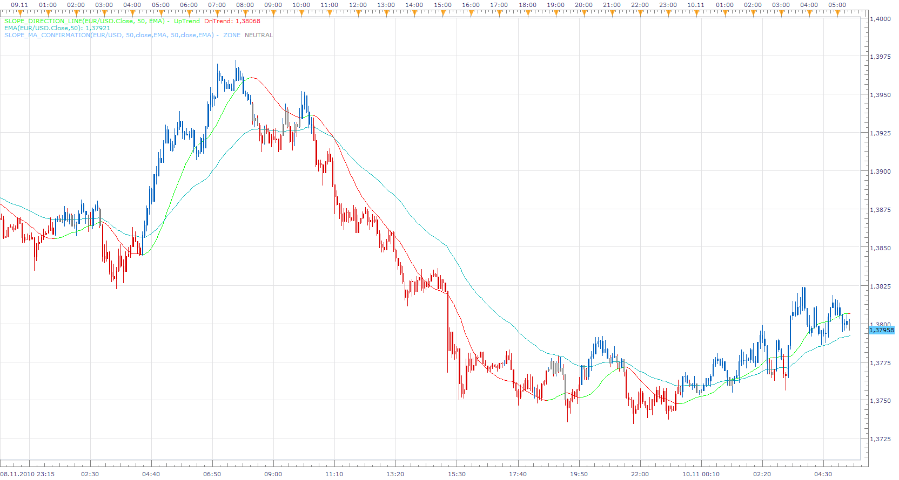

# Slope/MA Confirmation Indicator

> Source: https://fxcodebase.com/code/viewtopic.php?f=17&t=2648  
> Forum: 17 · Topic 2648 · 2 post(s)

---

## Slope/MA Confirmation Indicator

**Apprentice** · Wed Nov 10, 2010 5:30 am

The indicator shows when the SDL and MA are in harmony.

 [Slope_MA_Confirmation.lua](files/5979/Slope_MA_Confirmation.lua)

Please install the top of most version of Slope direction line, which can be found here.
[viewtopic.php?f=17&t=949&p=1738#p1738](https://fxcodebase.com/code/viewtopic.php?f=17&t=949&p=1738#p1738)

MT4/Mq4 version.
[viewtopic.php?f=38&t=64218](https://fxcodebase.com/code/viewtopic.php?f=38&t=64218)

---

## Re: Slope/MA Confirmation Indicator

**Apprentice** · Mon Feb 05, 2018 9:11 am

The Indicator was revised and updated.
