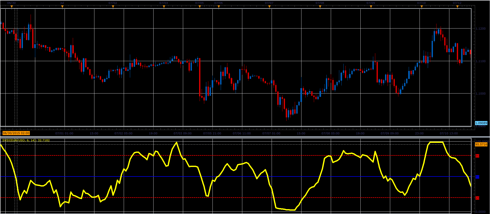

# Slow Volume Strength Index

> Source: https://fxcodebase.com/code/viewtopic.php?f=17&t=62451  
> Forum: 17 · Topic 62451 · 4 post(s)

---

## Slow Volume Strength Index

**Alexander.Gettinger** · Wed Jul 22, 2015 3:03 pm

This indicator has been described in the Stock&Commodities (August 2015).

 

Download:

 [SVSI.lua](files/101513/SVSI.lua)

The indicator was revised and updated

---

## Re: Slow Volume Strength Index

**Apprentice** · Tue Jul 04, 2017 9:43 am

The indicator was revised and updated.

---

## Re: Slow Volume Strength Index

**jaricarr** · Mon Jul 10, 2017 1:59 am

Hello Apprentice,

looks like the indicator line breaks up when it goes under level 20.

---

## Re: Slow Volume Strength Index

**Apprentice** · Mon Jul 10, 2017 3:42 pm

Dividing by zero.
Try it now.
