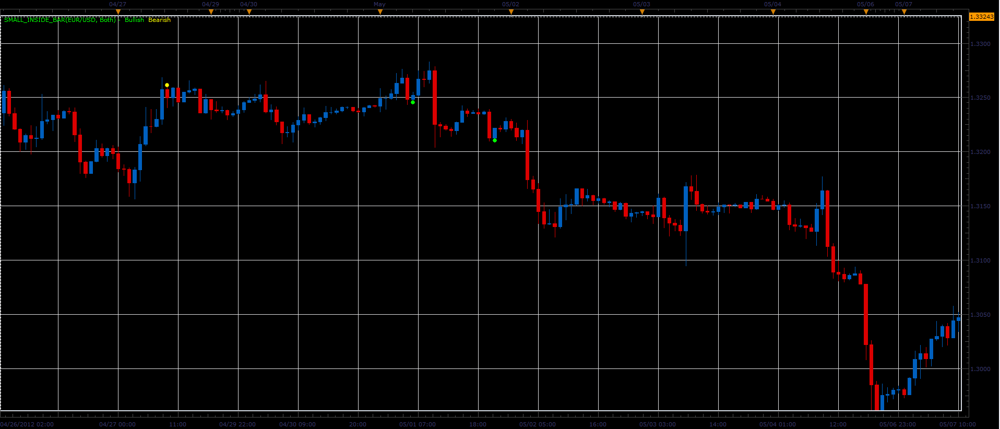

# Small inside bar

> Source: https://fxcodebase.com/code/viewtopic.php?f=17&t=18178  
> Forum: 17 · Topic 18178 · 4 post(s)

---

## Small inside bar

**Alexander.Gettinger** · Fri May 11, 2012 3:23 pm

Bullish small inside bar conditions:
1. High[i]<High[i-1],
2. Low[i]>Low[i-1],
3. (High[i-1]-Low[i-1])/(High[i]-Low[i]) >2,
4. Close[i]>Open[i],
5. High[i]<Median[i-1],
6. Close[i-1]<Open[i-1].

Bearish small inside bar conditions:
1. High[i]<High[i-1],
2. Low[i]>Low[i-1],
3. (High[i-1]-Low[i-1])/(High[i]-Low[i]) >2,
4. Close[i]<Open[i],
5. Low[i]<Median[i-1],
6. Close[i-1]>Open[i-1].

 

Download:

 [Small_Inside_Bar.lua](files/32808/Small_Inside_Bar.lua)

The indicator was revised and updated

---

## Re: Small inside bar

**Alexander.Gettinger** · Fri May 11, 2012 3:26 pm

MQL4 version of indicator: [viewtopic.php?f=38&t=18179](https://fxcodebase.com/code/viewtopic.php?f=38&t=18179)

---

## Re: Small inside bar

**Alexander.Gettinger** · Fri May 11, 2012 3:30 pm

Strategy based on Small inside indicator: [viewtopic.php?f=31&t=18180](https://fxcodebase.com/code/viewtopic.php?f=31&t=18180)

---

## Re: Small inside bar

**Apprentice** · Tue Apr 04, 2017 5:39 am

Indicator was revised and updated.
