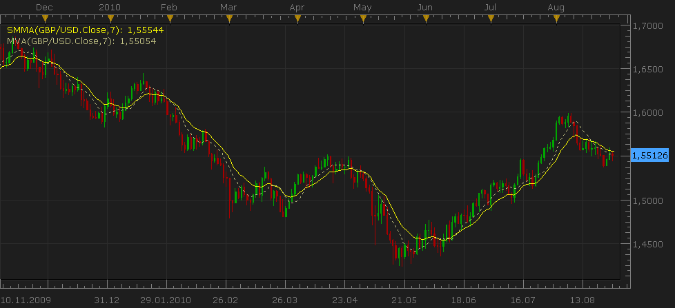

# SMMA - Smoothed Moving Average (SMMA) [Update Aug 27 2010]

> Source: https://fxcodebase.com/code/viewtopic.php?f=17&t=195  
> Forum: 17 · Topic 195 · 6 post(s)

---

## SMMA - Smoothed Moving Average (SMMA) [Update Aug 27 2010]

**Nikolay.Gekht** · Tue Dec 22, 2009 2:55 pm

**Update Aug 27 2010: The line style and width settings is supported**

**SMMA - Smoothed Moving Average (SMMA)**

Parameters:
n - number of periods for smoothing.

Formula:
SMMA(first) := SUM(source, for the last n) / n
SMMA(i) := (SMMA(i - 1) * N - SMMA(i - 1) + source(i)) / n

SMMA vs MVA on the chart:

 

Download the indicator

 [smma.lua](files/261/smma.lua)

The indicator was revised and updated

---

## Re: SMMA - Smoothed Moving Average (SMMA) [Update Aug 27 2010]

**Nikolay.Gekht** · Sat Aug 28, 2010 10:24 pm

Update Aug 27 2010: The line style and width settings is supported

---

## Re: SMMA - Smoothed Moving Average (SMMA) [Update Aug 27 2010]

**madpipa** · Sun Jul 17, 2011 9:15 pm

Hi Nikolay,

I think I may have found a problem with this indicator. If you place 2 indicators on a chart with the same period & data source ==> history of one set to OPEN, the other to CLOSE the 2 lines are identical. I have tried the same thing on MT4 & they show as 2 different lines that swap over each other as price reverses. This is what I would expect.

Thanks for the great work you & the team do. It is appreciated.
Cheers,
Mick

---

## Re: SMMA - Smoothed Moving Average (SMMA) [Update Aug 27 2010]

**sunshine** · Tue Jul 19, 2011 12:30 am

Hi Mick,

This is an issue with drawing of indicators. In the current version, indicators are drawn through the open and close part of the bar and open price of a bar is equal to the close price of the previous bar. That is why indicators on open and close look the same.

In the next version, indicators will be drawn through the center of the bar. Also we are going to make the open price of the bar equal to the first tick rather than the previous close price. This will solve the issue.

---

## Re: SMMA - Smoothed Moving Average (SMMA) [Update Aug 27 2010]

**madpipa** · Thu Jul 21, 2011 9:30 pm

Thanks Sunshine for the reply. Any idea when the next release may happen?

Cheers,
Mick

---

## Re: SMMA - Smoothed Moving Average (SMMA) [Update Aug 27 201

**Apprentice** · Thu Mar 16, 2017 5:33 am

Indicator was revised and updated.
