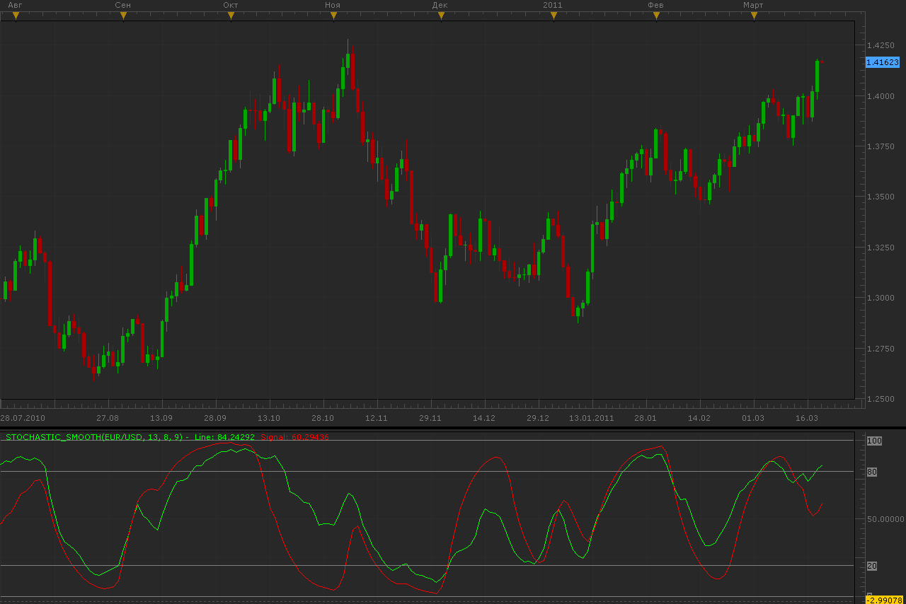

# Smooth stochastic indicator

> Source: https://fxcodebase.com/code/viewtopic.php?f=17&t=3685  
> Forum: 17 · Topic 3685 · 2 post(s)

---

## Smooth stochastic indicator

**Alexander.Gettinger** · Mon Mar 21, 2011 3:19 am

Indicator looks like traditional stochastic.

Formulas:
Line[i]=K*(St-Line[i-1])+Line[i-1],
Signal[i]=K2*(St2-Signal[i-1])+Signal[i-1], where
K=2/(1+[Slowing]),
K2=2/(1+[SignalSlowing]),
St=100*(close[i]-LowPrice)/(HighPrice-LowPrice),
LowPrice and HighPrice is a minimum and maximum prices at range from i-Period to i,
S2=100*(Line[i]-LowPrice2)/(HighPrice2-LowPrice2),
LowPrice2 and HighPrice2 is a minimum and maximum of Line at range from i-Period to i.

 

Download:

 [Stochastic_Smooth.lua](files/8917/Stochastic_Smooth.lua)

The indicator was revised and updated

---

## Re: Smooth stochastic indicator

**Apprentice** · Fri Mar 03, 2017 9:04 am

Indicator was revised and updated.
