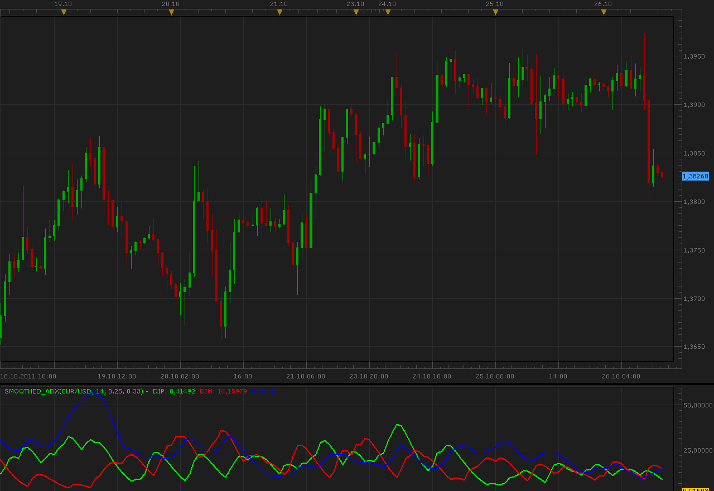
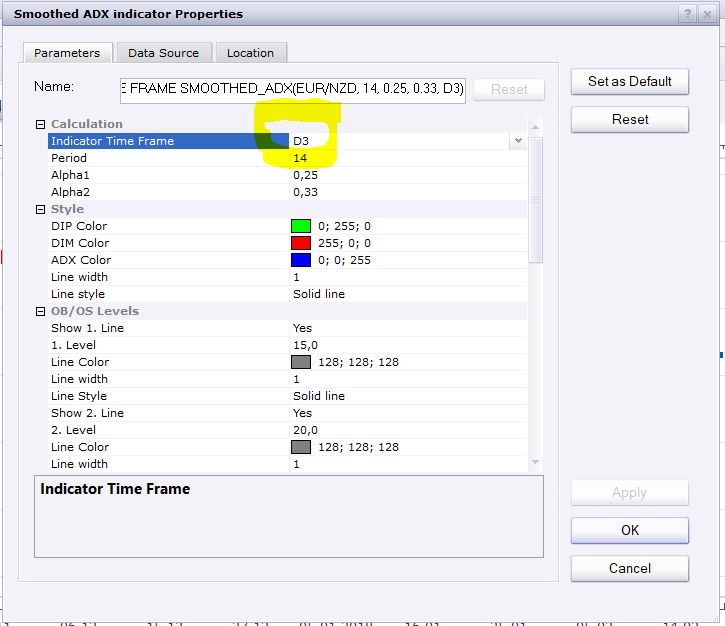

# Smoothed ADX indicator

> Source: https://fxcodebase.com/code/viewtopic.php?f=17&t=7635  
> Forum: 17 · Topic 7635 · 21 post(s)

---

## Smoothed ADX indicator

**Alexander.Gettinger** · Wed Oct 26, 2011 12:19 pm

This indicator is a ported MQL5 indicator from [http://www.mql5.com/ru/code/546](http://www.mql5.com/ru/code/546) (in Russian).

Formulas:
DIP[i]=Alpha2*DIP_Temp[i]+(1-Alpha2)*DIP[i-1],
DIM[i]=Alpha2*DIM_Temp[i]+(1-Alpha2)*DIM[i-1],
ADX[i]=Alpha2*ADX_Temp[i]+(1-Alpha2)*ADX[i-1], where
DIP_Temp[i]=2*DMI_P[i]+(Alpha1-2)*DMI_P[i-1]+(1-Alpha1)*DIP_Temp[i-1],
DIM_Temp[i]=2*DMI_M[i]+(Alpha1-2)*DMI_M[i-1]+(1-Alpha1)*DIM_Temp[i-1],
ADX_Temp[i]=2*ADX_I[i]+(Alpha1-2)*ADX_I[i-1]+(1-Alpha1)*ADX_Temp[i-1],
DMI_P, DMI_M - DMI+ and DMI-,
ADX_I - standard ADX indicator.

 

Download:

 [Smoothed_ADX.lua](files/16931/Smoothed_ADX.lua)

 [Other Time Frame Smoothed_ADX.lua](files/16931/Other%20Time%20Frame%20Smoothed_ADX.lua)

 [Custom Smoothed_ADX.lua](files/16931/Custom%20Smoothed_ADX.lua)

 

 [MTF MCP Custom Smoothed ADX Heat Map.lua](files/16931/MTF%20MCP%20Custom%20Smoothed%20ADX%20Heat%20Map.lua)

 [Smoothed_ADX Overlay.lua](files/16931/Smoothed_ADX%20Overlay.lua)

 [Smoothed_ADX Overlay with Alert.lua](files/16931/Smoothed_ADX%20Overlay%20with%20Alert.lua)

---

## Re: Smoothed ADX indicator

**Apprentice** · Sun Mar 19, 2017 10:33 am

Indicator was revised and updated.

---

## Re: Smoothed ADX indicator

**Apprentice** · Wed Sep 20, 2017 5:03 am

Custom Smoothed_ADX.lua added.

---

## Re: Smoothed ADX indicator

**Apprentice** · Tue Oct 17, 2017 5:15 am

Custom Smoothed_ADX.lua update.

---

## Re: Smoothed ADX indicator

**Apprentice** · Thu Nov 02, 2017 6:30 pm

MTF MCP Custom Smoothed ADX Heat Map.lua added.

---

## Re: Smoothed ADX indicator

**Apprentice** · Thu Mar 01, 2018 2:15 pm

Other Time Frame Smoothed_ADX.lua added.

---

## Re: Smoothed ADX indicator

**jrichardson83** · Sun Mar 04, 2018 8:04 am

> **Apprentice wrote:**
> Other Time Frame Smoothed_ADX.lua added.

Hey Apprentice, I don't think this is quite correct. What I was hoping for was the ability to select an n-value of days, for example, n=3 for a calculation based off the previous 3 days.

---

## Re: Smoothed ADX indicator

**Apprentice** · Mon Mar 05, 2018 8:43 am

Your request is added to the development list under Id Number 4060

---

## Re: Smoothed ADX indicator

**Apprentice** · Thu Mar 08, 2018 4:10 pm

[Other Time Frame Smoothed_ADX.lua](files/118080/Other%20Time%20Frame%20Smoothed_ADX.lua)

Something like this?
In this version, you can use some non-standard time frames like D3.

---

## Re: Smoothed ADX indicator

**jrichardson83** · Thu Mar 08, 2018 5:26 pm

> **Apprentice wrote:**
>
>
> Other Time Frame Smoothed_ADX.lua
>
>
>
> Something like this?
> In this version, you can use some non-standard time frames like D3.

I appreciate you guys working on this. Unfortunately, I'm still not seeing where to input the "n-value". I'm thinking that the parameters would look something like this

**Indicator Time Frame D1
N-Multiplier 3**

The indie is then calculated as 3x the chosen indicator time frame. Does that make sense or am I just confused, lol.

---

## Re: Smoothed ADX indicator

**Apprentice** · Fri Mar 09, 2018 6:42 am

As it is now, for D1 x 3 u will use D3.

---

## Re: Smoothed ADX indicator

**jrichardson83** · Fri Mar 09, 2018 9:58 am

> **Apprentice wrote:**
> As it is now, for D1 x 3 u will use D3.

Okay, cool, but where is that parameter at? In the indicator all I see under indicator timeframe are the standard values from m1-Month

---

## Re: Smoothed ADX indicator

**Apprentice** · Sun Mar 11, 2018 5:28 am

---

## Re: Smoothed ADX indicator

**jrichardson83** · Tue Mar 13, 2018 6:59 am

> **Apprentice wrote:**
>
>
> Capture.PNG

Lol, sorry Apprentice. I didn't realize you could just type it in.

---

## Re: Smoothed ADX indicator

**jrichardson83** · Fri Mar 23, 2018 11:07 am

> **Apprentice wrote:**
>
>
> Other Time Frame Smoothed_ADX.lua
>
>
>
> Something like this?
> In this version, you can use some non-standard time frames like D3.

Apprentice,

Can you add a candle overlay to this indicator with the following parameters:

LONG: +DI>-DI and ADX Rising
SHORT: -DI>+DI and ADX Rising
NEUTRAL: ADX Falling AND/OR Below 20

---

## Re: Smoothed ADX indicator

**jrichardson83** · Fri Mar 23, 2018 11:21 am

> **Apprentice wrote:**
>
>
> Other Time Frame Smoothed_ADX.lua
>
>
>
> Something like this?
> In this version, you can use some non-standard time frames like D3.

One more thing, Neutral color is for ADX Falling OR Flat OR under the 20 level

---

## Re: Smoothed ADX indicator

**jrichardson83** · Fri Mar 30, 2018 7:04 am

Is the overlay being worked on or will it not work for this indie? Just wondering.

If anything, can we at least get an alert/email function added? Thanks

---

## Re: Smoothed ADX indicator

**Apprentice** · Tue Apr 03, 2018 5:37 am

Smoothed_ADX Overlay.lua & Smoothed_ADX Overlay with alert.lua added.

---

## Re: Smoothed ADX indicator

**jrichardson83** · Tue Apr 03, 2018 12:15 pm

> **Apprentice wrote:**
> Smoothed_ADX Overlay.lua & Smoothed_ADX Overlay with alert.lua added.

Uhgg, my apologies Apprentice. I wanted an overlay and alert for this iteration of the Smoothed ADX.

 [Other Time Frame Smoothed_ADX.lua](files/118440/Other%20Time%20Frame%20Smoothed_ADX.lua)

---

## Re: Smoothed ADX indicator

**Apprentice** · Wed Apr 04, 2018 5:20 am

Your request is added to the development list under Id Number 4096

---

## Re: Smoothed ADX indicator

**Apprentice** · Sat Apr 07, 2018 4:35 pm

Try this version.

 [Overlay_Other Time Frame Smoothed_ADX_with_alert.lua](files/118516/Overlay_Other%20Time%20Frame%20Smoothed_ADX_with_alert.lua)
