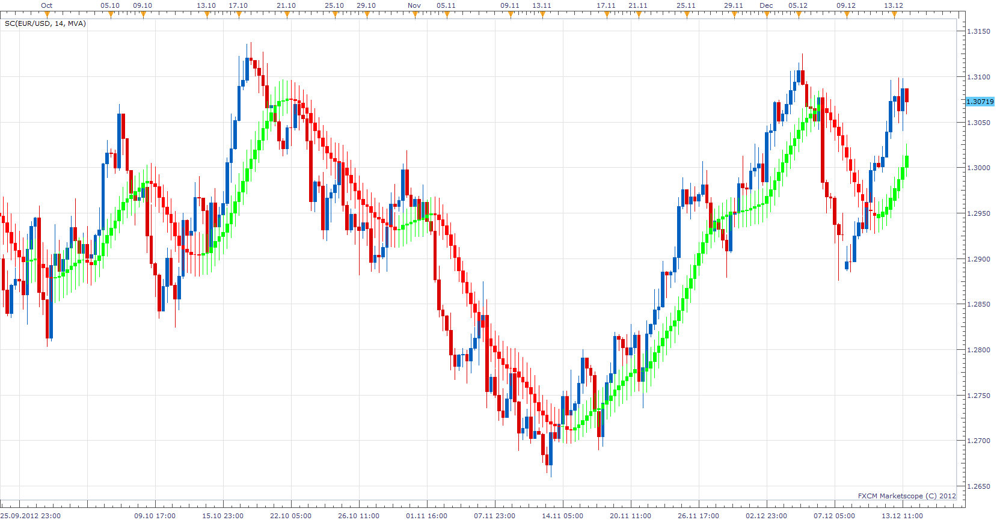

# Smoothed Candles

> Source: https://fxcodebase.com/code/viewtopic.php?f=17&t=27689  
> Forum: 17 · Topic 27689 · 2 post(s)

---

## Smoothed Candles

**Apprentice** · Thu Dec 13, 2012 1:41 pm

In this indicator the smoothing is applied to all elements of a price candlestick:
Open, Low, High and Close.

The indicator provides a clear graphical representation of a current market trend.
 A color of a candlestick indicates trend direction,
 and its body size shows the power of the current trend.

 [SC.lua](files/48459/SC.lua)

The indicator was revised and updated

---

## Re: Smoothed Candles

**Apprentice** · Tue May 02, 2017 12:03 pm

Indicator was revised and updated.
