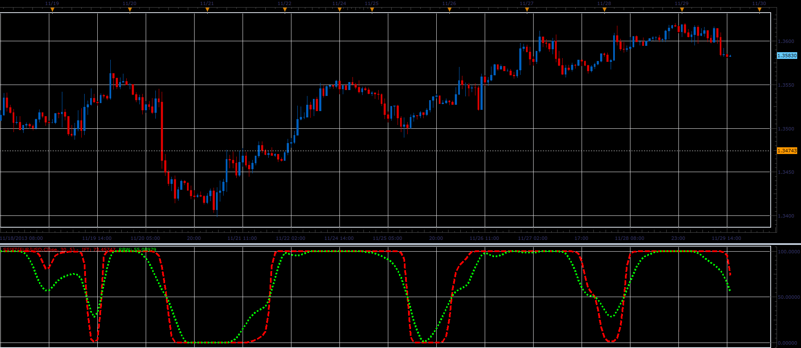

# Smoothed Stochastic Inverse Fisher Transform

> Source: https://fxcodebase.com/code/viewtopic.php?f=17&t=60026  
> Forum: 17 · Topic 60026 · 3 post(s)

---

## Smoothed Stochastic Inverse Fisher Transform

**Alexander.Gettinger** · Fri Nov 29, 2013 3:24 pm

To write this indicator I used the description and the indicator for NinjaTrader from [http://stocata.org/ninjatrader/svestochift.html](http://stocata.org/ninjatrader/svestochift.html).

 

Download:

 [SSIFT.lua](files/91247/SSIFT.lua)

---

## Re: Smoothed Stochastic Inverse Fisher Transform

**Alexander.Gettinger** · Fri Nov 29, 2013 3:26 pm

MQL4 version of Smoothed Stochastic Inverse Fisher Transform: [viewtopic.php?f=38&t=60027](https://fxcodebase.com/code/viewtopic.php?f=38&t=60027).

---

## Re: Smoothed Stochastic Inverse Fisher Transform

**Apprentice** · Thu Sep 13, 2018 3:21 am

The indicator was revised and updated.
