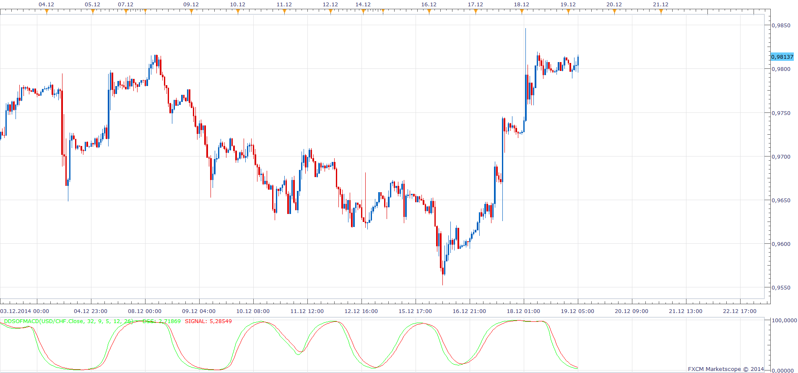

# Smoothed Stochastic of Smoothed Stochastic of MACD

> Source: https://fxcodebase.com/code/viewtopic.php?f=17&t=61607  
> Forum: 17 · Topic 61607 · 5 post(s)

---

## Smoothed Stochastic of Smoothed Stochastic of MACD

**Apprentice** · Fri Dec 19, 2014 6:19 am

Based on the request

 [Smoothed Stochastic of Smoothed Stochastic of MACD.lua](files/97771/Smoothed%20Stochastic%20of%20Smoothed%20Stochastic%20of%20MACD.lua)

The indicator was revised and updated

---

## Re: Smoothed Stochastic of Smoothed Stochastic of MACD

**lucmat** · Fri Dec 19, 2014 6:55 am

Thanks Apprentice!
Great work!
Is it possible to add change color with slope change?
Thanks

Lucmat

---

## Re: Smoothed Stochastic of Smoothed Stochastic of MACD

**Apprentice** · Sun Dec 21, 2014 4:16 am

Try this version.
Now u can choose the Up / Down colors for both streams.

---

## Re: Smoothed Stochastic of Smoothed Stochastic of MACD

**Alexander.Gettinger** · Wed Apr 08, 2015 11:19 am

MQL4 version of oscillator: [viewtopic.php?f=38&t=62086](https://fxcodebase.com/code/viewtopic.php?f=38&t=62086).

---

## Re: Smoothed Stochastic of Smoothed Stochastic of MACD

**Apprentice** · Tue Aug 08, 2017 5:29 am

The indicator was revised and updated.
