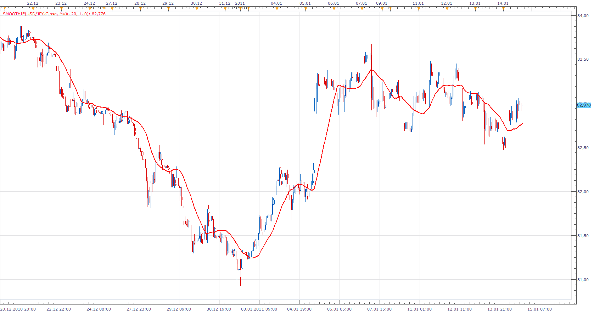
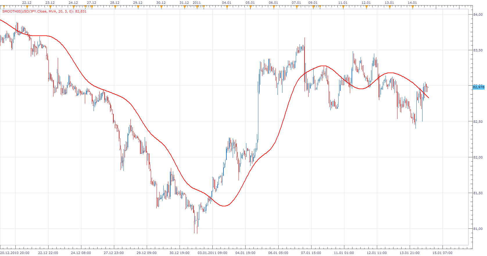
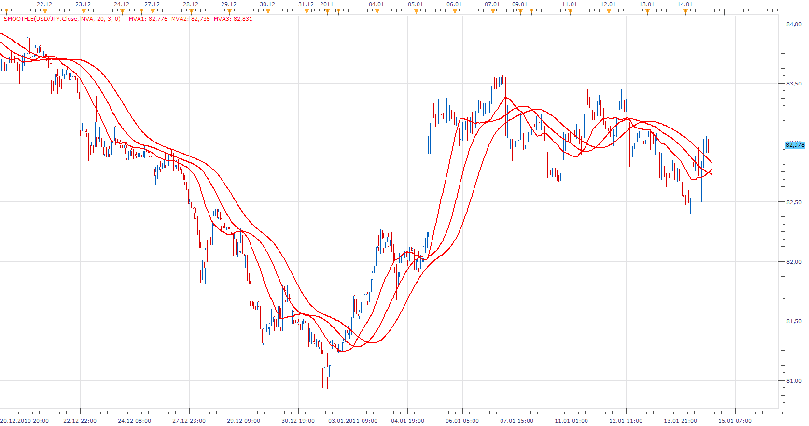

# Smoothie

> Source: https://fxcodebase.com/code/viewtopic.php?f=17&t=3176  
> Forum: 17 · Topic 3176 · 3 post(s)

---

## Smoothie

**Apprentice** · Sat Jan 15, 2011 12:57 pm

If Number of repetitions parameter is set to 1, The indicator is behaving like a regular moving average

 

If Number of repetitions parameter is not 1, The indicator is result of continuous smoothing
For example MVA of MVA of MVA...

 

If Show only Last parameter is set to No, all intermediate calculations Are visible.

 [Smoothie.lua](files/7483/Smoothie.lua)

The indicator was revised and updated

---

## Re: Smoothie

**Alexander.Gettinger** · Fri Dec 19, 2014 3:27 pm

MQL4 version of Smoothie indicator: [viewtopic.php?f=38&t=61614](https://fxcodebase.com/code/viewtopic.php?f=38&t=61614).

---

## Re: Smoothie

**Apprentice** · Mon Jun 26, 2017 10:01 am

The indicator was revised and updated.
