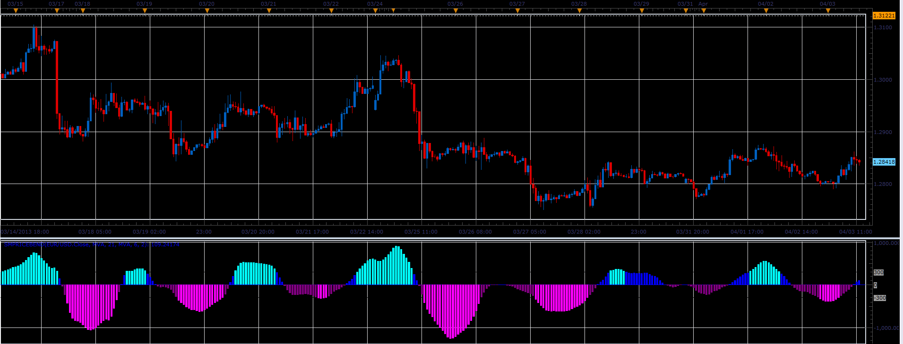

# SmPriceBend oscillator

> Source: https://fxcodebase.com/code/viewtopic.php?f=17&t=34060  
> Forum: 17 · Topic 34060 · 2 post(s)

---

## SmPriceBend oscillator

**Alexander.Gettinger** · Wed Apr 03, 2013 2:34 pm

This indicator is a ported MQL5 indicators from [http://www.mql5.com/en/code/1586](http://www.mql5.com/en/code/1586)

Formulas:
SmPriceBend = MA2(Momentum(MA1)), where
MA1 - moving average with [Method1] and [Period1] from price,
MA2 - moving average with [Method2] and [Period2] from Momentum.

 

Download:

 [SmPriceBend.lua](files/57899/SmPriceBend.lua)

For this indicator must be installed Averages indicator ([viewtopic.php?f=17&t=2430](https://fxcodebase.com/code/viewtopic.php?f=17&t=2430)) and Momentum ([viewtopic.php?f=17&t=896&p=1638](https://fxcodebase.com/code/viewtopic.php?f=17&t=896&p=1638)).

The indicator was revised and updated

---

## Re: SmPriceBend oscillator

**Apprentice** · Tue May 09, 2017 5:54 am

Indicator was revised and updated.
