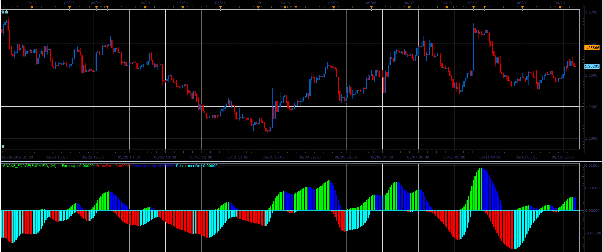
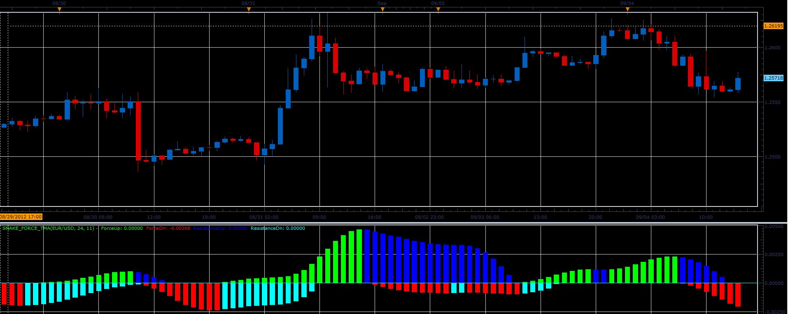

# Snake force indicator

> Source: https://fxcodebase.com/code/viewtopic.php?f=17&t=20166  
> Forum: 17 · Topic 20166 · 23 post(s)

---

## Snake force indicator

**Alexander.Gettinger** · Wed Jun 13, 2012 8:59 am

This indicator is a ported MQL4 indicator from [viewtopic.php?f=17&t=229&start=10#p34632](https://fxcodebase.com/code/viewtopic.php?f=17&t=229&start=10#p34632)

 

Download:

 [Snake_Force.lua](files/35452/Snake_Force.lua)

 [SF.lua](files/35452/SF.lua)

 

 [MTF MCP Snake_Force.lua](files/35452/MTF%20MCP%20Snake_Force.lua)

The indicator was revised and updated

---

## Re: Snake force indicator

**Panther** · Thu Jun 14, 2012 5:10 am

Hi. Could you add two Levels, default .00025 and -.00025?
Thanks

---

## Re: Snake force indicator

**wmaster** · Fri Jun 15, 2012 4:55 am

Line Levels added. They are adjustable in parameters.

---

## Re: Snake force indicator

**Panther** · Thu Jul 19, 2012 9:22 am

I would like to use this on the tick chart with a M1 data source.
When I apply the data source, the indicator disappears.
Could you fix this? Thanks.

---

## Re: Snake force indicator

**sunbeam** · Tue Aug 21, 2012 12:51 pm

Could you add this indicator without repainting for better entry and exit signals?

---

## Re: Snake force indicator

**Panther** · Tue Aug 21, 2012 4:56 pm

Hi. I found a Snakeforce - simple TMA.mq4 that does not repaint.
Would you convert it to a lua file? Thanks

---

## Re: Snake force indicator

**Apprentice** · Wed Aug 22, 2012 2:09 am

Your request is added to the development list.

---

## Re: Snake force indicator

**Alexander.Gettinger** · Tue Sep 04, 2012 1:51 pm

Snake force with TMA.

 

Download:

 [Snake_Force_TMA.lua](files/39646/Snake_Force_TMA.lua)

---

## Re: Snake force indicator

**Apprentice** · Thu Sep 20, 2012 11:13 am

Tick source version Added.

---

## Re: Snake force indicator

**fxcyberman** · Mon Nov 16, 2015 9:52 am

Is it possible to have a mq4 version ?
Thanks in advance.

---

## Re: Snake force indicator

**Apprentice** · Tue Nov 17, 2015 4:08 am

You can find some MQ4 versions in above posts.

---

## Re: Snake force indicator

**rose123** · Fri Nov 11, 2016 12:14 pm

hi,

may i request mtf mcp list snake force indicator with following conditions

**TIME FRAMES:H8, D1,W1,M1**

**GREEN UPPER ARROW:**

FORCE UP >0 AND RESISTANCE DOWN=0

**RED DOWN ARROW**:

FORCE DOWN <0 AND RESISTANE UP=0

**GREEN BIG DOT:**

FORCE UP >0 AND RESISTANCE DOWN<0

**RED DOWN BIG DOT**:

FORCE DOWN <0 AND RESISTANE UP>0

OTHERWICE : YELLOW DOT

---

## Re: Snake force indicator

**Apprentice** · Sat Nov 12, 2016 3:25 pm

MTF MCP Snake_Force.lua added.

---

## Re: Snake force indicator

**AlexanderS** · Wed Oct 27, 2021 8:14 am

HI
Can you make a strategy

close yes/NO

THANKS

---

## Re: Snake force indicator

**Apprentice** · Thu Oct 28, 2021 4:23 am

Your request is added to the development list.
Development reference 952.

---

## Re: Snake force indicator

**Apprentice** · Thu Oct 28, 2021 5:16 am

MTF Strategy.
[https://fxcodebase.com/code/viewtopic.php?f=31&t=23619](https://fxcodebase.com/code/viewtopic.php?f=31&t=23619)

Single time frame strategy.
[https://fxcodebase.com/code/viewtopic.php?f=31&t=71599](https://fxcodebase.com/code/viewtopic.php?f=31&t=71599)

---

## Re: Snake force indicator

**AlexanderS** · Sat Nov 11, 2023 3:47 am

Hi
can you make option
signal : Live / End of Turn

---

## Re: Snake force indicator

**Apprentice** · Fri Nov 17, 2023 5:50 am

To which file?
Snake Force Strategy has "Entry Execution Type" option.

---

## Re: Snake force indicator

**AlexanderS** · Thu Dec 26, 2024 8:49 am

HALLO
Can you make a ALERT Option
THANKS

---

## Re: Snake force indicator

**Apprentice** · Mon Dec 30, 2024 7:50 pm

We have added your request to the development list.
Development reference 934

---

## Re: Snake force indicator

**AlexanderS** · Thu Jan 02, 2025 7:19 pm

HI
can you make a snake clode
of the chart
same with snake force data

maybe with alert and arrow

very thanks

---

## Re: Snake force indicator

**AlexanderS** · Fri Mar 07, 2025 6:35 am

HI
can you make Alert option PLEAS

---

## Re: Snake force indicator

**Apprentice** · Fri Mar 14, 2025 5:01 am

 [Snake_Force with Alert Indicator.lua](files/158612/Snake_Force%20with%20Alert%20Indicator.lua)

 [Snake_Force with Alert.lua](files/158612/Snake_Force%20with%20Alert.lua)
