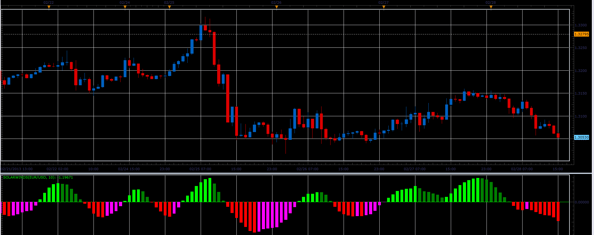

# Solar Winds oscillator

> Source: https://fxcodebase.com/code/viewtopic.php?f=17&t=32543  
> Forum: 17 · Topic 32543 · 2 post(s)

---

## Solar Winds oscillator

**Alexander.Gettinger** · Thu Feb 28, 2013 5:10 pm

This indicator is a ported MQL5 indicators from [http://www.mql5.com/en/code/1518](http://www.mql5.com/en/code/1518)

Formulas:
SW[i]=(ln((1+Value[i])/(1-Value[i]))+SW[i-1])/2, where
ln - natural logarithm,
Value[i]=(((Median price[i] - MinP)/(MaxP-MinP)-0.5)+Value[i-1])*2/3,
MinP, MaxP - minimum and maximum prices in the range from (i-Period) to i.

 

Download:

 [SolarWinds.lua](files/55437/SolarWinds.lua)

The indicator was revised and updated

---

## Re: Solar Winds oscillator

**Apprentice** · Tue May 09, 2017 5:46 am

Indicator was revised and updated.
