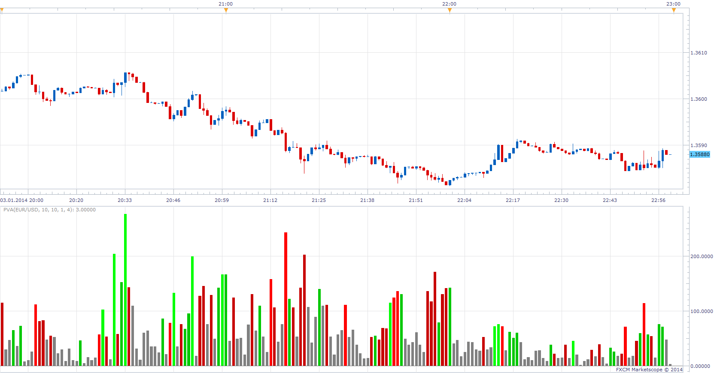
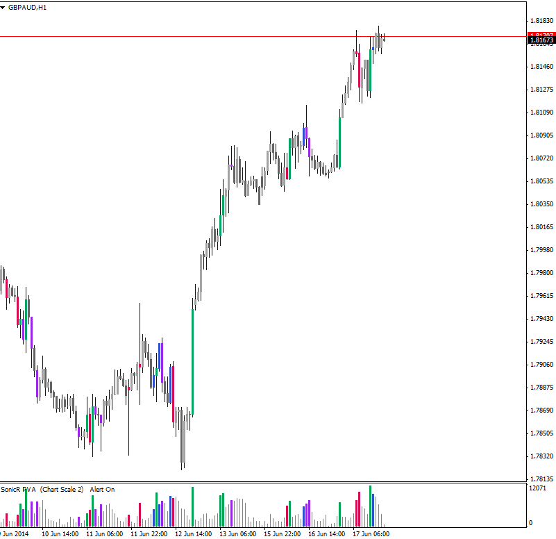

# SonicR PVA Volumes

> Source: https://fxcodebase.com/code/viewtopic.php?f=17&t=60177  
> Forum: 17 · Topic 60177 · 38 post(s)

---

## SonicR PVA Volumes

**Apprentice** · Sun Jan 05, 2014 8:19 am

Written according to User Request
[viewtopic.php?f=27&t=60174](https://fxcodebase.com/code/viewtopic.php?f=27&t=60174)

 [PVA.lua](files/91839/PVA.lua)

 

 [PVA Bar.lua](files/91839/PVA%20Bar.lua)

 [PVAOnChart.lua](files/91839/PVAOnChart.lua)

 [PVA Overlay.lua](files/91839/PVA%20Overlay.lua)

 [PVA Overlay with Alert.lua](files/91839/PVA%20Overlay%20with%20Alert.lua)

 

 [MCP MTF PVA.lua](files/91839/MCP%20MTF%20PVA.lua)

 [PVA with Alert.lua](files/91839/PVA%20with%20Alert.lua)

This indicator provides Audio / Email Alerts if SonicR PVA Volumes indication is given.

If the MA filter is used.
Only indications, confirmed by Price / MA cross will be of interest.

MT4/MQ4 version
[viewtopic.php?f=38&t=64164](https://fxcodebase.com/code/viewtopic.php?f=38&t=64164)

Strategy is available here.
[viewtopic.php?f=31&t=64169](https://fxcodebase.com/code/viewtopic.php?f=31&t=64169)
The indicator was revised and updated

---

## Re: SonicR PVA Volumes

**supertrader123** · Tue Jan 07, 2014 2:54 pm

hi apprentice,

thank you for this nice indicator

can you create mtf mcp indicator based on this sonicr pva volume indicator.

---

## Re: SonicR PVA Volumes

**tjunjie1983** · Wed Jan 08, 2014 4:08 am

> **Apprentice wrote:**
>
>
> pva.png
>
>
> Written according to User Request
> [viewtopic.php?f=27&t=60174](https://fxcodebase.com/code/viewtopic.php?f=27&t=60174)
>
>
> PVA.lua

Thank you so much!!!!

---

## Re: SonicR PVA Volumes

**tjunjie1983** · Wed Jan 08, 2014 4:29 am

hi apprentice, is there a way to make the volume to be at the background of the chart instead of a new area of indicator?thanks!

---

## Re: SonicR PVA Volumes

**Apprentice** · Wed Jan 08, 2014 7:05 am

PVA On Chart Added.

---

## Re: SonicR PVA Volumes

**Apprentice** · Wed Jan 08, 2014 7:46 am

MCP MTF PVA Added.

---

## Re: SonicR PVA Volumes

**supertrader123** · Wed Jan 08, 2014 8:54 am

THANK YOU APPRENDICE

---

## Re: SonicR PVA Volumes

**tjunjie1983** · Sat Jan 11, 2014 10:39 pm

> **Apprentice wrote:**
> PVA On Chart Added.

hi apprentice, i think there is some minor error for PVA volume indicator on chart. it seems like the last bar of tick volume is missing.

---

## Re: SonicR PVA Volumes

**Apprentice** · Sun Jan 12, 2014 12:35 pm

One of the possible reasons, exercising the test over the weekend.
Let me know if this problem persists.

---

## Re: SonicR PVA Volumes

**tjunjie1983** · Tue Jan 14, 2014 10:22 am

> **Apprentice wrote:**
> One of the possible reasons, exercising the test over the weekend.
> Let me know if this problem persists.

Hi Apprentice,

check out the volume in both cases, the one on the chart volume for PVA seems to "lag" by one bar. hope you got what i mean.Anyway to rectify this issue?Thanks!

---

## Re: SonicR PVA Volumes

**Apprentice** · Wed Jan 15, 2014 3:32 am

Please Try updated version.

---

## Re: SonicR PVA Volumes

**tjunjie1983** · Thu Jan 16, 2014 9:48 am

> **Apprentice wrote:**
> Please Try updated version.

thanks thanks Apprentice

---

## Re: SonicR PVA Volumes

**BTrade** · Tue Jun 17, 2014 12:12 pm

Hi Apprentice,

this is a GREAT indicator. Is it possible to make the candles the same color as the volume bars. then it will be very helpful to see which candle corresponds with particular volume bar.

 

---

## Re: SonicR PVA Volumes

**Apprentice** · Tue Jun 17, 2014 12:46 pm

PVA Overlay.lua Added.

---

## Re: SonicR PVA Volumes

**BTrade** · Tue Jun 17, 2014 12:54 pm

Great! Can you make it work with the PVA on chart too?

Thanks! Thanks!

---

## Re: SonicR PVA Volumes

**BTrade** · Tue Jun 17, 2014 1:47 pm

Hi Apprentice,

something weird is happening ... double candles when I switch timeframes (from M5 to H1 ...) ... can you, please, fix the bug?

---

## Re: SonicR PVA Volumes

**Apprentice** · Wed Jun 18, 2014 4:19 am

Hmm, very strange development.

Nothing within indicator can cause this behavior.
Will investigate.

---

## Re: SonicR PVA Volumes

**BTrade** · Wed Jun 18, 2014 4:23 am

It happens only when "Ask" price is selected and then switch timeframes or instrument.

---

## Re: SonicR PVA Volumes

**Apprentice** · Wed Jun 18, 2014 4:27 am

I have not managed to reproduce this.

One tip, if it's not too much hassle,
Make a complete de-installation & re-installation of TS.

Let me know if this helped.

---

## Re: SonicR PVA Volumes

**Apprentice** · Wed Jun 18, 2014 5:05 am

Marketscope developer said that this is a known bug and it should be fixed in the new version of Trading Station.

---

## Re: SonicR PVA Volumes

**BTrade** · Wed Jun 18, 2014 7:19 am

as you suggested, I reinstalled it and this fixed the issue.

THANKS!

---

## Re: SonicR PVA Volumes

**BTrade** · Fri Jun 27, 2014 3:09 pm

Hi Apprentice,

everything works GREAT!

is it possible to make an alert when a high volume colored candle (climax up or down) crosses a specific MA, EMA ... ?

Thanks!

---

## Re: SonicR PVA Volumes

**Apprentice** · Sat Jun 28, 2014 3:18 am

PVA with Alert.lua

---

## Re: SonicR PVA Volumes

**BTrade** · Mon Jun 30, 2014 8:36 pm

THANKS, Apprentice! the alert is working.

I see a few things for improvement. If you could, please, take a look ...

1. I prefer to use the PVAonChart. is it possible to make the alert work with it OR even better if it works with the PVA OVERLAY, the painted candles (then people can choose which volume to use - on chart or not)

2. Is it possible to make the MA color and width selectable by the user?

3. It is a GREAT idea to have dots by the candle with alert. Can you make the color for this dots selectable by the user? If it is not too much hassle, instead of dots, can you make it arrows?

once again THANKS! GREATLY appreciate your work!

---

## Re: SonicR PVA Volumes

**BTrade** · Mon Jun 30, 2014 8:46 pm

... one more thing ... I would like to be able to have the option to select high, low, close, open ... price for the MA ... and also the timeframe.

---

## Re: SonicR PVA Volumes

**Apprentice** · Wed Jul 02, 2014 3:24 am

PVA Overlay with Alert.lua Added.

---

## Re: SonicR PVA Volumes

**BTrade** · Mon Jul 07, 2014 5:43 am

Hi Apprentice,

First: THANK YOU!! for all the work done.

is it possible to make the "PVA on chart" and "Overlay with alert" work with Real Volume?

Thanks

---

## Re: SonicR PVA Volumes

**Apprentice** · Mon Jul 07, 2014 6:59 am

Yes, in theory.
Unfortunately, the real volume is not streamed in the same way as Tick volume.
That complicates things a bit.
Will put this on hold for now,
In the hope that Real Volume will be provided in a more friendlier form.

---

## Re: SonicR PVA Volumes

**BTrade** · Mon Jul 07, 2014 9:53 am

additional to your point, the Real Volume does NOT work with all currencies ... ... so, no need to put an effort on this for now.

can you make the MA selectable? i would like to be able to select MA based on High price for bullish alert and MA based on Low prices for bearish alert (having 2 MAs).

---

## Re: SonicR PVA Volumes

**tmue2014** · Sun Nov 09, 2014 7:30 pm

Apprentice - long time lurker, but finally sign up! Thanks for all your coding work - really appreciated...

Did a search but couldn't find the PVA Overlay with Alert for MT4 - any chance that you could find the time to release it for MT4 as well?

Much appreciated / TMue

---

## Re: SonicR PVA Volumes

**Alexander.Gettinger** · Wed Apr 08, 2015 11:25 am

MQL4 version of indicator: [viewtopic.php?f=38&t=62087](https://fxcodebase.com/code/viewtopic.php?f=38&t=62087).

---

## SonicR PVA Volume bar request

**transformer** · Wed Apr 15, 2015 1:30 pm

hi apprendice,

can you create SonicR PVA Volume bar like mfi bar

[http://www.fxcodebase.com/code/viewtopi ... =17&t=1968](http://www.fxcodebase.com/code/viewtopic.php?f=17&t=1968)

---

## Re: SonicR PVA Volumes

**Apprentice** · Fri Apr 17, 2015 4:26 am

PVA Bar.lua added.

---

## Re: SonicR PVA Volumes

**nookie** · Mon Apr 20, 2015 3:23 pm

Hello, is it possible to have an alert on a set exact value of the tick volum,e for example > if volume more than 1000 > trigger an alarm ?

---

## Re: SonicR PVA Volumes

**Apprentice** · Mon Dec 14, 2015 5:11 am

Dec 14, 2015: Compatibility issue Fixed. _Alert helper is not longer needed.

If you want to use updated version of this indicator,
please make sure to use TS Version 01.14.101415. or higher.

---

## Re: SonicR PVA Volumes

**Apprentice** · Fri Dec 02, 2016 4:44 am

Minor Update.

---

## Re: SonicR PVA Volumes

**fxlion** · Fri Dec 02, 2016 5:29 am

hi apprendice ,

can you create strategy based on this indicator:

**buying conditions:**

if(source.volume[period] >= ma_volume.DATA[period] * PVA_Rising_Factor)
 and (source.close[period] > source.open[period]) then buy

elseif {(source.high[period]-source.low[period])*source.volume[period]}
 >= {mathex.max( Range, period -PVA_Climax_Period, period-1 )}
 or (source.volume[period] >= ma_volume.DATA[period] * PVA_Extreme_Factor)
 and (source.close[period] > source.open[period]) then buy

**selling conditions:**

if(source.volume[period] >= ma_volume.DATA[period] * PVA_Rising_Factor)
(source.close[period] < source.open[period]) then sell

elseif {(source.high[period]-source.low[period])*source.volume[period]}
 >= {mathex.max( Range, period -PVA_Climax_Period, period-1 )}
 or (source.volume[period] >= ma_volume.DATA[period] * PVA_Extreme_Factor)
 and (source.close[period] < source.open[period]) then sell

---

## Re: SonicR PVA Volumes

**Apprentice** · Sat Dec 03, 2016 6:15 am

Try this version.
[viewtopic.php?f=31&t=64169](https://fxcodebase.com/code/viewtopic.php?f=31&t=64169)
