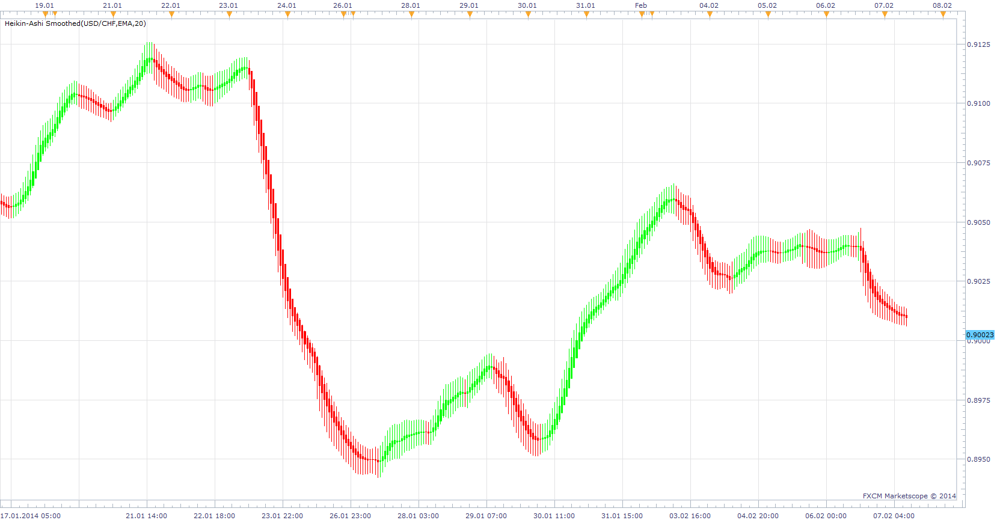

# Source Smoothed Heikin-Ashi

> Source: https://fxcodebase.com/code/viewtopic.php?f=17&t=60288  
> Forum: 17 · Topic 60288 · 9 post(s)

---

## Source Smoothed Heikin-Ashi

**Apprentice** · Fri Feb 07, 2014 3:23 am

Prior to Heikin-Ashi calculation, source data is smoothed with moving average.

 [SSHA.lua](files/92555/SSHA.lua)

The indicator was revised and updated

---

## Re: Source Smoothed Heikin-Ashi

**Apprentice** · Sat Feb 08, 2014 2:23 am

This version will not replace original price Source.

 [SSHA.lua](files/92572/SSHA.lua)

---

## Re: Source Smoothed Heikin-Ashi

**volnmar** · Thu Aug 14, 2014 3:23 am

can you smooth the first one with Ehler´s SUPERSMOOTHER please?

---

## Re: Source Smoothed Heikin-Ashi

**Apprentice** · Thu Aug 14, 2014 6:52 am

Do you want to add SUPERSMOOTHER as one of smoothing methods.
Or to have it for additional, post calculation smoothing.

---

## Re: Source Smoothed Heikin-Ashi

**volnmar** · Thu Aug 14, 2014 7:03 am

smooth source data with supersmooth please

---

## Re: Source Smoothed Heikin-Ashi

**Apprentice** · Fri Aug 15, 2014 9:33 am

SuperSmoother Option Added.

---

## Re: Source Smoothed Heikin-Ashi

**daniel.kovacik** · Mon Aug 18, 2014 1:46 pm

Hi, could you add transparency?

Thank youu

---

## Re: Source Smoothed Heikin-Ashi

**Apprentice** · Wed Aug 20, 2014 2:11 pm

In the current implementation, transparency is not an option, candles can not have transparency.

---

## Re: Source Smoothed Heikin-Ashi

**Apprentice** · Tue Jul 11, 2017 1:49 pm

The indicator was revised and updated.
