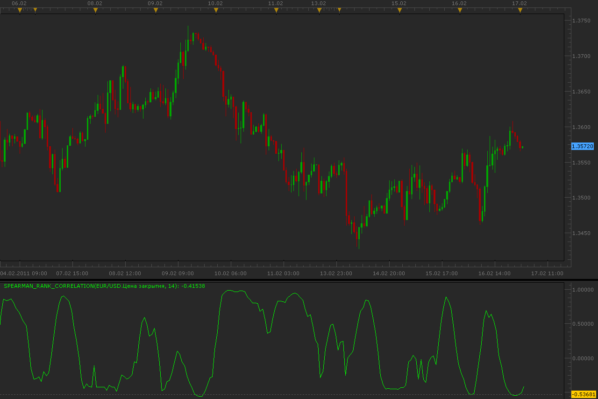

# Spearman Rank Correlation oscillator

> Source: https://fxcodebase.com/code/viewtopic.php?f=17&t=3427  
> Forum: 17 · Topic 3427 · 10 post(s)

---

## Spearman Rank Correlation oscillator

**Alexander.Gettinger** · Thu Feb 17, 2011 1:07 am

Read more about Spearman Rank Correlation at wiki: [http://en.wikipedia.org/wiki/Spearman%2 ... oefficient](https://en.wikipedia.org/wiki/Spearman%27s_rank_correlation_coefficient)

 

Download:

 [Spearman_Rank_Correlation.lua](files/8180/Spearman_Rank_Correlation.lua)

The indicator was revised and updated

---

## Re: Spearman Rank Correlation oscillator

**Alexander.Gettinger** · Mon Jul 04, 2011 2:44 am

Three Spearman Rank Correlation oscillator on one chart.

Download:

 [SRC3.lua](files/12283/SRC3.lua)

For this indicator must be installed Spearman_Rank_Correlation.lua

---

## Re: Spearman Rank Correlation oscillator

**rhodia16** · Mon Jul 04, 2011 7:11 am

Dear Alexander,

Thank you for creating useful indicators.

I have been always interested in usefulness of Spearman Ranc Correlation indicators, or so-called RCI.

I am wondering about the following point on the versions of RCI you kindly made for us. Isn't there any possibility that the Spearman RCI indicators you made are showing values upside down...? I mean, if the price goes up then the RCI (especially the one with a short period like 5 or 8 or 13) should be going up as well but the RCI here seems to be going the other way (going down instead of going up).

I would be most grateful if you could have a look at.

Thanks in advance.

Rhodia

---

## Re: Spearman Rank Correlation oscillator

**takami0056** · Sun Oct 23, 2011 12:39 pm

Hi Alexander,

I really need to have your SRC3 that you made for us, so could you please check the the program one more time and make sure that curves are not going opposite directions when prices goes up and down.

Thank you.

TK

---

## Re: Spearman Rank Correlation oscillator

**versitle** · Tue Oct 25, 2011 6:45 am

Thanks, Alexander, for making for us this RCI. I really needed it a lot. You saved my life:)

---

## Re: Spearman Rank Correlation oscillator

**Apprentice** · Tue Dec 23, 2014 9:02 am

Mq4 version can be found here.
[viewtopic.php?f=38&t=61638](https://fxcodebase.com/code/viewtopic.php?f=38&t=61638)

---

## Re: Spearman Rank Correlation oscillator

**zunixaani** · Sun Mar 01, 2015 11:52 pm

hello Apprentice,

this indicator is showing only Delta line ,the price line is not showing .your help is always appriciated.

---

## Re: Spearman Rank Correlation oscillator

**Apprentice** · Mon Mar 02, 2015 6:07 pm

Can you explain, Spearman Rank Correlation oscillator do not have this outputs.

---

## Re: Spearman Rank Correlation oscillator

**Apprentice** · Tue Jul 18, 2017 7:38 am

The indicator was revised and updated.

---

## Re: Spearman Rank Correlation oscillator

**ahmedalhosenyy** · Wed Nov 26, 2025 12:25 pm

Hello ,

Thanks for the beautiful indicator

thanks
