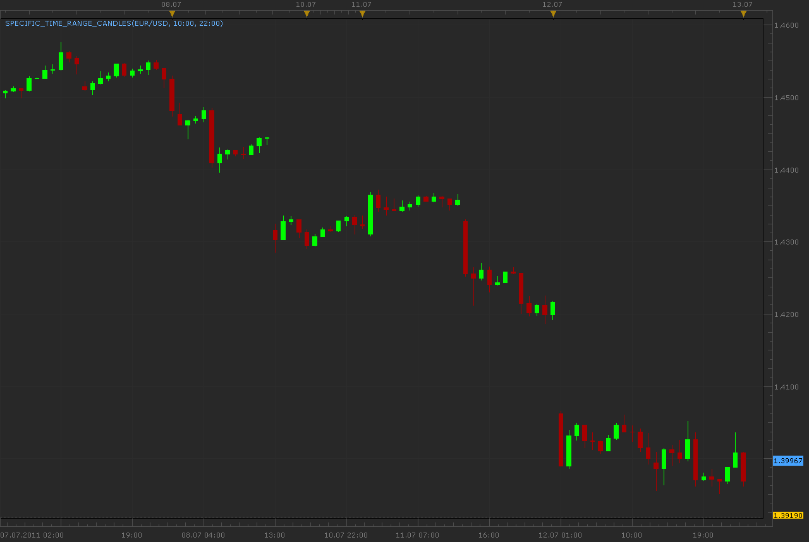

# Specific Time Range Candles

> Source: https://fxcodebase.com/code/viewtopic.php?f=17&t=5172  
> Forum: 17 · Topic 5172 · 2 post(s)

---

## Specific Time Range Candles

**Alexander.Gettinger** · Tue Jul 12, 2011 11:40 pm

Indicator show candles only for defined period.
For example, if defined period from 11:00 to 13:00 on hour chart, indicator show only 2 candles per day. If defined period from 13:00 to 11:00, indicator show 22 candles per day.

IMPORTANT! Time axis of chart does not correspond to realtime by candle.

 

Download:

 [Specific_Time_Range_Candles.lua](files/12642/Specific_Time_Range_Candles.lua)

MT4 /MQ4 version.
[viewtopic.php?f=38&t=64526](https://fxcodebase.com/code/viewtopic.php?f=38&t=64526)

The indicator was revised and updated

---

## Re: Specific Time Range Candles

**Apprentice** · Wed Mar 15, 2017 6:03 am

Indicator was revised and updated.
