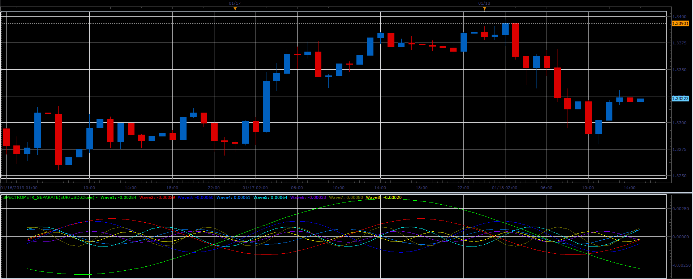
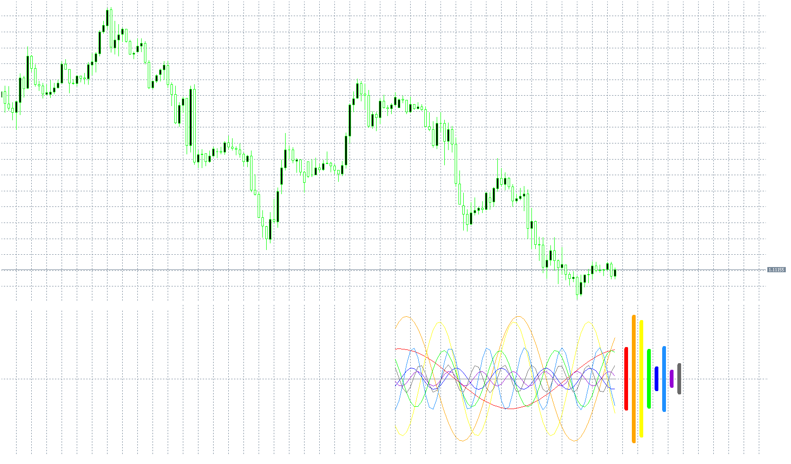

# Spectrometer separate indicator

> Source: https://fxcodebase.com/code/viewtopic.php?f=17&t=31129  
> Forum: 17 · Topic 31129 · 12 post(s)

---

## Spectrometer separate indicator

**Alexander.Gettinger** · Fri Jan 18, 2013 6:03 pm

This indicator is a ported MQL5 indicators from [viewtopic.php?f=27&t=27731](https://fxcodebase.com/code/viewtopic.php?f=27&t=27731)

 

Download:

 [Spectrometr_Separate.lua](files/53129/Spectrometr_Separate.lua)

MT5/MQ5 version.
[viewtopic.php?f=38&t=69942](https://fxcodebase.com/code/viewtopic.php?f=38&t=69942)

---

## Re: Spectrometer separate indicator

**globallabs** · Tue Jan 22, 2013 2:18 pm

This is great Does it use a Maximum Entropy Spectral Analysis to determine the dominant cycles then plot the sine curve?

---

## Re: Spectrometer separate indicator

**Blackcat2** · Tue Jan 22, 2013 6:39 pm

How to use this indicator?

Cheers..
BC

---

## Re: Spectrometer separate indicator

**Apprentice** · Mon Feb 05, 2018 11:09 am

The indicator was revised and updated.

---

## Re: Spectrometer separate indicator

**Feanor** · Tue May 26, 2020 9:53 am

Good morning,
I am having a problem in mt5 with the indicator.
As you can see in the attachment there are only 7 curves, and the missing one is the black one.
Can you please help me?

---

## Re: Spectrometer separate indicator

**Apprentice** · Wed May 27, 2020 4:49 am

Your request is added to the development list.
Development reference 1365.

---

## Re: Spectrometer separate indicator

**Apprentice** · Fri May 29, 2020 5:19 am

 [Spectrometer_Indicator.mq5](files/134448/Spectrometer_Indicator.mq5)

---

## Re: Spectrometer separate indicator

**Feanor** · Fri May 29, 2020 8:14 am

It works perfect.

Thank you very much.

---

## Re: Spectrometer separate indicator

**giova90** · Wed Aug 14, 2024 12:57 pm

Hello Apprentice, is it possible to make the Spectrometer_Indicator.mq5 lighter? because is heavy when using through iCustom in an EA or indicator the backtest is very slow. Also is it possible to add projections of the cycles in the future by a settable period (ie. forecast the cycle for the next 40 candles in the future starting from the last current candle)?

Thank you

---

## Re: Spectrometer separate indicator

**Apprentice** · Thu Aug 15, 2024 5:26 am

We have added your request to the development list.
Development reference 650

---

## Re: Spectrometer separate indicator

**giova90** · Sat Sep 14, 2024 12:51 pm

One month has passed and still no solution...at least could you make the indicator faster? In MT5 Expert tab it says when used with iCustom "Indicator is too slow 27885 ms rewrite indicator". Hope it can be done.... Thanks

---

## Re: Spectrometer separate indicator

**Apprentice** · Thu Nov 14, 2024 3:07 am

The iPeriod parameter is used to limit the number of bars calculated.
It is set to 60 by default, which is fast enough for me in the tester.
