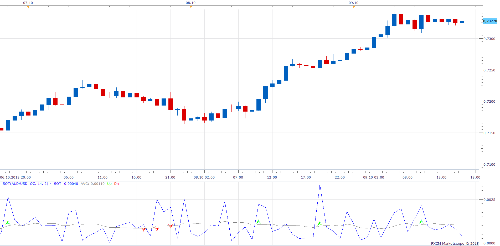

# Speed of Trade

> Source: https://fxcodebase.com/code/viewtopic.php?f=17&t=62766  
> Forum: 17 · Topic 62766 · 7 post(s)

---

## Speed of Trade

**Apprentice** · Sun Oct 11, 2015 5:33 am



Based on request.
[viewtopic.php?f=27&t=25492](https://fxcodebase.com/code/viewtopic.php?f=27&t=25492)

 [SoT.lua](files/102765/SoT.lua)

MT5 version
[viewtopic.php?f=38&t=70032](https://fxcodebase.com/code/viewtopic.php?f=38&t=70032)

---

## Re: Speed of Trade

**Stance** · Sun Oct 11, 2015 4:24 pm

I've managed to create a strategy for this indicator.

```lua
function Init() --The strategy profile initialization
    strategy:name("SoT strategy");
    strategy:description("");
   
   strategy.parameters:addGroup("Price");
    strategy.parameters:addString("Type", "Price Type", "", "Bid");
    strategy.parameters:addStringAlternative("Type", "Bid", "", "Bid");
    strategy.parameters:addStringAlternative("Type", "Ask", "", "Ask");
   
   strategy.parameters:addString("TF", "Time frame", "", "H1");
    strategy.parameters:setFlag("TF", core.FLAG_PERIODS);

   
 
    strategy.parameters:addGroup("Calculation");
   strategy.parameters:addString("CandleType", "Candle Type", "", "OC");
    strategy.parameters:addStringAlternative("CandleType", "Open / Close", "", "OC");
    strategy.parameters:addStringAlternative("CandleType", "High / Low", "", "HL");
   strategy.parameters:addInteger("Period", "MA Period", "", 14);
   strategy.parameters:addInteger("Trigger", "Trigger Level", "", 2);
   
   
   

    CreateTradingParameters();
end

function CreateTradingParameters()
    strategy.parameters:addGroup("Trading Parameters");

    strategy.parameters:addBoolean("AllowTrade", "Allow strategy to trade", "", false);   
    strategy.parameters:setFlag("AllowTrade", core.FLAG_ALLOW_TRADE);
   
 
   strategy.parameters:addString("ExecutionType", "End of Turn / Live", "", "End of Turn");
    strategy.parameters:addStringAlternative("ExecutionType", "End of Turn", "", "End of Turn");
   strategy.parameters:addStringAlternative("ExecutionType", "Live", "", "Live");
   
   strategy.parameters:addBoolean("CloseOnOpposite", "Close On Opposite", "", true);
    strategy.parameters:addString("CustomID", "Custom Identifier", "The identifier that can be used to distinguish strategy instances", "ETLS");
   
   strategy.parameters:addInteger("MaxNumberOfPositionInAnyDirection", "Max Number Of Open Position In Any Direction", "", 2, 1, 100);
   strategy.parameters:addInteger("MaxNumberOfPosition", "Max Number Of Position In One Direction", "", 1, 1, 100);
       
    strategy.parameters:addString("ALLOWEDSIDE", "Allowed side", "Allowed side for trading or signaling, can be Sell, Buy or Both", "Both");
    strategy.parameters:addStringAlternative("ALLOWEDSIDE", "Both", "", "Both");
    strategy.parameters:addStringAlternative("ALLOWEDSIDE", "Buy", "", "Buy");
    strategy.parameters:addStringAlternative("ALLOWEDSIDE", "Sell", "", "Sell");
   
   strategy.parameters:addString("Direction", "Type of Signal / Trade", "", "direct");
    strategy.parameters:addStringAlternative("Direction", "Direct", "", "direct");
    strategy.parameters:addStringAlternative("Direction", "Reverse", "", "reverse");

    strategy.parameters:addString("Account", "Account to trade on", "", "");
    strategy.parameters:setFlag("Account", core.FLAG_ACCOUNT);
    strategy.parameters:addInteger("Amount", "Trade Amount in Lots", "", 1, 1, 1000);
    strategy.parameters:addBoolean("SetLimit", "Set Limit Orders", "", false);
    strategy.parameters:addInteger("Limit", "Limit Order in pips", "", 30, 1, 10000);
    strategy.parameters:addBoolean("SetStop", "Set Stop Orders", "", false);
    strategy.parameters:addInteger("Stop", "Stop Order in pips", "", 30, 1, 10000);
    strategy.parameters:addBoolean("TrailingStop", "Trailing stop order", "", false);
 
   
    strategy.parameters:addGroup("Alerts");
    strategy.parameters:addBoolean("ShowAlert", "ShowAlert", "", false);
    strategy.parameters:addBoolean("PlaySound", "Play Sound", "", false);
    strategy.parameters:addFile("SoundFile", "Sound File", "", "");
    strategy.parameters:setFlag("SoundFile", core.FLAG_SOUND);
    strategy.parameters:addBoolean("RecurrentSound", "Recurrent Sound", "", false);
    strategy.parameters:addBoolean("SendEmail", "Send Email", "", false);
    strategy.parameters:addString("Email", "Email", "", "");
    strategy.parameters:setFlag("Email", core.FLAG_EMAIL);
   
    strategy.parameters:addGroup("Time Parameters");
    strategy.parameters:addString("StartTime", "Start Time for Trading", "", "00:00:00");
    strategy.parameters:addString("StopTime", "Stop Time for Trading", "", "24:00:00");

    strategy.parameters:addBoolean("UseMandatoryClosing", "Use Mandatory Closing", "", false);
    strategy.parameters:addString("ExitTime", "Mandatory Closing  Time", "", "23:59:00");
    strategy.parameters:addInteger("ValidInterval", "Valid interval for operation in second", "", 60);
   
   
end
local OpenTime, CloseTime, ExitTime,ValidInterval;
local source,Ticksource;
local MaxNumberOfPositionInAnyDirection, MaxNumberOfPosition;
local SoundFile = nil;
local RecurrentSound = false;
local ALLOWEDSIDE;
local AllowTrade;
local Offer;
local CanClose;
local Account;
local Amount;
local SetLimit;
local Limit;
local SetStop;
local Stop;
local TrailingStop;
local ShowAlert;
local Email;
local SendEmail;
local BaseSize;
local ExecutionType;
local CloseOnOpposite
local first;
local Direction;
local CustomID;
local SOT = nil;
local Trigger;
local Period;
local Avg;
local Size, up, down;
local CandleType;
local pipsize;

-- Don't need to store hour + minute + second for each time
local OpenTime, CloseTime, ExitTime;
--
function Prepare( nameOnly)
    CustomID = instance.parameters.CustomID;
   ExecutionType = instance.parameters.ExecutionType;
    CloseOnOpposite = instance.parameters.CloseOnOpposite;
   MaxNumberOfPositionInAnyDirection = instance.parameters.MaxNumberOfPositionInAnyDirection;
   MaxNumberOfPosition = instance.parameters.MaxNumberOfPosition;
   Direction = instance.parameters.Direction == "direct";
   
   ValidInterval = instance.parameters.ValidInterval;
   UseMandatoryClosing = instance.parameters.UseMandatoryClosing;
   pipsize = instance.bid:pipSize();
   CandleType=instance.parameters.CandleType;
   Trigger=instance.parameters.Trigger;
   Period=instance.parameters.Period;
   Size=instance.parameters.Size;

    assert(instance.parameters.TF ~= "t1", "The time frame must not be tick");

    local name;
    name = profile:id() .. "( " .. instance.bid:name() .. "," .. CustomID ..  " )";
    instance:name(name);
   
    PrepareTrading();

    if nameOnly then
        return ;
    end
   
   assert(core.indicators:findIndicator("SOT") ~= nil, "Please, download and install SOT.LUA indicator");         
   
   if ExecutionType== "Live" then
   Ticksource = ExtSubscribe(1, nil, "t1", instance.parameters.Type == "Bid", "close");
   end
   
    source = ExtSubscribe(2, nil, instance.parameters.TF, instance.parameters.Type == "Bid", "bar");
    SOTindicator = core.indicators:create("SOT", source, CandleType, Period, Trigger);
   first=SOTindicator.SOT:first();
   
    local valid;
    OpenTime, valid = ParseTime(instance.parameters.StartTime);
    assert(valid, "Time " .. instance.parameters.StartTime .. " is invalid");
    CloseTime, valid = ParseTime(instance.parameters.StopTime);
    assert(valid, "Time " .. instance.parameters.StopTime .. " is invalid");
    ExitTime, valid = ParseTime(instance.parameters.ExitTime);
    assert(valid, "Time " .. instance.parameters.ExitTime .. " is invalid");
   
   if UseMandatoryClosing then
        core.host:execute("setTimer", 100, math.max(ValidInterval / 2, 1));
    end
   
   
end

-- NG: create a function to parse time
function ParseTime(time)
    local Pos = string.find(time, ":");
    local h = tonumber(string.sub(time, 1, Pos - 1));
    time = string.sub(time, Pos + 1);
    Pos = string.find(time, ":");
    local m = tonumber(string.sub(time, 1, Pos - 1));
    local s = tonumber(string.sub(time, Pos + 1));
    return (h / 24.0 +  m / 1440.0 + s / 86400.0),                          -- time in ole format
           ((h >= 0 and h < 24 and m >= 0 and m < 60 and s >= 0 and s < 60) or (h == 24 and m == 0 and s == 0)); -- validity flag
end

function PrepareTrading()
    ALLOWEDSIDE = instance.parameters.ALLOWEDSIDE;

    local PlaySound = instance.parameters.PlaySound;
    if PlaySound then
        SoundFile = instance.parameters.SoundFile;
    else
        SoundFile = nil;
    end
    assert(not(PlaySound) or (PlaySound and SoundFile ~= ""), "Sound file must be chosen");

    ShowAlert = instance.parameters.ShowAlert;
    RecurrentSound = instance.parameters.RecurrentSound;

    SendEmail = instance.parameters.SendEmail;

    if SendEmail then
        Email = instance.parameters.Email;
    else
        Email = nil;
    end
    assert(not(SendEmail) or (SendEmail and Email ~= ""), "E-mail address must be specified");

    AllowTrade = instance.parameters.AllowTrade;
    Account = instance.parameters.Account;
    Amount = instance.parameters.Amount;
    BaseSize = core.host:execute("getTradingProperty", "baseUnitSize", instance.bid:instrument(), Account);
    Offer = core.host:findTable("offers"):find("Instrument", instance.bid:instrument()).OfferID;
    CanClose = core.host:execute("getTradingProperty", "canCreateMarketClose", instance.bid:instrument(), Account);
    SetLimit = instance.parameters.SetLimit;
    Limit = instance.parameters.Limit;
    SetStop = instance.parameters.SetStop;
    Stop = instance.parameters.Stop;
    TrailingStop = instance.parameters.TrailingStop;
end
 
local Last;
local LAST;
local ONE;

function ExtUpdate(id, source, period)  -- The method called every time when a new bid or ask price appears.
    if AllowTrade then
        if not(checkReady("trades")) or not(checkReady("orders")) then
            return ;
        end
    end
   
   
   if  ExecutionType ==  "Live" and  id == 1 then
         
         period= core.findDate (source.close, Ticksource:date(period), false );      
               
   end

   if  ExecutionType ==  "Live"  then
   
           if ONE == source:serial(period) then
         return;
         end
   
         if id == 2 then
         return;
         end      
         
         
      
   else   
         if id ~= 2 then       
         return;
         end
   end

 

    -- update indicators.
    SOTindicator:update(core.UpdateLast);

   if period < first  then
        return;
    end
   
   
    -- only buy if we have a fast cross over slow and the price is above the moving averages.
    if  SOTindicator.SOT[period]  > SOTindicator.AVG[period] *Trigger then
        if source.close[period] > source.open[period] then    
          if Direction then
                BUY();
            else
                SELL();
            end
      ONE= source:serial(period);
    elseif source.close[period] < source.open[period]
   then
            if Direction then
                SELL();
            else
                BUY();
            end
      ONE= source:serial(period);
    end
    end

end

-- NG: Introduce async function for timer/monitoring for the order results
function ExtAsyncOperationFinished(cookie, success, message)

    if cookie == 100 then
        -- timer
        if UseMandatoryClosing and AllowTrade then
            now = core.host:execute("getServerTime");
            -- get only time
            now = now - math.floor(now);
            -- check whether the time is in the exit time period
            if now >= ExitTime and now < ExitTime + ValidInterval then
                if not(checkReady("trades")) or not(checkReady("orders")) then
                    return ;
                end
                if haveTrades("S") then
                     exitSpecific("S");
                     Signal ("Close Short");
                end
                if haveTrades("B") then
                     exitSpecific("B");
                     Signal ("Close Long");
               end
            end
        end
    elseif cookie == 200 and not success then
        terminal:alertMessage(instance.bid:instrument(), instance.bid[instance.bid:size() - 1], "Open order failed" .. message, instance.bid:date(instance.bid:size() - 1));
    elseif cookie == 201 and not success then
        terminal:alertMessage(instance.bid:instrument(), instance.bid[instance.bid:size() - 1], "Close order failed" .. message, instance.bid:date(instance.bid:size() - 1));
    end
end

--===========================================================================--
--                    TRADING UTILITY FUNCTIONS                              --
--============================================================================--
function BUY()
    if AllowTrade then
        if CloseOnOpposite and haveTrades("S") then
            -- close on opposite signal
            exitSpecific("S");
            Signal ("Close Short");
        end

        if ALLOWEDSIDE == "Sell"  then
            -- we are not allowed buys.
            return;
        end

        enter("B");
    else
        Signal ("Buy Signal");   
    end
end   
   
function SELL ()      
    if AllowTrade then
        if CloseOnOpposite and haveTrades("B") then
            -- close on opposite signal
            exitSpecific("B");
            Signal ("Close Long");
        end

        if ALLOWEDSIDE == "Buy"  then
            -- we are not allowed sells.
            return;
        end

        enter("S");
    else
        Signal ("Sell Signal");   
    end
end

function Signal (Label)
    if ShowAlert then
        terminal:alertMessage(instance.bid:instrument(), instance.bid[NOW],  Label, instance.bid:date(NOW));
    end

    if SoundFile ~= nil then
        terminal:alertSound(SoundFile, RecurrentSound);
    end

    if Email ~= nil then
        terminal:alertEmail(Email, Label, profile:id() .. "(" .. instance.bid:instrument() .. ")" .. instance.bid[NOW]..", " .. Label..", " .. instance.bid:date(NOW));
    end
end                        

function checkReady(table)
    local rc;
    if Account == "TESTACC_ID" then
        -- run under debugger/simulator
        rc = true;
    else
        rc = core.host:execute("isTableFilled", table);
    end

    return rc;
end

function tradesCount(BuySell)
    local enum, row;
    local count = 0;
    enum = core.host:findTable("trades"):enumerator();
    row = enum:next();
    while row ~= nil do
        if row.AccountID == Account and row.OfferID == Offer and row.QTXT == CustomID and (row.BS == BuySell or BuySell == nil) then
            count = count + 1;
        end

        row = enum:next();
    end

    return count;
end

function haveTrades(BuySell)
    local enum, row;
    local found = false;
    enum = core.host:findTable("trades"):enumerator();
    row = enum:next();
    while (row ~= nil) do
        if row.AccountID == Account and row.OfferID == Offer and row.QTXT == CustomID and (row.BS == BuySell or BuySell == nil) then
            found = true;
            break;
        end

        row = enum:next();
    end

    return found;
end

-- enter into the specified direction
function enter(BuySell)
    -- do not enter if position in the specified direction already exists
    if tradesCount(BuySell) >= MaxNumberOfPosition
   or ((tradesCount(nil)) >= MaxNumberOfPositionInAnyDirection)   
   then
        return true;
    end

    -- send the alert after the checks to see if we can trade.
    if (BuySell == "S") then
        Signal ("Sell Signal");   
    else
        Signal ("Buy Signal");   
    end

    return MarketOrder(BuySell);
end

-- enter into the specified direction
function MarketOrder(BuySell)
    local valuemap, success, msg;
    valuemap = core.valuemap();

    valuemap.Command = "CreateOrder";
    valuemap.OrderType = "OM";
    valuemap.OfferID = Offer;
    valuemap.AcctID = Account;
    valuemap.Quantity = Amount * BaseSize;
    valuemap.BuySell = BuySell;
    valuemap.CustomID = CustomID;

    -- add stop/limit
    valuemap.PegTypeStop = "O";
    if SetStop then
        if BuySell == "B" then
            valuemap.PegPriceOffsetPipsStop = -Stop;
        else
            valuemap.PegPriceOffsetPipsStop = Stop;
        end
    end
    if TrailingStop then
        valuemap.TrailStepStop = 1;
    end

    valuemap.PegTypeLimit = "O";
    if SetLimit then
        if BuySell == "B" then
            valuemap.PegPriceOffsetPipsLimit = Limit;
        else
            valuemap.PegPriceOffsetPipsLimit = -Limit;
        end
    end

    if (not CanClose) then
        valuemap.EntryLimitStop = 'Y'
    end

    success, msg = terminal:execute(200, valuemap);

    if not(success) then
        terminal:alertMessage(instance.bid:instrument(), instance.bid[instance.bid:size() - 1], "Open order failed" .. msg, instance.bid:date(instance.bid:size() - 1));
        return false;
    end

    return true;
end

-- exit from the specified trade using the direction as a key
function exitSpecific(BuySell)
    -- we have to loop through to exit all trades in each direction instead
    -- of using the net qty flag because we may be running multiple strategies on the same account.
    local enum, row;
    local found = false;
    enum = core.host:findTable("trades"):enumerator();
    row = enum:next();
    while (not found) and (row ~= nil) do
        -- for every trade for this instance.
        if row.AccountID == Account and row.OfferID == Offer and row.QTXT == CustomID and (row.BS == BuySell or BuySell == nil) then
           exitTrade(row);
        end

        row = enum:next();
    end
end

-- exit from the specified direction
function exitTrade(tradeRow)
    if not(AllowTrade) then
        return true;
    end

    local valuemap, success, msg;
    valuemap = core.valuemap();

    -- switch the direction since the order must be in oppsite direction
    if tradeRow.BS == "B" then
        BuySell = "S";
    else
        BuySell = "B";
    end
    valuemap.OrderType = "CM";
    valuemap.OfferID = Offer;
    valuemap.AcctID = Account;
    if (CanClose) then
        -- Non-FIFO can close each trade independantly.
        valuemap.TradeID = tradeRow.TradeID;
        valuemap.Quantity = tradeRow.Lot;
    else
        -- FIFO.
        valuemap.NetQtyFlag = "Y"; -- this forces all trades to close in the opposite direction.
    end
    valuemap.BuySell = BuySell;
    valuemap.CustomID = CustomID;
    success, msg = terminal:execute(201, valuemap);

    if not(success) then
        terminal:alertMessage(instance.bid:instrument(), instance.bid[instance.bid:size() - 1], "Close order failed" .. msg, instance.bid:date(instance.bid:size() - 1));
        return false;
    end

    return true;
end

dofile(core.app_path() .. "\\strategies\\standard\\include\\helper.lua");
```

---

## Re: Speed of Trade

**Apprentice** · Mon Oct 12, 2015 3:33 am

Requested can be found here.
[viewtopic.php?f=31&t=62769](https://fxcodebase.com/code/viewtopic.php?f=31&t=62769)

Please download above-indicator, due to detected bug fix.

---

## Re: Speed of Trade

**juju1024** · Mon Oct 12, 2015 12:01 pm

Can you convert this file to mq4 please ? with arrows and MA period setup

---

## Re: Speed of Trade

**Apprentice** · Wed Oct 14, 2015 5:21 am

Requested can be found here.
[viewtopic.php?f=38&t=62785](https://fxcodebase.com/code/viewtopic.php?f=38&t=62785)

---

## Re: Speed of Trade

**juju1024** · Thu Oct 15, 2015 6:58 am

Thanks for link,
can you see it, this mq4 file display a black windows on most charts

---

## Re: Speed of Trade

**Apprentice** · Wed Jul 26, 2017 9:42 am

The indicator was revised and updated.
