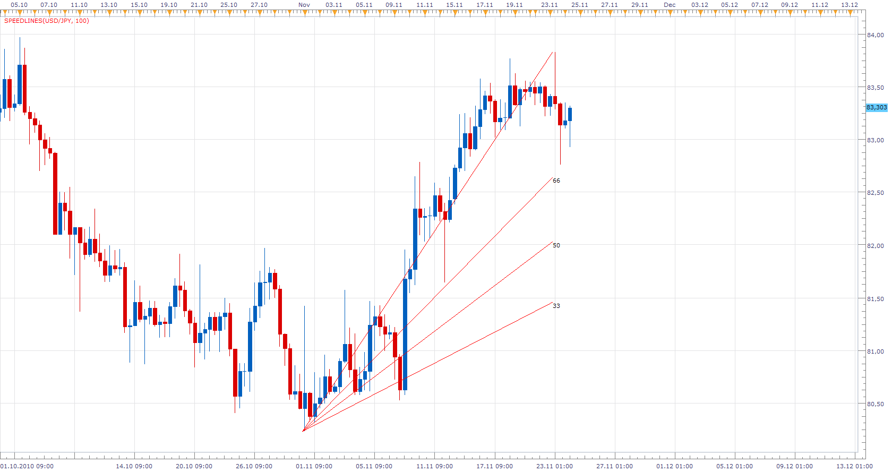

# Speedlines

> Source: https://fxcodebase.com/code/viewtopic.php?f=17&t=2783  
> Forum: 17 · Topic 2783 · 5 post(s)

---

## Speedlines

**Apprentice** · Wed Nov 24, 2010 5:10 am

Speed resistance lines are a fan similar to the Fibonacci fan. However, rather than using Fibonacci numbers, the fan uses calculations by thirds.
Click the minimum and maximum points of an identifiable trend to create the reference line. Two other lines are drawn fanning out from this line at angles of 33.33% and 66.66%. These lines represent lines of possible price support on retracement. They may give insight not only to the degree of retracement but also the rate of retracement (hence the term "speed lines")

 [SpeedLines.lua](files/6344/SpeedLines.lua)

This indicator is under development.
I need to extend the rays, until the last period.

But this is primarily designed as concept.
Example for the development team,
in order to include speed lines as a tool.

MT4/MQ4 version.
[viewtopic.php?f=38&t=65770](https://fxcodebase.com/code/viewtopic.php?f=38&t=65770)

The indicator was revised and updated

---

## Re: Speedlines

**Apprentice** · Wed Nov 24, 2010 5:47 am

Update

---

## Re: Speedlines

**leonala** · Wed May 11, 2011 12:34 am

I want to have Fibonacci fan....

---

## Re: Speedlines

**Apprentice** · Wed May 11, 2011 3:48 am

I have good news.
On my Trading Station I have Fibonacci fan tools and two other.
This is the early development beta, I believe it will be available to all during the summer.

---

## Re: Speedlines

**Apprentice** · Thu Mar 02, 2017 7:03 am

Indicator was revised and updated.
