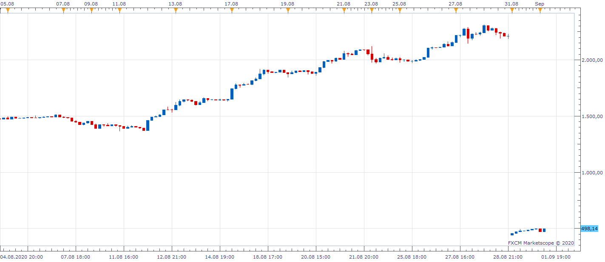
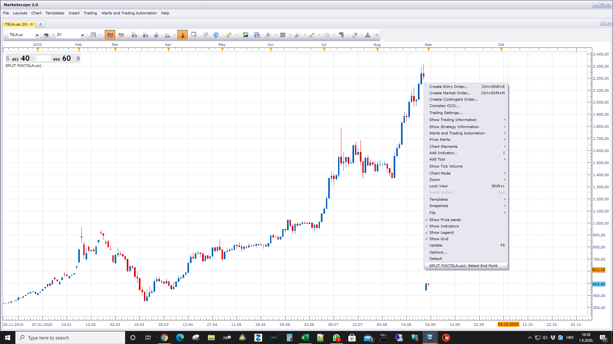

# Split fix

> Source: https://fxcodebase.com/code/viewtopic.php?f=17&t=70363  
> Forum: 17 · Topic 70363 · 1 post(s)

---

## Split fix

**Apprentice** · Tue Sep 01, 2020 10:02 am

 

 

Having problems, charting TSLA,
this tool may help,
unfortunately, you will have to define dates and ration for individual stock manually,
as it is written as one fits all solution.

 [Split fix.lua](files/137220/Split%20fix.lua)
