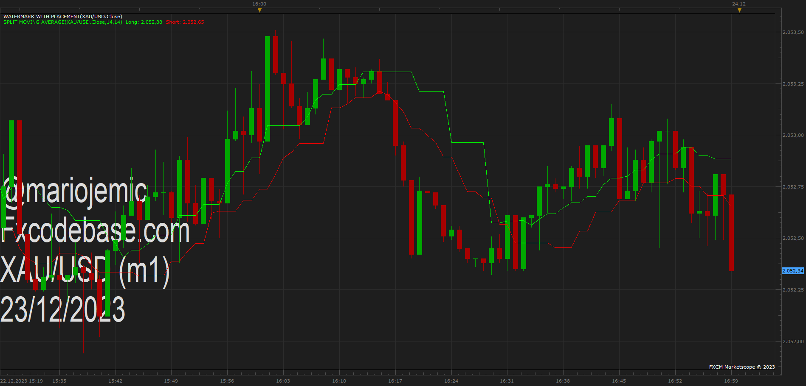

# Split Moving Average

> Source: https://fxcodebase.com/code/viewtopic.php?f=17&t=74472  
> Forum: 17 · Topic 74472 · 1 post(s)

---

## Split Moving Average

**Apprentice** · Sat Dec 23, 2023 3:27 am

Instead of a moving average of all data points,
we calculate the moving average of up and down changes.

Will be calculated only if a current data point is up for Up trend
and vice versa.

 [Split Moving Average.lua](files/153785/Split%20Moving%20Average.lua)

 

The trailing variant is calculated regardless of whether the current data point is up or down.

 [Trailing Split Moving Average.lua](files/153785/Trailing%20Split%20Moving%20Average.lua)
