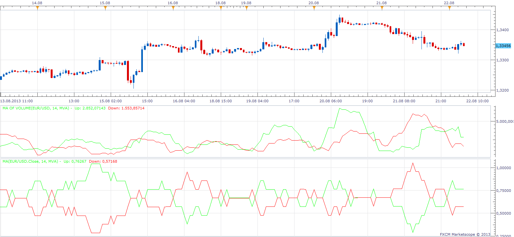

# Split Moving Average

> Source: https://fxcodebase.com/code/viewtopic.php?f=17&t=59276  
> Forum: 17 · Topic 59276 · 27 post(s)

---

## Split Moving Average

**Apprentice** · Thu Aug 22, 2013 4:26 am

These two indicators first separate price stream for two.
First for up price movement, second for down price movement.

MA is calculated on the basis of these data streams.

 [Split Moving Average.lua](files/88836/Split%20Moving%20Average.lua)

 [Split Moving Average of Volume.lua](files/88836/Split%20Moving%20Average%20of%20Volume.lua)

 

 [Split Moving Average with normalization.lua](files/88836/Split%20Moving%20Average%20with%20normalization.lua)

 [Split Moving Average of Volume with normalization.lua](files/88836/Split%20Moving%20Average%20of%20Volume%20with%20normalization.lua)

---

## Re: Split Moving Average

**speakinmymind** · Thu Aug 22, 2013 7:40 am

This is great! can you please create a strategy that buys/sells at crossover for both split volume and split price MVAs! thanks!

---

## Re: Split Moving Average

**speakinmymind** · Thu Aug 22, 2013 5:29 pm

Even better strategy, given a user defined threshold,

buy when the buy line falls to threshold

sell when sell line touches threshold

knowing how this indicator operates, the entry order would have to wait until the next candle opens before executing.

---

## Re: Split Moving Average

**Apprentice** · Fri Aug 23, 2013 2:02 am

Your request is added to the development list.

---

## Re: Split Moving Average

**speakinmymind** · Wed Sep 18, 2013 7:12 am

Can you please create a strategy that buys/sells at crossover for both split volume and split price MVAs! thanks!

---

## Re: Split Moving Average

**Apprentice** · Wed Sep 18, 2013 1:50 pm

Requested can be found here.
[viewtopic.php?f=31&t=59520](https://fxcodebase.com/code/viewtopic.php?f=31&t=59520)

---

## Re: Split Moving Average

**brajaboy** · Fri Oct 04, 2013 3:34 pm

Hey,

Can you please convert this for use on mt4 please?

Thanks so much

---

## Re: Split Moving Average

**Apprentice** · Sat Oct 05, 2013 3:58 am

Try this version.
[viewtopic.php?f=38&t=59612](https://fxcodebase.com/code/viewtopic.php?f=38&t=59612)

---

## Re: Split Moving Average

**brajaboy** · Thu Oct 10, 2013 8:43 am

Thank so much! so i have put the indicator into MT4 but i am having an issue of lag. I have to keep refreshing each time frame for it to keep up with the current candle. any idea why that is? the Broker says they cannot find any problems on their end.

[http://img24.imageshack.us/img24/8695/diqm.jpg](http://img24.imageshack.us/img24/8695/diqm.jpg)

Thanks so much for all your help

---

## Re: Split Moving Average

**Apprentice** · Thu Oct 10, 2013 12:06 pm

Try Updated Versions.

---

## Re: Split Moving Average

**brajaboy** · Thu Oct 10, 2013 4:18 pm

im sorry but through my searches i am not able to find an updated version for mt4 or lua for that matter. Could it be under a different name than "split moving average"?

thank you

---

## Re: Split Moving Average

**Apprentice** · Fri Oct 11, 2013 2:13 am

They are available here.
[viewtopic.php?f=38&t=59612](http://www.fxcodebase.com/code/viewtopic.php?f=38&t=59612)

---

## Re: Split Moving Average

**brajaboy** · Fri Oct 11, 2013 6:22 am

Thank you so much!

---

## Re: Split Moving Average

**speakinmymind** · Fri Oct 18, 2013 10:32 am

Could you please add another output that will tell the difference between the up and down output?

In addition, could this output be made into its own indicator?

also, can you add these features to the prevailing trend indicator as well? Thanks!

[viewtopic.php?f=17&t=59402](https://fxcodebase.com/code/viewtopic.php?f=17&t=59402)

---

## Re: Split Moving Average

**Apprentice** · Tue Oct 22, 2013 5:58 am

[Split Moving Average.lua](files/90231/Split%20Moving%20Average.lua)

 [Split Moving Average of Volume.lua](files/90231/Split%20Moving%20Average%20of%20Volume.lua)

Try this versions.

---

## Re: Split Moving Average

**speakinmymind** · Tue Oct 22, 2013 1:40 pm

Great, thanks a lot! Can you please add the option for the output of the difference to be an absolute value? Always positive?

That way the output would be a measure of imbalance.

I ask that this be optional because the current way you have the output of the difference is very useful as well.

Thanks again!

---

## Re: Split Moving Average

**speakinmymind** · Tue Oct 22, 2013 3:39 pm

Could you please add a convergence divergence signal based off the difference output or make this compatible with the "Indicator Divergence" indicator?

[viewtopic.php?f=17&t=3846](https://fxcodebase.com/code/viewtopic.php?f=17&t=3846)

---

## Re: Split Moving Average

**Apprentice** · Tue Oct 22, 2013 5:00 pm

Your request is added to the development list.

---

## Re: Split Moving Average

**speakinmymind** · Fri Nov 08, 2013 1:08 am

Could you please allow for the option of line display for difference instead of histogram? Thanks!

---

## Re: Split Moving Average

**Apprentice** · Fri Nov 08, 2013 4:30 am

Line Option Added.

---

## Re: Split Moving Average

**speakinmymind** · Fri Sep 25, 2015 2:15 pm

Could please add a midpoint line?

Thanks

---

## Re: Split Moving Average

**Apprentice** · Mon Sep 28, 2015 2:48 am

Midpoint line added, please re-download from first post in this topic.

---

## Re: Split Moving Average

**speakinmymind** · Mon Mar 14, 2016 6:16 am

Could you please create these indicators with normalization? Thanks!!

---

## Re: Split Moving Average

**Apprentice** · Wed Mar 16, 2016 4:01 am

Split Moving Average with normalization added.

---

## Re: Split Moving Average

**speakinmymind** · Thu Apr 21, 2016 10:54 pm

Could you please create an alert for cross of midpoint line?

---

## Re: Split Moving Average

**Apprentice** · Fri Apr 22, 2016 5:01 am

Alerts added to three-component versions.

---

## Re: Split Moving Average

**Apprentice** · Tue Sep 04, 2018 9:48 am

The indicator was revised and updated.
