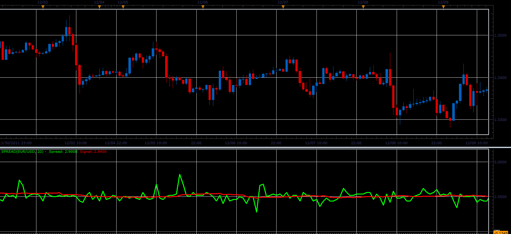

# Spread indicator

> Source: https://fxcodebase.com/code/viewtopic.php?f=17&t=10150  
> Forum: 17 · Topic 10150 · 4 post(s)

---

## Spread indicator

**Alexander.Gettinger** · Mon Dec 19, 2011 8:45 pm

The indicator shows the value of spread for the open prices of each candle.
The indicator has a signal line.

 

Download:

 [Spread.lua](files/21250/Spread.lua)

The indicator was revised and updated

---

## Re: Spread indicator

**Jeffreyvnlk** · Wed Oct 31, 2012 1:09 pm

Could you explain the theory behind that.Thanks

---

## Re: Spread indicator

**Apprentice** · Thu Nov 01, 2012 2:59 am

Indicator shows the difference between the bid and ask price.
Spread depends on the liquidity of a particular currency pair.
Higher liquidity, lower spread and vice versa.
You can try to take advantage of a temporary imbalance in it,
And try Spread Trade.

---

## Re: Spread indicator

**Apprentice** · Mon Apr 17, 2017 7:08 am

Indicator was revised and updated.
