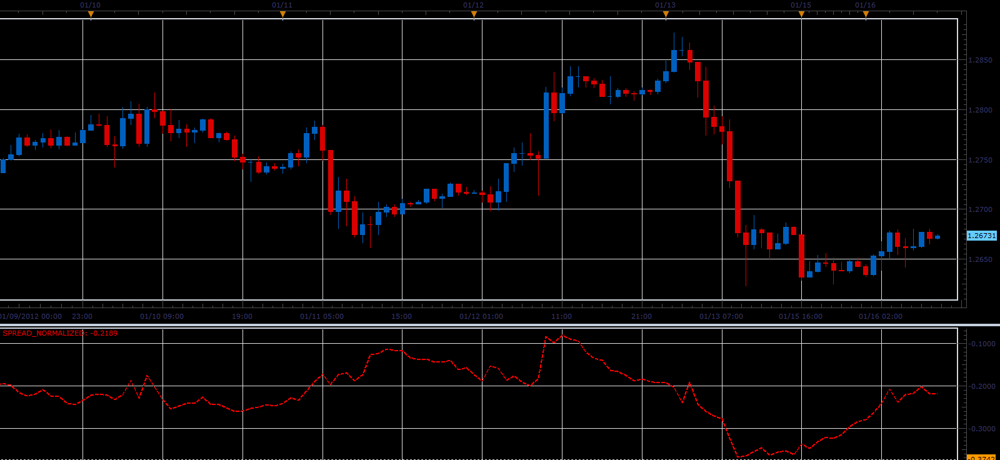

# Spread Normalized indicator

> Source: https://fxcodebase.com/code/viewtopic.php?f=17&t=11788  
> Forum: 17 · Topic 11788 · 2 post(s)

---

## Spread Normalized indicator

**Alexander.Gettinger** · Mon Jan 16, 2012 9:27 am

Formulas:
Spread Normalized=(MA(Spr)-Spr)/sDev, where
Spr=Price(First market)-Price(Second market),
sDev=Abs(Spr)/sqrt(Period).

 

Download:

 [Spread_Normalized.lua](files/23591/Spread_Normalized.lua)

The indicator was revised and updated

---

## Re: Spread Normalized indicator

**Apprentice** · Thu Mar 23, 2017 2:44 pm

Indicator was revised and updated.
