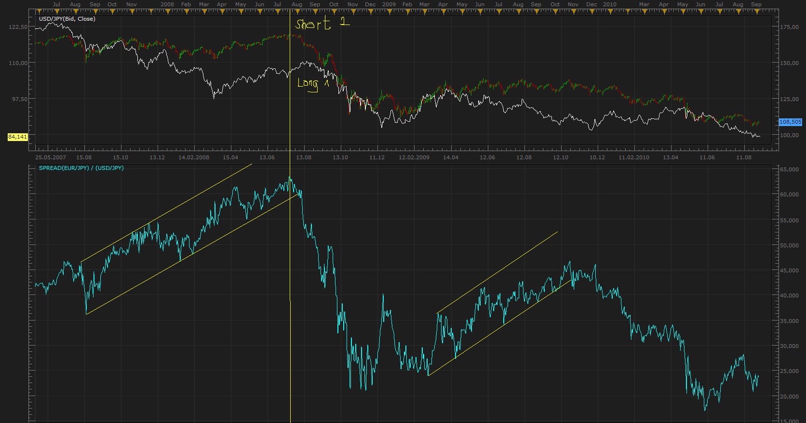
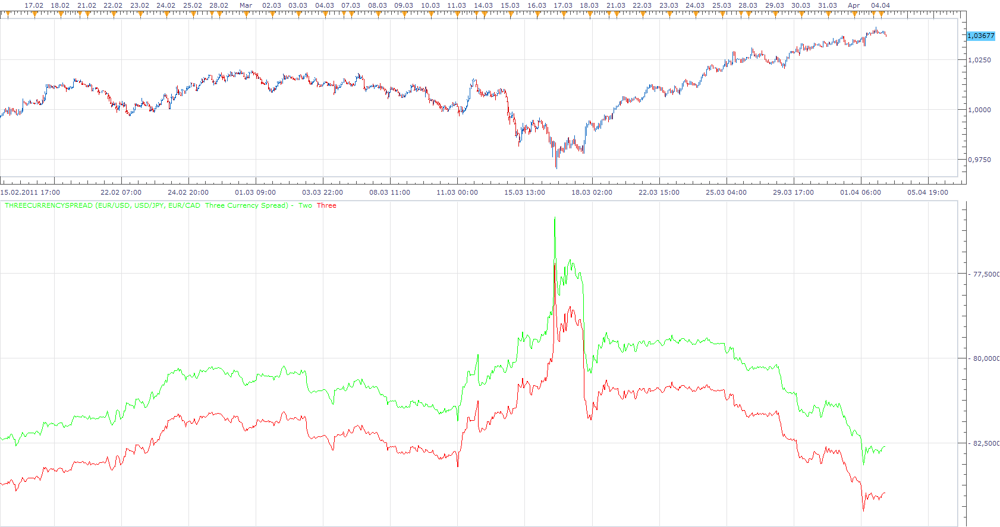
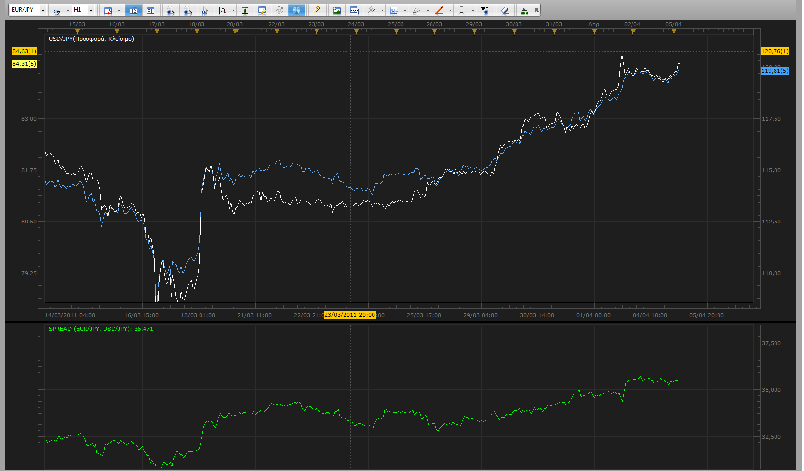

# Spread Trading

> Source: https://fxcodebase.com/code/viewtopic.php?f=17&t=2073  
> Forum: 17 · Topic 2073 · 27 post(s)

---

## Spread Trading

**Apprentice** · Mon Sep 06, 2010 2:57 am

Spreads show the difference in price between two securities.

A spread Trading involves buying one security and selling another (currency pair).
Profit opportunities arise from the narrowing or expanding of the difference between the two securities.

Spreads are typically constitute between securities with high correlation.
Exploit temporarily disrupted relationships between securities.

Opening at the same time Long & Short position we expect that one of securities will rise faster (or fall more slowly) than the price of other.

You can also spread a single security, by buying one contract and selling another with different maturity.

 [Spread.lua](files/4246/Spread.lua)

---

## Re: Spread Trading

**fxm12000** · Fri Oct 29, 2010 2:23 am

Thank for a great indicator. Is it possible to make a signal out of it, with sound and email alert when spread touches or crosses defined value?

---

## Re: Spread Trading

**Apprentice** · Fri Oct 29, 2010 4:24 am

Good suggestion.

I asked all the traders who are interested in Spread Trading,
to require from FXCM, the possibility of trading with spreads.

---

## Re: Spread Trading

**Apprentice** · Fri Oct 29, 2010 1:19 pm

Requested can be found here.
[viewtopic.php?f=31&t=2554](https://fxcodebase.com/code/viewtopic.php?f=31&t=2554)

---

## Re: Spread Trading

**Apprentice** · Sun Dec 05, 2010 4:18 pm

Currency Selector added.

---

## Re: Spread Trading

**fxm12000** · Sat Apr 02, 2011 12:55 pm

Is by any chance possible to add third pair in spread indicator. I would like to have indicator that will give chance to trade for example eurusd buy/gbpusd sell and cover them with eurgbp sell . And collect profit when declining from normal corelation.

---

## Re: Spread Trading

**Apprentice** · Sat Apr 02, 2011 4:07 pm

I'll try to find some solution for this type of trading.

---

## Re: Spread Trading

**Apprentice** · Mon Apr 04, 2011 4:35 am

I have written two versions.
ThreeCurrencySpread according to your specifications.
And a bonus one.

But I'm not sure what is their usefulness.

 [ThreeCurrencySpread.lua](files/9338/ThreeCurrencySpread.lua)

 [TwoSpreadSpread.lua](files/9338/TwoSpreadSpread.lua)

---

## Re: Spread Trading

**alepan72** · Mon Apr 04, 2011 7:04 pm

Hi all!
I used this indicator and seems to be nice tool for correlation trades. Is there someone explain me how I recognize a point of entry?
(e.g. on a chart with EURJPY and USDJPY the indicator is on 35.500. Which direction I have to follow?)
I will appreciate duly each help. (PM allowed).
Thanx in advance! Kisses from Greece!!!

 

---

## Re: Spread Trading

**Apprentice** · Tue Apr 05, 2011 2:14 am

In theory.
Find the two currency pairs with high correlation and high current Spread.
Then open the two positions, One Short and One Long.
Direction that you will take depends on long-term trend that you expect,
Is Spread Negative or Positive.
First Pair Long Second Short or First Short and Second Long.
Since you expect that spread will decrease.
On a trade will be profitable, second will not, overall you should be in profit.
Here there are several parameters such as the rollover.
It is possible to realize the trade with a one-sided position.

I can tell you more.
This is not a trading forum, our primary mission is programming support.
Not give trading advice.

---

## Re: Spread Trading

**fxm12000** · Tue Apr 05, 2011 7:55 am

Thanks for making this two additional versions of spread indicator. Can you change threecurrencyspread in form that on chart only threecurrencyspread line will be visible since sometimes value of spread and threecurrency spread is so different that on indicator you cannot visualize the difference.

---

## Re: Spread Trading

**Apprentice** · Tue Apr 05, 2011 11:30 am

Updated

---

## Re: Spread Trading

**Trader1** · Tue Aug 30, 2011 7:20 am

Thanks for this

a very nice addition!

 a suggestion

is it possible to add the pips between the pairs to view as numbers?

it's hard to see how many pips on a gap on just looking at the moving average line.

and it would be good to know how much the correlation is in numbers like on the mataf.net site

Thanks

---

## Re: Spread Trading

**Apprentice** · Tue Aug 30, 2011 4:25 pm

It is possible, unfortunately in the last few weeks I do not have a lot of free time.

---

## Re: Spread Trading

**Apprentice** · Sun Sep 30, 2012 4:32 am

Indicators are updated.

---

## Re: Spread Trading

**Jeffreyvnlk** · Mon Oct 29, 2012 11:24 pm

> **Apprentice wrote:**
>
>
> Spread.png
>
>
> Spreads show the difference in price between two securities.
>
> A spread Trading involves buying one security and selling another (currency pair).
> Profit opportunities arise from the narrowing or expanding of the difference between the two securities.
>
> Spreads are typically constitute between securities with high correlation.
> Exploit temporarily disrupted relationships between securities.
>
> Opening at the same time Long & Short position we expect that one of securities will rise faster (or fall more slowly) than the price of other.
>
> You can also spread a single security, by buying one contract and selling another with different maturity.
>
>
>
> Spread.lua
>
>
>
> This indicator is using new "getSyncHistory", new "simpler" way to retrieve Historyc data.
> Currently, 30th September 2012, is available only in beta.
>
> If you do not have a beta version of TS,
> You can find it here.
> [viewtopic.php?f=30&t=20383](https://fxcodebase.com/code/viewtopic.php?f=30&t=20383)

Sorry for ask not so well-thought question: Are we trading EUR/USD by long/short EUR/JPY and USD/JPY at the same time ?

---

## Re: Spread Trading

**Apprentice** · Tue Oct 30, 2012 2:55 am

Yes, you trade both.
In opposing positions.
This minimizes your risk,
and your profit from the spread normalization.

---

## Re: Spread Trading

**Jeffreyvnlk** · Tue Oct 30, 2012 2:06 pm

> **Apprentice wrote:**
> Yes, you trade both.
> In opposing positions.
> This minimizes your risk,
> and your profit from the spread normalization.

In combination with COT , it would be great. Some currency will move faster when COT in extreme

---

## Re: Spread Trading

**Jeffreyvnlk** · Mon Apr 29, 2013 4:20 pm

It was appreciated if you could make this indicator called Spread Oscillator (SO):

A. Modified spread: dividing 1 instrument by 2rd and then multiplying by 100
B- Subtract a 5-period exponential moving average of A from a 15- period exponential moving average of A as well

Long and short 1st instrument when SO crossing above or below Zero line

Thanks in advance

---

## Re: Spread Trading

**Apprentice** · Fri May 03, 2013 4:15 am

Requested can be found here.
[viewtopic.php?f=17&t=36328](https://fxcodebase.com/code/viewtopic.php?f=17&t=36328)

---

## Re: Spread Trading

**Jeffreyvnlk** · Fri May 03, 2013 6:59 am

> **Apprentice wrote:**
> Requested can be found here.
> [viewtopic.php?f=17&t=36328](https://fxcodebase.com/code/viewtopic.php?f=17&t=36328)

Beautiful, thanks

---

## Re: Spread Trading

**Apprentice** · Fri Jul 06, 2018 6:37 am

The indicator was revised and updated.

---

## Re: Spread Trading

**douvanik** · Thu Jun 20, 2019 8:02 pm

Hi excellent Indicator.Can you please make a modify version to divide the two symbols prices? Thanks.

---

## Re: Spread Trading

**Apprentice** · Sat Jun 22, 2019 5:44 am

Can you clarify?
I'm not sure I understand you.

---

## Re: Spread Trading

**douvanik** · Sun Jun 23, 2019 11:36 am

The two prices divide for ex. audusd price/ audjpy price, 0.96/ 74.28.

---

## Re: Spread Trading

**Apprentice** · Mon Jun 24, 2019 12:06 pm

Try this version.

 [Spread Ratio.lua](files/127076/Spread%20Ratio.lua)

---

## Re: Spread Trading

**douvanik** · Tue Jun 25, 2019 5:30 am

ok thanks.
