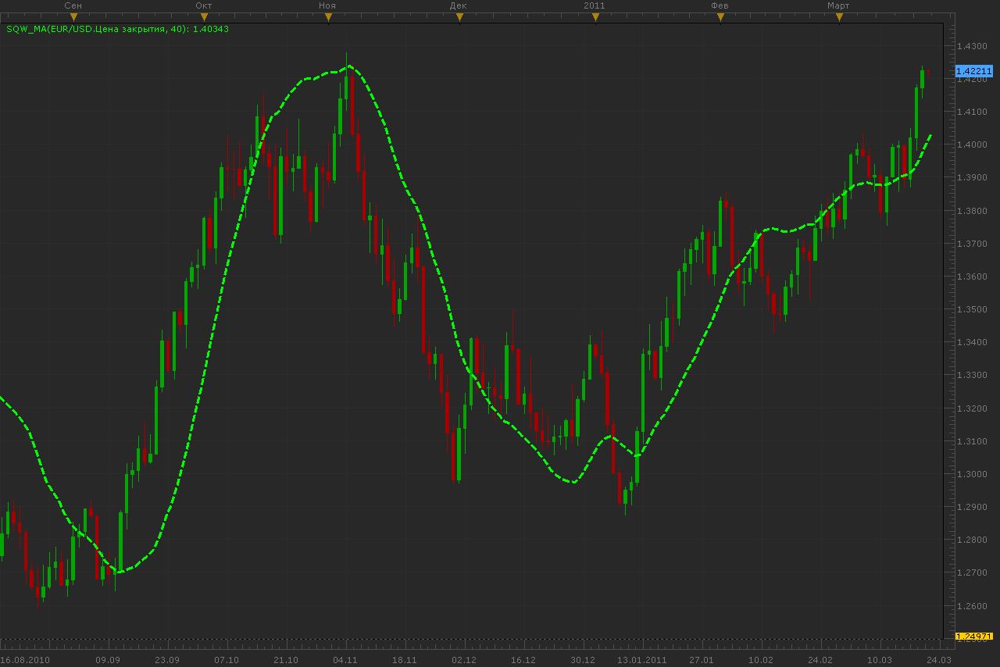

# Square weighted MA

> Source: https://fxcodebase.com/code/viewtopic.php?f=17&t=3697  
> Forum: 17 · Topic 3697 · 5 post(s)

---

## Square weighted MA

**Alexander.Gettinger** · Mon Mar 21, 2011 11:24 pm

Formulas:
MA=(Sum-SumP*(SumW*Period-SumP*Sum)/(SumP2*Period-SumP*SumP))/Period, where
Sum[i]=Price[i]+Price[i-1]+...+Price[i-Period+1],
SumW[i]=Price[i-1]*1+Price[i-2]*2+...+Price[i-Period+1]*(Period-1),
SumP=1+2+...+(Period-1),
SumP2=1*1+2*2+...+(Period-1)*(Period-1).

 

Download:

 [SqW_MA.lua](files/8949/SqW_MA.lua)

The indicator was revised and updated

---

## Re: Square weighted MA

**Alexander.Gettinger** · Fri Jun 29, 2012 1:44 pm

MQL4 version of this indicator: [viewtopic.php?f=38&t=20680](https://fxcodebase.com/code/viewtopic.php?f=38&t=20680)

---

## Re: Square weighted MA

**Apprentice** · Tue Apr 04, 2017 6:11 am

Indicator was revised and updated.

---

## Re: Square weighted MA

**xpertizetrading** · Wed Apr 05, 2017 5:26 pm

What does it mean?

Thanks,
XpertizeTrading

---

## Re: Square weighted MA

**Apprentice** · Thu Apr 06, 2017 1:30 pm

I started to test everything ever written,
Fix modify and optimize if necessary.

This is info for me, that particular indicator is revised.
