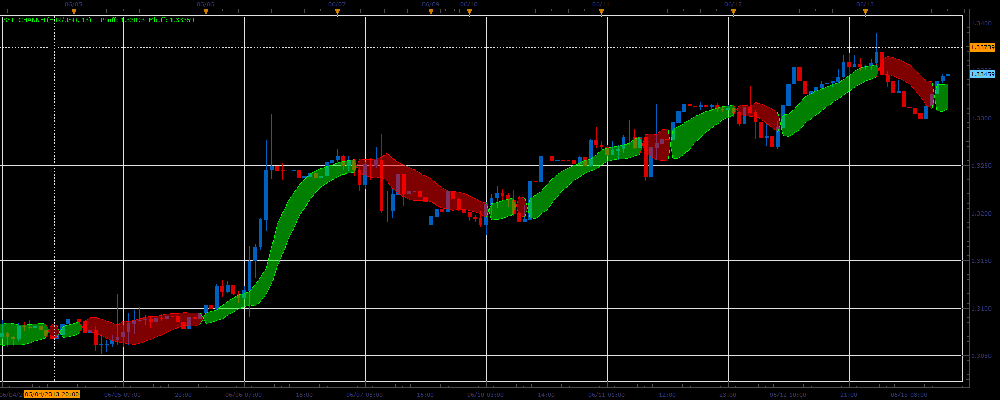

# SSL channel indicator

> Source: https://fxcodebase.com/code/viewtopic.php?f=17&t=41288  
> Forum: 17 · Topic 41288 · 2 post(s)

---

## SSL channel indicator

**Alexander.Gettinger** · Tue Jun 18, 2013 12:45 pm

This indicator is a ported MQL5 indicator from [http://www.mql5.com/en/code/1692](http://www.mql5.com/en/code/1692)

 

Download:

 [SSL_Channel.lua](files/67508/SSL_Channel.lua)

The indicator was revised and updated

---

## Re: SSL channel indicator

**Apprentice** · Sat May 27, 2017 11:30 am

Indicator was revised and updated.
