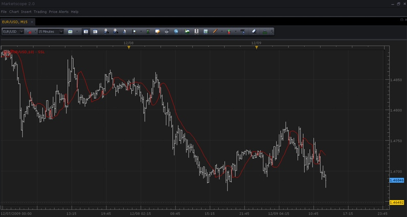

# SSL Indicator

> Source: https://fxcodebase.com/code/viewtopic.php?f=17&t=139  
> Forum: 17 · Topic 139 · 34 post(s)

---

## SSL Indicator

**TonyMod** · Wed Dec 09, 2009 1:19 pm

Here is a screenshot, thumbnail image barely displays the line so click it to enlarge:

 

*Screenshot of this indicator in MarketScope 2.0 Charts*

You can download it:

 [SSL.lua](files/200/SSL.lua)

 [BF_SSL.lua](files/200/BF_SSL.lua)

 [SSL Dot.lua](files/200/SSL%20Dot.lua)

 

 [MTF MCP SSL Heat Map.lua](files/200/MTF%20MCP%20SSL%20Heat%20Map.lua)

SSL.lua based strategy.
[viewtopic.php?f=31&t=67065&p=122568#p122568](https://fxcodebase.com/code/viewtopic.php?f=31&t=67065&p=122568#p122568)

 [Averages SSL.lua](files/200/Averages%20SSL.lua)

Averages.lua
[viewtopic.php?f=17&t=2430](https://fxcodebase.com/code/viewtopic.php?f=17&t=2430)

---

## Re: Hello there !

**silviu** · Mon Dec 14, 2009 2:02 pm

WOW !!! Thanks again

---

## Re: SSL Indicator (Exact Translation from MQ4 version)

**bluepip** · Thu Oct 07, 2010 1:44 am

Is it possible to get the SSL Indicator colored like "Color Regression line" (values over SSL are green, values under SSL are red)?

Thanks

---

## Re: SSL Indicator (Exact Translation from MQ4 version)

**Apprentice** · Thu Oct 07, 2010 2:04 am

Added to development Cue.

---

## Re: SSL Indicator (Exact Translation from MQ4 version)

**nazaar** · Fri Feb 10, 2012 5:06 pm

Please,

can you advise how the SSL line is generated, what is the formula. Is it generated from price, from an another indcator or both. The default look back period is 10, what does the look back period determine?

this looks like a good indicator but I have no idea how it is generated.

thanks

---

## Re: SSL Indicator (Exact Translation from MQ4 version)

**Apprentice** · Sun Feb 12, 2012 4:16 am

SSL a.k.a. GHLA is or moving average of the high value
or moving average of the low value.
If the closing price is higher than the indicator line,
from that point forward SSL is MVA, of High.
If the closing price is lower than the indicator line,
from that point forward SSL is MVA, of Low.

---

## Re: SSL Indicator (Exact Translation from MQ4 version)

**nazaar** · Sun Feb 12, 2012 8:43 pm

Thank you, your explanation makes sense. I understand the ssl indicator better now.

Is it possible to add a line width and style option.

take care.

---

## Re: SSL Indicator (Exact Translation from MQ4 version)

**Apprentice** · Mon Feb 13, 2012 6:05 am

Color & Style options added.

---

## Re: SSL Indicator

**rahulmalik** · Sun Mar 11, 2012 1:08 am

Dear Apprentice, I could not find any strategy on SSL indicator on this forum.

Please device an strategy for the same for automatic trades.

In my opinion, following are good ideas to be a part of strategy :

1. Option to chose Buy / Sell / Both
2. Allowed trade - Yes
3. Stop - In addition to chose pips, should have option to use the reverse signal as exit signal (if single side trade option buy or sell is activated)

Thank you much in advance for your efforts.

---

## Re: SSL Indicator

**Apprentice** · Sun Mar 11, 2012 5:24 am

Try this one.
[viewtopic.php?f=31&t=3562&p=8543&hilit=GHLA#p8543](https://fxcodebase.com/code/viewtopic.php?f=31&t=3562&p=8543&hilit=GHLA#p8543)

---

## Re: SSL Indicator

**rahulmalik** · Sun Mar 11, 2012 8:11 am

> **Apprentice wrote:**
> Try this one.
> [viewtopic.php?f=31&t=3562&p=8543&hilit=GHLA#p8543](https://fxcodebase.com/code/viewtopic.php?f=31&t=3562&p=8543&hilit=GHLA#p8543)

Thanks Apprentice. I did some homework. Its the same.

Regards

---

## Re: SSL Indicator

**Blackcat2** · Tue Mar 13, 2012 6:50 am

How to use/read/interpret this indicator?

Cheers...
BC

---

## Re: SSL Indicator

**Coondawg71** · Sun Oct 28, 2012 4:56 pm

can we please request a strategy using the SSL indicator.

I see it has been referred to as being the same as the GHLA indicators...SSL does plot more smoothly than GHLA and GHLA Touchline and that would be my preference in choice for this strategy.

Thanks,

sjc

---

## Re: SSL Indicator

**Apprentice** · Mon Oct 29, 2012 2:50 pm

Your request is added to the development list.

---

## Re: SSL Indicator

**Apprentice** · Mon Apr 17, 2017 7:11 am

Indicator was revised and updated.

---

## Re: SSL Indicator

**Apprentice** · Fri Apr 28, 2017 8:59 am

The strategy based on this indicator is available here.
[viewtopic.php?f=31&t=64626](https://fxcodebase.com/code/viewtopic.php?f=31&t=64626)

---

## Re: SSL Indicator

**Recursive Trendline** · Tue Sep 19, 2017 9:48 am

Hi Apprentice,

Need the indicator to be plotted as a dot instead of line. Similar to SAR. Not dotted line as mentioned in grid style but simple dot.

Will be a great tool for stop placement.

Regards,

---

## Re: SSL Indicator

**Apprentice** · Wed Sep 20, 2017 4:24 am

SSL Dot.lua added.

---

## Re: SSL Indicator

**Recursive Trendline** · Wed Sep 20, 2017 4:29 am

Thanks a lot Apprentice! Means a lot!
Regards,

---

## Re: SSL Indicator

**Apprentice** · Wed Sep 20, 2017 4:43 am

MTF MCP SSL Heat Map.lua added.

---

## Re: SSL Indicator

**Apprentice** · Sat Sep 08, 2018 10:18 am

The Indicator was revised and updated.

---

## Re: SSL Indicator

**xpertize** · Tue Oct 01, 2019 5:12 am

Hi Apprentice,

I need Bigger time frame version of the indicator just like you did with averages.lua
[http://fxcodebase.com/code/download/file.php?id=2596](https://fxcodebase.com/code/download/file.php?id=2596)

There is an option for choosing higher time frame inbuilt but I need a flat line version. Just like BF_Averages.lua above

Thanks,
Xpertize

---

## Re: SSL Indicator

**Apprentice** · Wed Oct 02, 2019 5:57 am

BF_SSL.lua added.
Make sure to re-download SSL.lua

---

## Re: SSL Indicator

**xpertize** · Sat Oct 05, 2019 3:01 am

Thanks Apprentice!

---

## Re: SSL Indicator

**lowcoloured** · Wed May 13, 2020 9:03 am

Hi Apprentice,

In other websites like tradingview.com there is an ssl which displays output on setting 1 also.
The version here does only from 2 and beyond.
Please edit the ssl so that it can show output with setting 1 also.

Thanks

---

## Re: SSL Indicator

**Apprentice** · Wed May 13, 2020 4:17 pm

[SSL.lua](files/133916/SSL.lua)

Try this version.

---

## Re: SSL Indicator

**lowcoloured** · Thu May 14, 2020 12:56 am

Thanks Apprentice

---

## Re: SSL Indicator

**lowcoloured** · Thu May 21, 2020 2:39 am

> **Apprentice wrote:**
>
>
> SSL.lua
>
>
> Try this version.

Some error. Unable to install

---

## Re: SSL Indicator

**Apprentice** · Thu May 21, 2020 6:06 am

Your request is added to the development list.
Development reference 1323.

---

## Re: SSL Indicator

**Apprentice** · Tue May 26, 2020 8:54 am

Fixed.
Make sure our clear your browser buffer prior to download, or use different browser.

---

## Re: SSL Indicator

**PAWPUSS** · Wed Sep 08, 2021 1:56 pm

Hello , on trading view there is an SSL Crossover indicator with MA choice(by Monduras). Is there an indicator for MT4 that can offer EMA,SMA,HMA,WMA ??
Many thanks

---

## Re: SSL Indicator

**Apprentice** · Fri Sep 10, 2021 3:44 am

TS2 version
[https://fxcodebase.com/code/viewtopic.php?f=17&t=71487](https://fxcodebase.com/code/viewtopic.php?f=17&t=71487)

Your request is added to the development list.
Development reference 807.

---

## Re: SSL Indicator

**Apprentice** · Fri Sep 10, 2021 6:44 am

Tradingview source
[https://www.tradingview.com/script/t9bo ... MA-choice/](https://www.tradingview.com/script/t9bocpPF-SSL-Crossover-MA-choice/)

---

## Re: SSL Indicator

**Apprentice** · Mon Sep 13, 2021 11:30 am

MT4 version.
[https://fxcodebase.com/code/viewtopic.php?f=38&t=71493](https://fxcodebase.com/code/viewtopic.php?f=38&t=71493)
