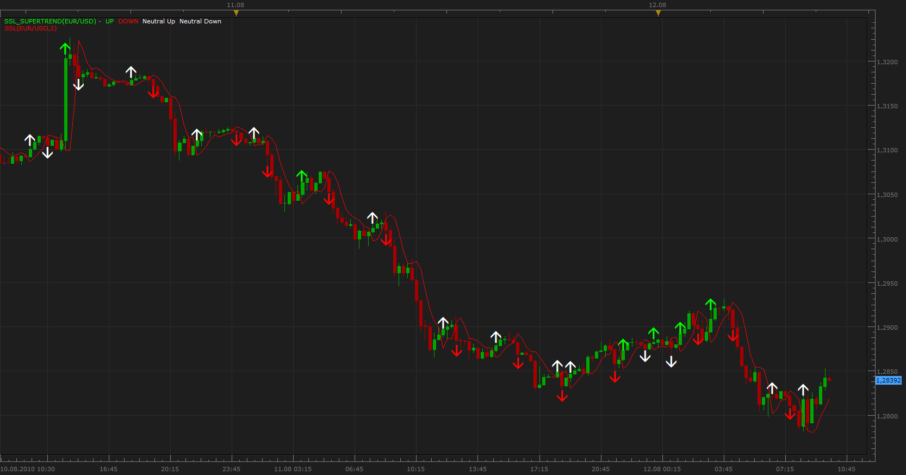

# SSL SuperTrend Indicator

> Source: https://fxcodebase.com/code/viewtopic.php?f=17&t=1756  
> Forum: 17 · Topic 1756 · 10 post(s)

---

## SSL SuperTrend Indicator

**Apprentice** · Thu Aug 12, 2010 8:53 am

Green / Red Arrows **(enter the trade)**are generated when closing price cross over SSL line,
but only if it is confirmed by SuperTrend indicators.

White Arrows **(miss the trade)** are generated when closing price cross over SSL line,
but it is not confirmed by SuperTrend indicators.

If you use wider definition options, the Arrows is generated when both conditions are positive, regardless of the sequence of positive indications.

 [SSL_SuperTrend.lua](files/3534/SSL_SuperTrend.lua)

If you do not have them you need the following indicators.

SSL INDICATOR:
 [viewtopic.php?f=17&t=139&p=200&hilit=ssl#p200](https://fxcodebase.com/code/viewtopic.php?f=17&t=139&p=200&hilit=ssl#p200)
--
SUPERTREND INDICATOR:
 [viewtopic.php?f=17&t=605](https://fxcodebase.com/code/viewtopic.php?f=17&t=605)

The indicator was revised and updated

---

## Re: SSL SuperTrend Indicator

**Apprentice** · Fri Aug 13, 2010 4:54 am

Update

---

## Re: SSL SuperTrend Indicator

**BabyCoder** · Fri Jan 20, 2012 9:20 pm

Hi,

Can this indicator be modified with MA's instead of SSL? Cheers

---

## Re: SSL SuperTrend Indicator

**Apprentice** · Sun Jan 22, 2012 5:51 pm

Your request is added to the developmental cue.

---

## Re: SSL SuperTrend Indicator

**Apprentice** · Tue Jan 24, 2012 5:41 am

Requested can be found here.
[viewtopic.php?f=17&t=12227&p=24216#p24216](https://fxcodebase.com/code/viewtopic.php?f=17&t=12227&p=24216#p24216)

---

## Re: SSL SuperTrend Indicator

**briansummy** · Wed Mar 07, 2012 3:25 pm

This would awesome for a MTF setup.

---

## Re: SSL SuperTrend Indicator

**Apprentice** · Thu Mar 08, 2012 6:39 am

Indicator or Strategy.
We need more information.
Especially if you want a strategy.
Entry / Exit rules are necessary.

---

## Re: SSL SuperTrend Indicator

**rahulmalik** · Sun Mar 11, 2012 2:13 am

> **Apprentice wrote:**
> Indicator or Strategy.
> We need more information.
> Especially if you want a strategy.
> Entry / Exit rules are necessary.

Dear Apprentice, please help with this signal / indicator, to be converted to a auto trade strategy. I believe following info may suffice :

1. Trade Both sides.
2. If trading only or BUY or SELL side, should be allowed to exit the trade in case of signal reverses.
3. Stop / Limit / Trail Stop parameters are a must to make it more profitable.

---

## Re: SSL SuperTrend Indicator

**Apprentice** · Sun Mar 11, 2012 10:30 am

Required can be found here.
[viewtopic.php?f=31&t=14698](https://fxcodebase.com/code/viewtopic.php?f=31&t=14698)

---

## Re: SSL SuperTrend Indicator

**Apprentice** · Sun Apr 02, 2017 7:18 am

Indicator was revised and updated.
